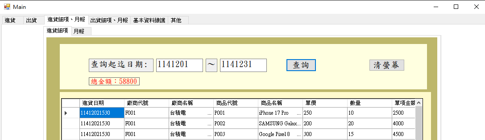

# 📖 C#單元十：庫存管理系統與進階報表（SQL 聚合函數與分組查詢）

---

## 🎯 單元目標

- ✅ 建立庫存管理系統所需的資料表
- ✅ 了解 SQL 聚合函數（SUM、COUNT、AVG、MAX、MIN）的用法
- ✅ 學會使用 GROUP BY 進行資料分組查詢
- ✅ 學會使用 HAVING 子句篩選分組結果
- ✅ 實作庫存查詢功能
- ✅ 實作進貨統計報表功能
- ✅ 實作出貨統計報表功能
- ✅ 完成庫存異動明細報表作業

---

## 📋 單元一：建立庫存管理系統所需的資料表

本單元將在 `DB_TEST` 資料庫中建立庫存管理系統所需的資料表。
共6個資料表：

1. FactoryTbl（廠商主檔）
2. ProductTbl（商品主檔）
3. InputHeadTbl（進貨單頭）
4. InputDetailTbl（進貨單身）
5. OutputHeadTbl（出貨單頭）
6. OutputDetailTbl（出貨單身）

```sql
USE [DB_TEST]
GO

SET ANSI_NULLS ON
GO

SET QUOTED_IDENTIFIER ON
GO

CREATE TABLE [dbo].[FactoryTbl](
	[chFactNo] [char](10) NOT NULL,
	[chFactName] [char](100) NULL,
 CONSTRAINT [PK_FactoryTbl] PRIMARY KEY CLUSTERED 
(
	[chFactNo] ASC
)WITH (PAD_INDEX = OFF, STATISTICS_NORECOMPUTE = OFF, IGNORE_DUP_KEY = OFF, ALLOW_ROW_LOCKS = ON, ALLOW_PAGE_LOCKS = ON, OPTIMIZE_FOR_SEQUENTIAL_KEY = OFF) ON [PRIMARY]
) ON [PRIMARY]
GO


INSERT INTO FactoryTbl (chFactNo, chFactName) VALUES ('F001', '台積電');
INSERT INTO FactoryTbl (chFactNo, chFactName) VALUES ('F002', '聯發科技');
INSERT INTO FactoryTbl (chFactNo, chFactName) VALUES ('F003', '台達電');
INSERT INTO FactoryTbl (chFactNo, chFactName) VALUES ('F004', '鴻海');
INSERT INTO FactoryTbl (chFactNo, chFactName) VALUES ('F005', '仁寶');


USE [DB_TEST]
GO

SET ANSI_NULLS ON
GO

SET QUOTED_IDENTIFIER ON
GO

CREATE TABLE [dbo].[ProductTbl](
	[chProdNo] [char](7) NOT NULL,
	[chProdName] [char](100) NOT NULL,
	[chUnit] [char](4) NULL,
	[rlStockQty] [real] NULL,
	[rlInpPrice] [real] NULL,
	[rlSellPrice] [real] NULL,
	[chCreatDateTime] [char](11) NULL,
 CONSTRAINT [PK_ProductTbl] PRIMARY KEY CLUSTERED 
(
	[chProdNo] ASC
)WITH (PAD_INDEX = OFF, STATISTICS_NORECOMPUTE = OFF, IGNORE_DUP_KEY = OFF, ALLOW_ROW_LOCKS = ON, ALLOW_PAGE_LOCKS = ON, OPTIMIZE_FOR_SEQUENTIAL_KEY = OFF) ON [PRIMARY]
) ON [PRIMARY]
GO


INSERT INTO ProductTbl (chProdNo, chProdName, chUnit, rlStockQty, rlInpPrice, rlSellPrice, chCreatDateTime) VALUES ('P001', 'iPhone 17 Pro', '片', 100, 250, 400, '11412020000');
INSERT INTO ProductTbl (chProdNo, chProdName, chUnit, rlStockQty, rlInpPrice, rlSellPrice, chCreatDateTime) VALUES ('P002', 'SAMSUNG Galaxy S25', '片', 100, 200, 300, '11412020000');
INSERT INTO ProductTbl (chProdNo, chProdName, chUnit, rlStockQty, rlInpPrice, rlSellPrice, chCreatDateTime) VALUES ('P003', 'Google Pixel 8', '顆', 100, 200, 300, '11412020000');


USE [DB_TEST]
GO

SET ANSI_NULLS ON
GO

SET QUOTED_IDENTIFIER ON
GO

CREATE TABLE [dbo].[InputHeadTbl](
	[chInpDateTime] [char](13) NOT NULL,
	[chFactNo] [char](10) NOT NULL,
	[rlInpTotAmt] [real] NULL,
 CONSTRAINT [PK_InputHeadTbl] PRIMARY KEY CLUSTERED 
(
	[chInpDateTime] ASC,
	[chFactNo] ASC
)WITH (PAD_INDEX = OFF, STATISTICS_NORECOMPUTE = OFF, IGNORE_DUP_KEY = OFF, ALLOW_ROW_LOCKS = ON, ALLOW_PAGE_LOCKS = ON, OPTIMIZE_FOR_SEQUENTIAL_KEY = OFF) ON [PRIMARY]
) ON [PRIMARY]
GO


USE [DB_TEST]
GO

SET ANSI_NULLS ON
GO

SET QUOTED_IDENTIFIER ON
GO

CREATE TABLE [dbo].[InputDetailTbl](
	[chInpDateTime] [char](13) NOT NULL,
	[chFactNo] [char](10) NOT NULL,
	[chProdNo] [char](7) NOT NULL,
	[rlInpQty] [real] NULL,
	[rlInpPrice] [real] NULL,
	[rlInpAmt] [real] NULL,
 CONSTRAINT [PK_InputDetailTbl] PRIMARY KEY CLUSTERED 
(
	[chInpDateTime] ASC,
	[chFactNo] ASC,
	[chProdNo] ASC
)WITH (PAD_INDEX = OFF, STATISTICS_NORECOMPUTE = OFF, IGNORE_DUP_KEY = OFF, ALLOW_ROW_LOCKS = ON, ALLOW_PAGE_LOCKS = ON, OPTIMIZE_FOR_SEQUENTIAL_KEY = OFF) ON [PRIMARY]
) ON [PRIMARY]
GO


USE [DB_TEST]
GO

SET ANSI_NULLS ON
GO

SET QUOTED_IDENTIFIER ON
GO

CREATE TABLE [dbo].[OutputHeadTbl](
	[chOutpDateTime] [nchar](13) NOT NULL,
	[chFactNo] [nchar](10) NOT NULL,
	[rlOutpTotAmt] [real] NULL,
 CONSTRAINT [PK_OutputHeadTbl] PRIMARY KEY CLUSTERED 
(
	[chOutpDateTime] ASC,
	[chFactNo] ASC
)WITH (PAD_INDEX = OFF, STATISTICS_NORECOMPUTE = OFF, IGNORE_DUP_KEY = OFF, ALLOW_ROW_LOCKS = ON, ALLOW_PAGE_LOCKS = ON, OPTIMIZE_FOR_SEQUENTIAL_KEY = OFF) ON [PRIMARY]
) ON [PRIMARY]
GO


USE [DB_TEST]
GO

SET ANSI_NULLS ON
GO

SET QUOTED_IDENTIFIER ON
GO

CREATE TABLE [dbo].[OutputDetailTbl](
	[chOutpDateTime] [char](13) NOT NULL,
	[chFactNo] [char](10) NOT NULL,
	[chProdNo] [char](7) NOT NULL,
	[rlQty] [real] NULL,
	[rlOutpPrice] [real] NULL,
	[rlOutpAmt] [real] NULL,
 CONSTRAINT [PK_OutputDetailTbl] PRIMARY KEY CLUSTERED 
(
	[chOutpDateTime] ASC,
	[chFactNo] ASC,
	[chProdNo] ASC
)WITH (PAD_INDEX = OFF, STATISTICS_NORECOMPUTE = OFF, IGNORE_DUP_KEY = OFF, ALLOW_ROW_LOCKS = ON, ALLOW_PAGE_LOCKS = ON, OPTIMIZE_FOR_SEQUENTIAL_KEY = OFF) ON [PRIMARY]
) ON [PRIMARY]
GO

```

 

---

## 📊 單元二：SQL 語法教學

### 📝 欄位別名（Alias）

使用 `AS` 關鍵字可以為欄位設定別名，讓查詢結果更容易閱讀：

以下為原始未使用別名的查詢結果

```sql
SELECT 
    chInpDateTime,
    chFactNo,
    chProdNo,
    rlInpQty,
    rlInpPrice,
    rlInpAmt
FROM InputDetailTbl
```

```sql
SELECT 
    chInpDateTime AS '進貨日期時間',
    chFactNo AS '廠商代號',
    chProdNo AS '商品編號',
    rlInpQty AS '進貨數量',
    rlInpPrice AS '進貨單價',
    rlInpAmt AS '進貨金額'
FROM InputDetailTbl
```

> 💡 **提示**：別名可以使用單引號或雙引號包起來，也可以不使用引號（如果別名不包含空格）。

#### 練習題：ProductTbl 資料表的欄位別名

請同學練習為 `ProductTbl` 資料表的所有欄位設定中文別名：


### 🎯 JOIN 的種類

SQL JOIN 用於結合兩個或多個資料表的資料。常見的 JOIN 種類包括：


JOIN  分為連結後的欄位呈現  (擴充欄位)、資料關係比對

### 📝 LEFT JOIN 深入講解

#### 2.1 LEFT JOIN 的撰寫方式

```sql
SELECT 
    左表.欄位1,
    左表.欄位2,

    右表.欄位1,
    右表.欄位2
FROM 左表
LEFT JOIN 右表 ON 左表.關聯欄位 = 右表.關聯欄位
```

#### 2.2 LEFT JOIN 的預期結果

- **左表的所有記錄都會被返回**
- 如果右表有匹配的記錄，則顯示右表的資料
- 如果右表沒有匹配的記錄，則右表的欄位顯示為 `NULL`

#### 2.2.1 範例：資料不全的情況

假設我們有以下情況：

- **交易明細表（InputDetailTbl）** 有 P001、P002、P003、P004 的商品記錄

```sql
INSERT INTO InputDetailTbl (chInpDateTime, chFactNo, chProdNo, rlInpQty, rlInpPrice, rlInpAmt) VALUES
('1141202153000', 'F001', 'P001', 10, 250, 2500),
('1141202153000', 'F001', 'P002', 20, 200, 4000),
('1141202153000', 'F001', 'P003', 15, 300, 4500),
('1141202153000', 'F001', 'P004', 5, 150, 750);
INSERT INTO InputHeadTbl (chInpDateTime, chFactNo, rlInpTotAmt) VALUES ('1141202153000', 'F001', 11750);
```

- **商品基本檔（ProductTbl）** 只有 P001、P002、P003 的商品資料（缺少 P004）

**交易明細表（InputDetailTbl）的資料：**

| chInpDateTime | chFactNo | chProdNo | rlInpQty | rlInpPrice | rlInpAmt |
| ------------- | -------- | -------- | -------- | ---------- | -------- |
| 11412021530   | F001     | P001     | 10       | 250        | 2500     |
| 11412021530   | F001     | P002     | 20       | 200        | 4000     |
| 11412021530   | F001     | P003     | 15       | 300        | 4500     |
| 11412021530   | F001     | P004     | 5        | 150        | 750      |

**商品基本檔（ProductTbl）的資料：**

| chProdNo | chProdName         | chUnit | rlStockQty | rlInpPrice | rlSellPrice |
| -------- | ------------------ | ------ | ---------- | ---------- | ----------- |
| P001     | iPhone 17 Pro      | 支     | 100        | 250        | 400         |
| P002     | SAMSUNG Galaxy S25 | 支     | 100        | 200        | 300         |
| P003     | iPad Pro           | 台     | 50         | 300        | 450         |

**使用 LEFT JOIN 查詢：**

```sql
SELECT 
    d.chProdNo AS '商品編號',
    p.chProdName AS '商品名稱',
    d.rlInpQty AS '進貨數量',
    d.rlInpPrice AS '進貨單價',
    d.rlInpAmt AS '進貨金額'
FROM InputDetailTbl d
LEFT JOIN ProductTbl p ON d.chProdNo = p.chProdNo
```

**LEFT JOIN 查詢結果：**

| 商品編號 | 商品名稱           | 進貨數量 | 進貨單價 | 進貨金額 |
| -------- | ------------------ | -------- | -------- | -------- |
| P001     | iPhone 17 Pro      | 10       | 250      | 2500     |
| P002     | SAMSUNG Galaxy S25 | 20       | 200      | 4000     |
| P003     | iPad Pro           | 15       | 300      | 4500     |
| *P004*   | *NULL*             | *5*      | *150*    | *750*    |

**重點說明：**

- ✅ **P001、P002、P003**：在商品基本檔中有對應資料，所以顯示商品名稱
- ⚠️ **P004**：在商品基本檔中**沒有**對應資料，所以商品名稱欄位顯示為 `NULL`
- ✅ **所有交易明細記錄都被保留**：即使 P004 在商品基本檔中不存在，交易明細的記錄仍然會被返回

這個範例清楚地展示了 LEFT JOIN 的特性：**即使右表（ProductTbl）沒有匹配的記錄，左表（InputDetailTbl）的所有記錄都會被返回**，這正是 LEFT JOIN 與 INNER JOIN 的最大差異。

#### 2.3 使用 INNER JOIN 的差異

如果我們使用 INNER JOIN，同樣以缺少 P004 為例：

**使用相同的資料表：**

- **交易明細表（InputDetailTbl）** 有 P001、P002、P003、P004 的商品記錄
- **商品基本檔（ProductTbl）** 只有 P001、P002、P003 的商品資料（缺少 P004）

**使用 INNER JOIN 查詢：**

```sql
SELECT 
    d.chProdNo AS '商品編號',
    p.chProdName AS '商品名稱',
    d.rlInpQty AS '進貨數量',
    d.rlInpPrice AS '進貨單價',
    d.rlInpAmt AS '進貨金額'
FROM InputDetailTbl d
INNER JOIN ProductTbl p ON d.chProdNo = p.chProdNo
```

**INNER JOIN 查詢結果：**

| 商品編號 | 商品名稱           | 進貨數量 | 進貨單價 | 進貨金額 |
| -------- | ------------------ | -------- | -------- | -------- |
| P001     | iPhone 17 Pro      | 10       | 250      | 2500     |
| P002     | SAMSUNG Galaxy S25 | 20       | 200      | 4000     |
| P003     | iPad Pro           | 15       | 300      | 4500     |

**重點說明：**

- ✅ **P001、P002、P003**：在商品基本檔中有對應資料，所以顯示商品名稱
- ❌ **P004**：在商品基本檔中**沒有**對應資料，**整筆記錄被過濾掉**，不會出現在查詢結果中
- ⚠️ **只返回有匹配的記錄**：INNER JOIN 只會返回兩個表中都有對應資料的記錄

**LEFT JOIN vs INNER JOIN 的差異比較：**

| 比較項目 | LEFT JOIN                 | INNER JOIN  |
| -------- | ------------------------- | ----------- |
| P001     | ✅ 顯示                    | ✅ 顯示      |
| P002     | ✅ 顯示                    | ✅ 顯示      |
| P003     | ✅ 顯示                    | ✅ 顯示      |
| P004     | ✅ 顯示（商品名稱為 NULL） | ❌**不顯示** |

這個範例清楚地展示了 INNER JOIN 的特性：**只返回兩個表中都有匹配的記錄，如果右表（ProductTbl）沒有匹配的記錄，左表（InputDetailTbl）的該筆記錄會被完全過濾掉**，這就是 INNER JOIN 與 LEFT JOIN 的最大差異。

#### 2.4 結果驗證

1. 在 SSMS 中執行 LEFT JOIN 的查詢
2. 觀察結果：所有進貨明細都會顯示
3. 在 SSMS 中執行 INNER JOIN 的查詢
4. 觀察結果：只顯示有對應商品的進貨明細
5. 比較兩者的差異

#### 📝 練習題：出貨單頭的 LEFT JOIN 查詢

請同學完成以下練習：
請分析每個欄位需要從哪個資料表取得資料，並寫出 SQL 查詢  以得到此圖內容的資料


### 📝 實戰範例：多表 JOIN 查詢進貨明細報表

#### 資料表關聯關係圖

```
InputHeadTbl (InpH) ──LEFT JOIN──> InputDetailTbl (InpD)
     │                                    │
     │                                    │
     └──LEFT JOIN──> FactoryTbl (F)       └──LEFT JOIN──> ProductTbl (P)
```

以下是一個完整的實戰範例，展示如何使用多個 LEFT JOIN 來查詢進貨明細報表：

```sql
SELECT InpH.chInpDateTime AS '進貨日期', InpH.chFactNo AS '廠商代號',
		F.chFactName AS '廠商名稱',InpD.chProdNo AS '商品代號', P.chProdName AS '商品名稱',
		InpD.rlInpPrice AS '單價', InpD.rlInpQty AS '數量', InpD.rlInpAmt AS '單項金額'
from InputHeadTbl InpH (nolock) 
left join InputDetailTbl InpD (nolock) on InpH.chInpDateTime = InpD.chInpDateTime AND InpH.chFactNo = InpD.chFactNo
left join FactoryTbl F (nolock) on InpH.chFactNo = F.chFactNo
left join ProductTbl P (nolock) ON InpD.chProdNo = P.chProdNo 
Where InpH.chInpDateTime >= '1141202000000' AND InpH.chInpDateTime <= '1141202153000'

```

#### SQL 結構講解

**1. SELECT （欄位）**

- `InpH.chInpDateTime AS '進貨日期'`：從進貨單頭表（InputHeadTbl，別名 `InpH`）取得進貨日期時間
- `InpH.chFactNo AS '廠商代號'`：從進貨單頭表取得廠商代號
- `F.chFactName AS '廠商名稱'`：從廠商主檔（FactoryTbl，別名 `F`）取得廠商名稱
- `InpD.chProdNo AS '商品代號'`：從進貨單身表（InputDetailTbl，別名 `InpD`）取得商品代號
- `P.chProdName AS '商品名稱'`：從商品主檔（ProductTbl，別名 `P`）取得商品名稱
- `InpD.rlInpPrice AS '單價'`、`InpD.rlInpQty AS '數量'`、`InpD.rlInpAmt AS '單項金額'`：從進貨單身表取得價格、數量和金額資訊

**2. FROM （主表）**

- `from InputHeadTbl InpH (nolock)`：以進貨單頭表作為主表（左表），別名為 `InpH`
- `(nolock)`：SQL Server 的提示，表示讀取時不鎖定資料表，適合報表查詢使用

**3. LEFT JOIN （關聯其他資料表）**

- **第一個 LEFT JOIN**：`left join InputDetailTbl InpD (nolock) on InpH.chInpDateTime = InpD.chInpDateTime AND InpH.chFactNo = InpD.chFactNo`

  - 關聯進貨單身表（別名 `InpD`）
  - 關聯條件：進貨日期時間和廠商代號都相同（因為主鍵是複合鍵）
  - 目的：取得每張進貨單的明細資料
- **第二個 LEFT JOIN**：`left join FactoryTbl F (nolock) on InpH.chFactNo = F.chFactNo`

  - 關聯廠商主檔（別名 `F`）
  - 關聯條件：廠商代號相同
  - 目的：取得廠商名稱（擴充欄位）
- **第三個 LEFT JOIN**：`left join ProductTbl P (nolock) ON InpD.chProdNo = P.chProdNo`

  - 關聯商品主檔（別名 `P`）
  - 關聯條件：商品代號相同
  - 目的：取得商品名稱（擴充欄位）

**4. WHERE 子句（篩選條件）**

- `Where InpH.chInpDateTime >= '1141202000000' AND InpH.chInpDateTime <= '1141202153000'`
- 篩選進貨日期時間在指定範圍內的記錄
- `'1141202000000'` 表示民國 114 年 12 月 02 日 00:00:00（格式：yyyMMddhhmmss，13碼）
- `'1141202153000'` 表示民國 114 年 12 月 02 日 15:30:00（格式：yyyMMddhhmmss，13碼）

#### 查詢邏輯說明

1. **以進貨單頭表為主**：查詢從 `InputHeadTbl` 開始，確保所有進貨單都會被查詢到
2. **關聯進貨單身表**：透過進貨日期時間關聯，取得每張進貨單的明細資料
3. **擴充廠商資訊**：透過廠商代號關聯廠商主檔，取得廠商名稱
4. **擴充商品資訊**：透過商品代號關聯商品主檔，取得商品名稱
5. **使用 LEFT JOIN 的原因**：確保即使某些資料表缺少對應資料（例如商品主檔中沒有該商品），進貨明細記錄仍然會被顯示

#### 使用 LEFT JOIN 的優點

- ✅ **資料完整性**：即使商品主檔或廠商主檔缺少資料，進貨明細仍會顯示
- ✅ **報表需求**：報表通常需要顯示所有交易記錄，即使主檔資料不完整
- ✅ **除錯方便**：可以發現主檔資料不完整的問題（顯示 NULL 值）

---

## 📊 單元三：進貨明細表操作（進貨明細）

### 🎯 功能說明

本單元將實作進貨明細表功能，使用 SQL JOIN 查詢進貨明細，並使用 DataGridView 的 DataSource 屬性綁定 DataTable 來呈現資料。



### 📝 步驟一：設計進貨明細表介面

在表單上加入以下控制項：

1. **查詢起迄日期輸入框**
2. **查詢按鈕**
3. **DataGridView**  此次我們不建立欄位

### 📝 步驟二：讀取資料庫資料並顯示在 DataGridView

本步驟將說明如何撰寫 SQL 查詢語句，並將查詢結果綁定到 DataGridView 顯示。

#### 2.1 串接 SQL 查詢語句

使用 `LEFT JOIN` 關聯多個資料表，查詢進貨明細資料：

```csharp
// SQL 查詢語句
string strSQL = @"SELECT InpH.chInpDateTime AS '進貨日期', InpH.chFactNo AS '廠商代號',
        F.chFactName AS '廠商名稱',InpD.chProdNo AS '商品代號', P.chProdName AS '商品名稱',
        InpD.rlInpPrice AS '單價', InpD.rlInpQty AS '數量', InpD.rlInpAmt AS '單項金額'
        from InputHeadTbl InpH (nolock) 
        left join InputDetailTbl InpD (nolock) on InpH.chInpDateTime = InpD.chInpDateTime AND InpH.chFactNo = InpD.chFactNo
        left join FactoryTbl F (nolock) on InpH.chFactNo = F.chFactNo
        left join ProductTbl P (nolock) ON InpD.chProdNo = P.chProdNo
        Where InpH.chInpDateTime >= '" + txtInpDetailSDate.Text.Trim() + "' AND InpH.chInpDateTime <= '" + txtInpDetailEDate.Text.Trim() + "999999'";
```

**重點說明：**

- 使用 `LEFT JOIN` 關聯 `InputHeadTbl`、`InputDetailTbl`、`FactoryTbl` 和 `ProductTbl`
- 使用欄位別名（`AS`）讓查詢結果更容易閱讀
- 使用 `WHERE` 子句篩選日期範圍
- 注意日期格式：迄日後面加上 `'999999'` 以包含當天的所有時間

#### 2.2 將 DataTable 綁定到 DataGridView

使用 `DataSource` 屬性將查詢結果綁定到 DataGridView：

```csharp
dgvInpDetailReport.DataSource = dt;
```

**重點說明：**

- DataGridView 會自動根據 DataTable 的欄位產生對應的欄位
- SQL 查詢中的欄位別名會自動成為 DataGridView 的欄位標題

當需要清除 DataGridView 中的資料時，可以將 `DataSource` 設為 `null`：

```csharp
dgvInpDetailReport.DataSource = null;
```

#### 2.3 DataSource 綁定的優點

- **自動產生欄位**：DataGridView 會根據 DataTable 的欄位自動產生對應的欄位
- **自動顯示別名**：SQL 查詢中的欄位別名會自動成為 DataGridView 的欄位標題
- **程式碼簡潔**：不需要手動使用迴圈新增資料列

#### 2.4 計算總金額

在查詢結果顯示後，需要計算所有進貨明細的總金額並顯示在標籤中：

```csharp
// 計算總金額
decimal totAmt = 0;
for (int i = 0; i < dt.Rows.Count; i++)
{
    decimal amt;
    if (decimal.TryParse(dt.Rows[i]["單項金額"].ToString(), out amt))
    {
        totAmt += amt;
    }
}
lblInpDetailTotAmt.Text = "總金額：" + Convert.ToString(totAmt);
lblInpDetailTotAmt.Visible = true;
```

**重點說明：**

- 使用 `for` 迴圈遍歷 DataTable 的每一筆資料，從索引 0 開始到 `dt.Rows.Count - 1`
- 使用 `dt.Rows[i]` 存取第 i 筆資料列
- 使用 `decimal.TryParse()` 安全地轉換欄位值，避免轉換錯誤
- `TryParse` 會回傳 `bool` 值表示轉換是否成功，成功時將結果存入 `out` 參數
- 計算完成後設定標籤文字並設為可見

#### 2.5 實作查詢按鈕事件

將上述 SQL 查詢語句和 DataSource 綁定整合到按鈕事件處理函式中：

```csharp
        private void btnInpDetailQuery_Click(object sender, EventArgs e)
        {
            // 步驟一：驗證日期格式
            if (txtInpDetailSDate.Text.Length != 7 || txtInpDetailEDate.Text.Length != 7)
            {
                MessageBox.Show("起迄日期需為7碼日期, eg.1141201" + "\r\n\r\n" + "按任一鍵離開!", "日期錯誤!!!");
                txtInpDetailSDate.Focus();
                return;
            }

            // 步驟二：設定游標為等待狀態，並初始化總金額標籤
            this.Cursor = Cursors.WaitCursor;
            lblInpDetailTotAmt.Text = "";
            lblInpDetailTotAmt.Visible = false;
            try
            {
                using (SqlConnection mySqlConn = new SqlConnection(strConnString))
                {
                    mySqlConn.Open();

                    // ---------------------------------------------
                    // 請學生實作：撰寫 SQL 查詢語句
                    // ---------------------------------------------
                    string strSQL = @"請學生實作";

                    using (SqlCommand sqlCmd = new SqlCommand(strSQL, mySqlConn))
                    {
                        // 執行查詢並載入 DataTable
                        DataTable dt = new DataTable();
                        dt.Load(sqlCmd.ExecuteReader());

                        // 步驟五：檢查是否有查詢結果
                        if (dt.Rows.Count == 0)
                        {
                            MessageBox.Show("查詢區間內無進貨資料。" + "\r\n\r\n" + "按任一鍵離開!", "查無資料，敬請確認！！！");
                            this.Cursor = Cursors.Default;
                            return;
                        }

                        // ---------------------------------------------
                        // 請學生實作：將 DataTable 綁定到 DataGridView
                        // ---------------------------------------------


                        // ---------------------------------------------
                        // 請學生實作：計算DataGridView總金額，並顯示在lblInpDetailTotAmt標籤中
                        // ---------------------------------------------
                    }
                }
            }
            catch (Exception ex)
            {
                MessageBox.Show(ex.Message);
                this.Cursor = Cursors.Default;
            }
            this.Cursor = Cursors.Default;
        }
```

**重點說明：**

1. **SQL 查詢語句**：

   - 使用 `LEFT JOIN` 關聯多個資料表
   - 使用欄位別名（`AS`）讓查詢結果更容易閱讀
   - 使用 `WHERE` 子句篩選日期範圍
   - 注意日期格式：迄日後面加上 `'999999'` 以包含當天的所有時間
2. **DataSource 綁定**：

   - 使用 `dgvInpDetailReport.DataSource = dt;` 將 DataTable 綁定到 DataGridView
   - DataGridView 會自動根據 DataTable 的欄位產生對應的欄位
   - SQL 查詢中的欄位別名會自動成為 DataGridView 的欄位標題

### 💡 重點整理

- **LEFT JOIN** 可以確保所有進貨明細都會被顯示，即使商品或廠商資料不存在
- **欄位別名（Alias）** 可以讓查詢結果更容易閱讀，並自動成為 DataGridView 的欄位標題
- **DataSource 綁定** 比使用迴圈新增資料列更簡潔、更有效率

---

## 🏠 課後作業

### 📋 作業要求

完成出貨明細報表功能。

### 🎯 作業步驟

1. **設計出貨明細表介面**
2. **撰寫 SQL 查詢語句**
3. **實作查詢功能**

### 💡 提示

- 參考進貨明細表的實作方式
- 使用 LEFT JOIN 確保所有出貨明細都會被顯示
- 欄位別名使用中文，讓報表更容易閱讀

### ✅ 驗證清單

完成作業後，請確認：

- [ ] 出貨明細表介面設計完整
- [ ] SQL 查詢使用 LEFT JOIN
- [ ] 欄位有適當的別名（中文）
- [ ] 使用 DataSource 屬性綁定 DataTable
- [ ] 日期篩選功能正常運作
- [ ] 可以正確顯示出貨明細資料（含廠商名稱、商品名稱）
- [ ] 所有功能都能正常運作

---
