# 📖 C#單元十一：SQL JOIN 與 GROUP BY 教學、最終整合

---

## 🎯 單元目標

- ✅ 認識 Primary Key（主鍵）的定義與應用
- ✅ 理解 JOIN 的概念與最小共通主鍵的重要性
- ✅ 學會逐步撰寫多表 JOIN 查詢
- ✅ 掌握 SUM 與 GROUP BY 聚合查詢的用法

---

## 📋 單元一：建立庫存管理系統所需的資料表

本單元將在 `DB_TEST` 資料庫中建立庫存管理系統所需的資料表。
共6個資料表：

1. FactoryTbl（廠商主檔）
2. ProductTbl（商品主檔）
3. InputHeadTbl（進貨單頭）
4. InputDetailTbl（進貨單身）
5. OutputHeadTbl（出貨單頭）
6. OutputDetailTbl（出貨單身）

```sql
USE [DB_TEST]
GO

SET ANSI_NULLS ON
GO

SET QUOTED_IDENTIFIER ON
GO

CREATE TABLE [dbo].[FactoryTbl](
	[chFactNo] [char](10) NOT NULL,
	[chFactName] [char](100) NULL,
 CONSTRAINT [PK_FactoryTbl] PRIMARY KEY CLUSTERED 
(
	[chFactNo] ASC
)WITH (PAD_INDEX = OFF, STATISTICS_NORECOMPUTE = OFF, IGNORE_DUP_KEY = OFF, ALLOW_ROW_LOCKS = ON, ALLOW_PAGE_LOCKS = ON, OPTIMIZE_FOR_SEQUENTIAL_KEY = OFF) ON [PRIMARY]
) ON [PRIMARY]
GO


INSERT INTO FactoryTbl (chFactNo, chFactName) VALUES ('F001', '台積電');
INSERT INTO FactoryTbl (chFactNo, chFactName) VALUES ('F002', '聯發科技');
INSERT INTO FactoryTbl (chFactNo, chFactName) VALUES ('F003', '台達電');
INSERT INTO FactoryTbl (chFactNo, chFactName) VALUES ('F004', '鴻海');
INSERT INTO FactoryTbl (chFactNo, chFactName) VALUES ('F005', '仁寶');


USE [DB_TEST]
GO

SET ANSI_NULLS ON
GO

SET QUOTED_IDENTIFIER ON
GO

CREATE TABLE [dbo].[ProductTbl](
	[chProdNo] [char](7) NOT NULL,
	[chProdName] [char](100) NOT NULL,
	[chUnit] [char](4) NULL,
	[rlStockQty] [real] NULL,
	[rlInpPrice] [real] NULL,
	[rlSellPrice] [real] NULL,
	[chCreatDateTime] [char](11) NULL,
 CONSTRAINT [PK_ProductTbl] PRIMARY KEY CLUSTERED 
(
	[chProdNo] ASC
)WITH (PAD_INDEX = OFF, STATISTICS_NORECOMPUTE = OFF, IGNORE_DUP_KEY = OFF, ALLOW_ROW_LOCKS = ON, ALLOW_PAGE_LOCKS = ON, OPTIMIZE_FOR_SEQUENTIAL_KEY = OFF) ON [PRIMARY]
) ON [PRIMARY]
GO


INSERT INTO ProductTbl (chProdNo, chProdName, chUnit, rlStockQty, rlInpPrice, rlSellPrice, chCreatDateTime) VALUES ('P001', 'iPhone 17 Pro', '片', 100, 250, 400, '11412020000');
INSERT INTO ProductTbl (chProdNo, chProdName, chUnit, rlStockQty, rlInpPrice, rlSellPrice, chCreatDateTime) VALUES ('P002', 'SAMSUNG Galaxy S25', '片', 100, 200, 300, '11412020000');
INSERT INTO ProductTbl (chProdNo, chProdName, chUnit, rlStockQty, rlInpPrice, rlSellPrice, chCreatDateTime) VALUES ('P003', 'Google Pixel 8', '顆', 100, 200, 300, '11412020000');


USE [DB_TEST]
GO

SET ANSI_NULLS ON
GO

SET QUOTED_IDENTIFIER ON
GO

CREATE TABLE [dbo].[InputHeadTbl](
	[chInpDateTime] [char](13) NOT NULL,
	[chFactNo] [char](10) NOT NULL,
	[rlInpTotAmt] [real] NULL,
 CONSTRAINT [PK_InputHeadTbl] PRIMARY KEY CLUSTERED 
(
	[chInpDateTime] ASC,
	[chFactNo] ASC
)WITH (PAD_INDEX = OFF, STATISTICS_NORECOMPUTE = OFF, IGNORE_DUP_KEY = OFF, ALLOW_ROW_LOCKS = ON, ALLOW_PAGE_LOCKS = ON, OPTIMIZE_FOR_SEQUENTIAL_KEY = OFF) ON [PRIMARY]
) ON [PRIMARY]
GO


USE [DB_TEST]
GO

SET ANSI_NULLS ON
GO

SET QUOTED_IDENTIFIER ON
GO

CREATE TABLE [dbo].[InputDetailTbl](
	[chInpDateTime] [char](13) NOT NULL,
	[chFactNo] [char](10) NOT NULL,
	[chProdNo] [char](7) NOT NULL,
	[rlInpQty] [real] NULL,
	[rlInpPrice] [real] NULL,
	[rlInpAmt] [real] NULL,
 CONSTRAINT [PK_InputDetailTbl] PRIMARY KEY CLUSTERED 
(
	[chInpDateTime] ASC,
	[chFactNo] ASC,
	[chProdNo] ASC
)WITH (PAD_INDEX = OFF, STATISTICS_NORECOMPUTE = OFF, IGNORE_DUP_KEY = OFF, ALLOW_ROW_LOCKS = ON, ALLOW_PAGE_LOCKS = ON, OPTIMIZE_FOR_SEQUENTIAL_KEY = OFF) ON [PRIMARY]
) ON [PRIMARY]
GO


USE [DB_TEST]
GO

SET ANSI_NULLS ON
GO

SET QUOTED_IDENTIFIER ON
GO

CREATE TABLE [dbo].[OutputHeadTbl](
	[chOutpDateTime] [nchar](13) NOT NULL,
	[chFactNo] [nchar](10) NOT NULL,
	[rlOutpTotAmt] [real] NULL,
 CONSTRAINT [PK_OutputHeadTbl] PRIMARY KEY CLUSTERED 
(
	[chOutpDateTime] ASC,
	[chFactNo] ASC
)WITH (PAD_INDEX = OFF, STATISTICS_NORECOMPUTE = OFF, IGNORE_DUP_KEY = OFF, ALLOW_ROW_LOCKS = ON, ALLOW_PAGE_LOCKS = ON, OPTIMIZE_FOR_SEQUENTIAL_KEY = OFF) ON [PRIMARY]
) ON [PRIMARY]
GO


USE [DB_TEST]
GO

SET ANSI_NULLS ON
GO

SET QUOTED_IDENTIFIER ON
GO

CREATE TABLE [dbo].[OutputDetailTbl](
	[chOutpDateTime] [char](13) NOT NULL,
	[chFactNo] [char](10) NOT NULL,
	[chProdNo] [char](7) NOT NULL,
	[rlQty] [real] NULL,
	[rlOutpPrice] [real] NULL,
	[rlOutpAmt] [real] NULL,
 CONSTRAINT [PK_OutputDetailTbl] PRIMARY KEY CLUSTERED 
(
	[chOutpDateTime] ASC,
	[chFactNo] ASC,
	[chProdNo] ASC
)WITH (PAD_INDEX = OFF, STATISTICS_NORECOMPUTE = OFF, IGNORE_DUP_KEY = OFF, ALLOW_ROW_LOCKS = ON, ALLOW_PAGE_LOCKS = ON, OPTIMIZE_FOR_SEQUENTIAL_KEY = OFF) ON [PRIMARY]
) ON [PRIMARY]
GO


INSERT INTO InputDetailTbl (chInpDateTime, chFactNo, chProdNo, rlInpQty, rlInpPrice, rlInpAmt) VALUES
('1141202153000', 'F001', 'P001', 10, 250, 2500),
('1141202153000', 'F001', 'P002', 20, 200, 4000),
('1141202153000', 'F001', 'P003', 15, 300, 4500),
('1141202153000', 'F001', 'P004', 5, 150, 750);
INSERT INTO InputHeadTbl (chInpDateTime, chFactNo, rlInpTotAmt) VALUES ('1141202153000', 'F001', 11750);


INSERT INTO InputDetailTbl (chInpDateTime, chFactNo, chProdNo, rlInpQty, rlInpPrice, rlInpAmt) VALUES
('1141227160000', 'F002', 'P001', 10, 250, 2500),
('1141227160000', 'F002', 'P002', 20, 200, 4000),
('1141227160000', 'F002', 'P003', 15, 300, 4500),
('1141227160000', 'F002', 'P004', 5, 150, 750);
INSERT INTO InputHeadTbl (chInpDateTime, chFactNo, rlInpTotAmt) VALUES ('1141227160000', 'F002', 11750);

```

---

## 📊 單元二：SQL JOIN 與 GROUP BY 逐步教學

本單元將以逐步的方式，帶領對 SQL 了解不多的同學學習如何撰寫 JOIN 查詢和 GROUP BY 聚合查詢。

---

### 📝 步驟一：認識 Primary Key（主鍵）

#### 1.1 Primary Key 的定義

**Primary Key（主鍵）** 是資料表中用來**唯一識別每一筆記錄**的欄位或欄位組合。    **口語簡稱PK**

**Primary Key 的特性：**

- ✅ **唯一性**：每一筆記錄的主鍵值都必須是唯一的，不能重複
- ✅ **不可為空**：主鍵欄位不能是 `NULL`
- ✅ **識別性**：透過主鍵可以準確找到特定的記錄

#### 1.2 各資料表的 Primary Key

讓我們來看看庫存管理系統中各個資料表的 Primary Key：

**1. FactoryTbl（廠商主檔）**

- Primary Key：`chFactNo`（廠商代號）
- 說明：每個廠商都有一個唯一的代號

  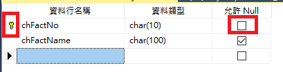

**2. ProductTbl（商品主檔）**

- Primary Key：`chProdNo`（商品編號）
- 說明：每個商品都有一個唯一的編號

  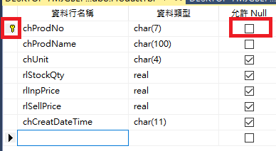

**3. InputHeadTbl（進貨單頭）**

- Primary Key：`chInpDateTime` + `chFactNo`（複合主鍵）
- 說明：同一時間、同一廠商只能有一張進貨單

  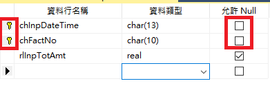

**4. InputDetailTbl（進貨單身）**

- Primary Key：`chInpDateTime` + `chFactNo` + `chProdNo`（複合主鍵）
- 說明：同一張進貨單中，同一商品只能出現一次

  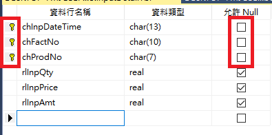

**5. OutputHeadTbl（出貨單頭）**

- Primary Key：`chOutpDateTime` + `chFactNo`（複合主鍵）
- 說明：同一時間、同一廠商只能有一張出貨單
  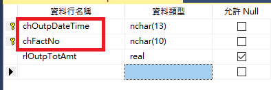

**6. OutputDetailTbl（出貨單身）**

- Primary Key：`chOutpDateTime` + `chFactNo` + `chProdNo`（複合主鍵）
- 說明：同一張出貨單中，同一商品只能出現一次

  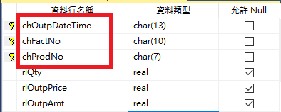

#### 1.3 練習：找出資料表的 Primary Key

講師、助教會指定資料表，請同學看著SSMS回答該資料表的 Primary Key 是哪一個（或哪些）欄位。

**範例問題：**

- Q：`InputHeadTbl` 的 Primary Key 是什麼？
- A：`chInpDateTime` 和 `chFactNo`（2個PK）
- Q：`ProductTbl` 的 Primary Key 是什麼？
- A：`chProdNo`

---

### 📝 步驟二：為什麼需要 JOIN？從單表到雙表的查詢

#### 2.1 問題情境

假設我們想要查詢「完整的進貨資料」(InputHeadTbl、InputDetailTbl))，包含：

- 進貨日期時間   (兩個Table的PK)
- 廠商代號          (兩個Table的PK)
- 
- 進貨總金額（來自 InputHeadTbl）
- 
- 商品編號（來自 InputDetailTbl）
- 進貨數量（來自 InputDetailTbl）
- 進貨單價（來自 InputDetailTbl）
- 進貨金額（來自 InputDetailTbl）

這些資料分別存在兩個資料表中，就需要用JOIN組合

#### 2.2 資料表關係分析

**InputHeadTbl（進貨單頭）** 的資料：

- 記錄每一張進貨單的基本資訊
- Primary Key：`chInpDateTime` + `chFactNo`

**InputDetailTbl（進貨單身）** 的資料：

- 記錄每一張進貨單的明細資料（每張單可能有多筆商品）
- Primary Key：`chInpDateTime` + `chFactNo` + `chProdNo`

**關聯關係：**

- 一張進貨單頭（InputHeadTbl）對應多筆進貨單身（InputDetailTbl）
- 關聯的欄位：`chInpDateTime` 和 `chFactNo`（這兩個欄位共同組成最小共通主鍵）

#### 2.3 為什麼 JOIN 需要使用 Primary Key？

**重點概念：JOIN 最小共通主鍵**

當我們要 JOIN 兩個資料表時，必須找到兩個資料表的**最小共通主鍵**來作為關聯條件。

**為什麼？**

- Primary Key 保證唯一性，可以準確地將兩個資料表的記錄配對
- 使用最小共通主鍵（兩個資料表都有的主鍵欄位）可以確保關聯的正確性

**範例：InputHeadTbl JOIN InputDetailTbl**

- InputHeadTbl 的主鍵：`chInpDateTime` + `chFactNo`
- InputDetailTbl 的主鍵：`chInpDateTime` + `chFactNo` + `chProdNo`
- **最小共通主鍵**：`chInpDateTime` + `chFactNo`（兩個資料表都有這兩個欄位）

#### 2.4 實作：InputHeadTbl JOIN InputDetailTbl

```sql
SELECT 
    IH.chInpDateTime AS '進貨日期時間',
    IH.chFactNo AS '廠商代號',
    IH.rlInpTotAmt AS '進貨總金額',
    ID.chProdNo AS '商品編號',
    ID.rlInpQty AS '進貨數量',
    ID.rlInpPrice AS '進貨單價',
    ID.rlInpAmt AS '進貨金額'
FROM InputHeadTbl IH
LEFT JOIN InputDetailTbl ID 
    ON IH.chInpDateTime = ID.chInpDateTime 
    AND IH.chFactNo = ID.chFactNo
```

**SQL 語法說明：**

1. **FROM InputHeadTbl IH**：以進貨單頭表作為主表（左表），別名為 `IH`
2. **LEFT JOIN InputDetailTbl ID**：關聯進貨單身表（右表），別名為 `ID`
3. **ON 條件**：
   - `IH.chInpDateTime = ID.chInpDateTime`：進貨日期時間必須相同
   - `AND IH.chFactNo = ID.chFactNo`：廠商代號必須相同
   - 這兩個條件共同組成最小共通主鍵的比對

**查詢結果說明：**

- 如果一張進貨單頭有多筆明細，會產生多筆記錄（一對多關係）
- 如果一張進貨單頭沒有明細，明細欄位會顯示為 `NULL`（因為使用 LEFT JOIN）

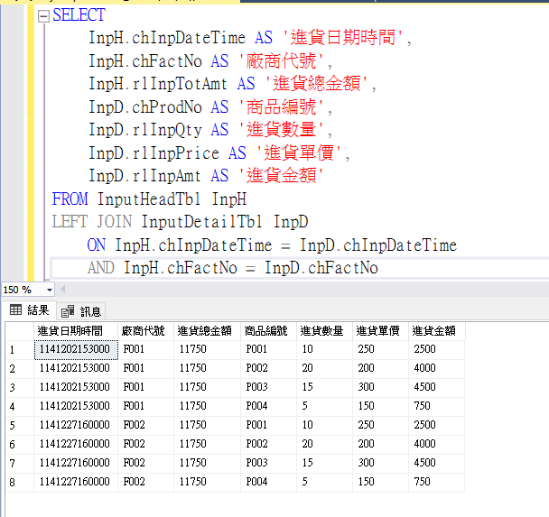

#### 2.5 練習：出貨單頭 JOIN 出貨單身

**請同學練習：**

參考上述進貨單的 JOIN 寫法，寫出出貨單頭（OutputHeadTbl）JOIN 出貨單身（OutputDetailTbl）的 SQL 查詢。

**提示：**

- OutputHeadTbl 的主鍵：`chOutpDateTime` + `chFactNo`
- OutputDetailTbl 的主鍵：`chOutpDateTime` + `chFactNo` + `chProdNo`
- 最小共通主鍵：`chOutpDateTime` + `chFactNo`

**請寫出完整的 SQL 查詢：**

```sql
-- 請同學寫出 SQL 查詢
```

---

### 📝 步驟三：逐步增加 JOIN - 擴充欄位資訊

#### 3.1 問題情境

現在我們已經有了 `InputHeadTbl JOIN InputDetailTbl` 的查詢結果，但我們還想要：

- 顯示廠商名稱（而不是只有廠商代號）
- 顯示商品名稱（而不是只有商品編號）

**問題：** 該如何增加 JOIN 來取得這些資訊？

#### 3.2 思考過程：如何決定要 JOIN 哪個資料表？

**步驟 1：找出需要的欄位在哪個資料表**

- 需要「廠商名稱」→ 查詢 `FactoryTbl` 資料表，欄位是 `chFactName`
- 需要「商品名稱」→ 查詢 `ProductTbl` 資料表，欄位是 `chProdName`

**步驟 2：找出關聯的 Key Column（最小主鍵）**

**如何思考關聯條件？**

1. **從現有的查詢結果中找出關聯欄位**

   - 我們已經有 `chFactNo`（廠商代號）→ 可以用來關聯 `FactoryTbl`
   - 我們已經有 `chProdNo`（商品編號）→ 可以用來關聯 `ProductTbl`
2. **確認目標資料表的主鍵**

   - `FactoryTbl` 的主鍵：`chFactNo`
   - `ProductTbl` 的主鍵：`chProdNo`
3. **建立關聯條件**

   - JOIN FactoryTbl：`IH.chFactNo = F.chFactNo`（使用最小主鍵 `chFactNo`）
   - JOIN ProductTbl：`ID.chProdNo = P.chProdNo`（使用最小主鍵 `chProdNo`）

#### 3.3 實作：增加 FactoryTbl 的 JOIN

**第一步：先加上廠商名稱**

```sql
SELECT 
    IH.chInpDateTime AS '進貨日期時間',
    IH.chFactNo AS '廠商代號',
    F.chFactName AS '廠商名稱',  -- 新增的欄位
    IH.rlInpTotAmt AS '進貨總金額',
    ID.chProdNo AS '商品編號',
    ID.rlInpQty AS '進貨數量',
    ID.rlInpPrice AS '進貨單價',
    ID.rlInpAmt AS '進貨金額'
FROM InputHeadTbl IH
LEFT JOIN InputDetailTbl ID 
    ON IH.chInpDateTime = ID.chInpDateTime 
    AND IH.chFactNo = ID.chFactNo
LEFT JOIN FactoryTbl F 
    ON IH.chFactNo = F.chFactNo  -- 新增的 JOIN
```

**重點說明：**

- 使用 `LEFT JOIN FactoryTbl F` 來關聯廠商主檔
- 關聯條件：`IH.chFactNo = F.chFactNo`
- 為什麼用 `IH.chFactNo`？因為 `chFactNo` 在 `InputHeadTbl` 中，而我們要從 `InputHeadTbl` 關聯到 `FactoryTbl`
- 為什麼用 `F.chFactNo`？因為 `chFactNo` 是 `FactoryTbl` 的主鍵

#### 3.4 實作：增加 ProductTbl 的 JOIN

**第二步：再加上商品名稱**

```sql
SELECT 
    IH.chInpDateTime AS '進貨日期時間',
    IH.chFactNo AS '廠商代號',
    F.chFactName AS '廠商名稱',
    IH.rlInpTotAmt AS '進貨總金額',
    ID.chProdNo AS '商品編號',
    P.chProdName AS '商品名稱',  -- 新增的欄位
    ID.rlInpQty AS '進貨數量',
    ID.rlInpPrice AS '進貨單價',
    ID.rlInpAmt AS '進貨金額'
FROM InputHeadTbl IH
LEFT JOIN InputDetailTbl ID 
    ON IH.chInpDateTime = ID.chInpDateTime 
    AND IH.chFactNo = ID.chFactNo
LEFT JOIN FactoryTbl F 
    ON IH.chFactNo = F.chFactNo
LEFT JOIN ProductTbl P 
    ON ID.chProdNo = P.chProdNo  -- 新增的 JOIN
```

**重點說明：**

- 使用 `LEFT JOIN ProductTbl P` 來關聯商品主檔
- 關聯條件：`ID.chProdNo = P.chProdNo`
- 為什麼用 `ID.chProdNo`？因為 `chProdNo` 在 `InputDetailTbl` 中，而我們要從 `InputDetailTbl` 關聯到 `ProductTbl`
- 為什麼用 `P.chProdNo`？因為 `chProdNo` 是 `ProductTbl` 的主鍵

#### 3.5 完整的進貨明細查詢（參考範例）

**欄位：進貨日期、廠商代號、廠商名稱、商品代號、商品名稱、單價、數量、單項金額**
以下是一個完整的實戰範例，展示如何使用多個 LEFT JOIN 來查詢進貨明細報表：

```sql
SELECT 
    IH.chInpDateTime AS '進貨日期',
    IH.chFactNo AS '廠商代號',
    F.chFactName AS '廠商名稱',
    ID.chProdNo AS '商品代號',
    P.chProdName AS '商品名稱',
    ID.rlInpPrice AS '單價',
    ID.rlInpQty AS '數量',
    ID.rlInpAmt AS '單項金額'
FROM InputHeadTbl IH (nolock)
LEFT JOIN InputDetailTbl ID (nolock) 
    ON IH.chInpDateTime = ID.chInpDateTime 
    AND IH.chFactNo = ID.chFactNo
LEFT JOIN FactoryTbl F (nolock) 
    ON IH.chFactNo = F.chFactNo
LEFT JOIN ProductTbl P (nolock) 
    ON ID.chProdNo = P.chProdNo
WHERE IH.chInpDateTime >= '1141202000000' 
    AND IH.chInpDateTime <= '1141202153000'
```

**資料表關聯關係圖：**

```
InputHeadTbl (IH) ──LEFT JOIN──> InputDetailTbl (ID)
     │                                    │
     │                                    │
     └──LEFT JOIN──> FactoryTbl (F)       └──LEFT JOIN──> ProductTbl (P)
```

**查詢邏輯說明：**

1. **以進貨單頭表為主**：查詢從 `InputHeadTbl` 開始，確保所有進貨單都會被查詢到
2. **關聯進貨單身表**：透過進貨日期時間和廠商代號關聯，取得每張進貨單的明細資料
3. **擴充廠商資訊**：透過廠商代號關聯廠商主檔，取得廠商名稱
4. **擴充商品資訊**：透過商品代號關聯商品主檔，取得商品名稱
5. **使用 LEFT JOIN 的原因**：確保即使某些資料表缺少對應資料（例如商品主檔中沒有該商品），進貨明細記錄仍然會被顯示

#### 3.6 練習：寫出出貨明細的完整查詢

**請同學練習：**

參考上述進貨明細的完整查詢 SQL，寫出出貨明細的完整查詢。

**提示：**

- 出貨單頭表：`OutputHeadTbl`（別名建議用 `OH`）
- 出貨單身表：`OutputDetailTbl`（別名建議用 `OD`）
- 廠商主檔：`FactoryTbl`（別名建議用 `F`）
- 商品主檔：`ProductTbl`（別名建議用 `P`）
- 出貨單頭的主鍵：`chOutpDateTime` + `chFactNo`
- 出貨單身的主鍵：`chOutpDateTime` + `chFactNo` + `chProdNo`

**請寫出完整的 SQL 查詢：**

```sql
-- 請同學在此寫出完整的出貨明細查詢 SQL
```

---

### 📝 步驟四：SUM 與 GROUP BY - 聚合查詢

#### 4.1 問題情境

假設我們想要查詢「這個月的進貨總金額」，該如何撰寫 SQL？

**問題分析：**

- 進貨金額存在 `InputDetailTbl` 的 `rlInpAmt` 欄位
- 需要將多筆記錄的進貨金額加總起來
- 需要按照月份分組

**解決方法：** 使用 `SUM()` 函數和 `GROUP BY` 子句

#### 4.2 SUM 函數的用法

**SUM 函數** 用來計算數值欄位的總和。

**語法：**

```sql
SUM(欄位名稱)
```

**範例：**

```sql
SELECT SUM(rlInpAmt) AS '總金額'
FROM InputDetailTbl
```

這會計算 `InputDetailTbl` 中所有記錄的 `rlInpAmt` 總和。

#### 4.3 GROUP BY 的用法

**GROUP BY** 用來將查詢結果按照指定的欄位分組，通常與聚合函數（如 SUM、COUNT、AVG）一起使用。

**語法：**

```sql
SELECT 欄位1, 欄位2, SUM(欄位3)
FROM 資料表
GROUP BY 欄位1, 欄位2
```

**重點規則：**

- `SELECT` 中的欄位，如果不是聚合函數，就必須出現在 `GROUP BY` 中
- `GROUP BY` 會將相同值的記錄分組在一起
- 每個分組會產生一筆結果記錄

#### 4.4 實作：按日期分組的進貨總金額

**範例 1：按照進貨日期時間（前 7 碼，民國年月日）分組**

```sql
SELECT 
    SUBSTRING(chInpDateTime, 1, 7) AS '進貨日期',
    chFactNo AS '廠商代號',
    SUM(rlInpAmt) AS '進貨總金額'
FROM InputDetailTbl
GROUP BY SUBSTRING(chInpDateTime, 1, 7), chFactNo
```

**SQL 語法說明：**

1. **SUBSTRING(chInpDateTime, 1, 7)**：

   - 從 `chInpDateTime` 欄位中取出第 1 個字元開始的 7 個字元
   - 例如：`'1141202153000'` → `'1141202'`（民國 114 年 12 月 02 日）
   - 這代表「年月日」的資訊
2. **SUM(rlInpAmt)**：

   - 計算每個分組的進貨金額總和
3. **GROUP BY SUBSTRING(chInpDateTime, 1, 7), chFactNo**：

   - 按照「進貨日期（前 7 碼）」和「廠商代號」分組
   - 相同日期、相同廠商的記錄會被分在同一組

**查詢結果說明：**

- 每一筆結果代表「某一天、某個廠商」的進貨總金額
- 如果同一天、同一廠商有多筆進貨記錄，會被加總成一筆

#### 4.5 實作：按月份分組的進貨總金額

**範例 2：按照進貨日期時間（前 5 碼，民國年月）分組**

```sql
SELECT 
    SUBSTRING(chInpDateTime, 1, 5) AS '進貨年月',
    SUM(rlInpAmt) AS '進貨總金額'
FROM InputDetailTbl
GROUP BY SUBSTRING(chInpDateTime, 1, 5)
```

**SQL 語法說明：**

1. **SUBSTRING(chInpDateTime, 1, 5)**：

   - 從 `chInpDateTime` 欄位中取出第 1 個字元開始的 5 個字元
   - 例如：`'1141202153000'` → `'11412'`（民國 114 年 12 月）
   - 這代表「年月」的資訊
2. **SUM(rlInpAmt)**：

   - 計算每個月份的進貨金額總和
3. **GROUP BY SUBSTRING(chInpDateTime, 1, 5)**：

   - 按照「進貨年月（前 5 碼）」分組
   - 相同年月的記錄會被分在同一組

**查詢結果說明：**

- 每一筆結果代表「某個月份」的進貨總金額
- 如果同一個月有多筆進貨記錄，會被加總成一筆

#### 4.6 實作：完整的進貨月報查詢（使用 JOIN）

**完整的進貨月報查詢範例：**

**欄位：日期、廠商、金額**

在實際應用中，月報通常需要顯示廠商名稱（而不是只有廠商代號），並且需要篩選特定日期範圍。以下是一個完整的進貨月報查詢範例：

```sql
SELECT 
    SUBSTRING(IH.chInpDateTime, 1, 7) AS '日期',
    F.chFactName AS '廠商名稱',
    SUM(ID.rlInpAmt) AS '總金額'
FROM InputHeadTbl IH (nolock)
LEFT JOIN InputDetailTbl ID (nolock) 
    ON IH.chInpDateTime = ID.chInpDateTime 
    AND IH.chFactNo = ID.chFactNo
LEFT JOIN FactoryTbl F (nolock) 
    ON IH.chFactNo = F.chFactNo
WHERE IH.chInpDateTime >= '1141202000000' 
    AND IH.chInpDateTime <= '1141227999999'
GROUP BY SUBSTRING(IH.chInpDateTime, 1, 7), F.chFactName
ORDER BY SUBSTRING(IH.chInpDateTime, 1, 7), F.chFactName
```

**SQL 語法說明：**

1. **SELECT 欄位**：

   - `SUBSTRING(IH.chInpDateTime, 1, 7) AS '日期'`：從進貨日期時間中取出前 7 碼（民國年月日）
   - `F.chFactName AS '廠商名稱'`：顯示廠商名稱（透過 JOIN FactoryTbl 取得）
   - `SUM(ID.rlInpAmt) AS '總金額'`：計算每個分組的進貨金額總和
2. **FROM 和 JOIN**：

   - 以 `InputHeadTbl` 為主表（別名 `IH`）
   - LEFT JOIN `InputDetailTbl`（別名 `ID`）取得明細資料
   - LEFT JOIN `FactoryTbl`（別名 `F`）取得廠商名稱
3. **WHERE 子句**：

   - 篩選進貨日期時間在指定範圍內的記錄
   - `'1141202000000'` 表示民國 114 年 12 月 02 日 00:00:00
   - `'1141227999999'` 表示民國 114 年 12 月 27 日 23:59:59（使用 999999 包含當天所有時間）
4. **GROUP BY**：

   - 按照「日期（前 7 碼）」和「廠商名稱」分組
   - 相同日期、相同廠商的記錄會被分在同一組
5. **ORDER BY**：

   - 按照日期和廠商名稱排序，讓報表更容易閱讀

**查詢結果說明：**

- 每一筆結果代表「某一天、某個廠商」的進貨總金額
- 結果會按照日期和廠商名稱排序
- 如果同一天、同一廠商有多筆進貨記錄，會被加總成一筆

**與簡單範例的差異：**

| 項目     | 簡單範例（4.4、4.5）    | 完整月報範例（4.6）       |
| -------- | ----------------------- | ------------------------- |
| 資料表   | 只使用 `InputDetailTbl` | 使用 JOIN 關聯多個資料表  |
| 廠商資訊 | 顯示廠商代號            | 顯示廠商名稱              |
| 日期篩選 | 無 WHERE 子句           | 有 WHERE 子句篩選日期範圍 |
| 排序     | 無 ORDER BY             | 有 ORDER BY 排序          |

#### 4.7 練習：寫出完整的出貨月報查詢

請同學參考上述進貨月報查詢的範例，寫出按月份查詢出貨總金額的 SQL 查詢。

```sql
-- 請同學在此寫出完整的出貨月報查詢 SQL
```

---

### 💡 重點整理

#### JOIN 的重點

- ✅ **JOIN 需要使用最小共通主鍵**：找到兩個資料表都有的主鍵欄位來作為關聯條件
- ✅ **逐步增加 JOIN**：先從兩個資料表開始，再逐步增加其他資料表
- ✅ **思考關聯條件**：從現有查詢結果中找出關聯欄位，確認目標資料表的主鍵，建立關聯條件
- ✅ **使用 LEFT JOIN**：確保即使某些資料表缺少對應資料，記錄仍然會被顯示

#### GROUP BY 的重點

- ✅ **SUM 函數**：用來計算數值欄位的總和
- ✅ **GROUP BY**：用來將查詢結果按照指定的欄位分組
- ✅ **SUBSTRING 函數**：用來從字串中取出部分字元（例如：取出日期時間的前幾碼）
- ✅ **SELECT 規則**：SELECT 中的欄位，如果不是聚合函數，就必須出現在 GROUP BY 中

---

## 🎯 課程成果

---

### 📊 單元一：DataGridView 資料綁定說明

#### 1.1 DataGridView 與 DataTable 的綁定方式

在 Windows Forms 中，我們可以使用 `DataSource` 屬性將 `DataTable` 的資料直接綁定到 `DataGridView` 控制項。

**基本語法：**

```csharp
dgv.DataSource = dt;
```

**運作原理：**

1. **自動產生欄位**：當 `DataTable` 綁定到 `DataGridView` 時，`DataGridView` 會自動根據 `DataTable` 的欄位（Columns）產生對應的欄位標題和資料列
2. **欄位標題對應**：SQL 查詢中使用 `AS` 別名的欄位名稱，會自動成為 `DataGridView` 的欄位標題
3. **資料自動顯示**：`DataTable` 中的每一筆資料列（Row）會自動顯示在 `DataGridView` 的對應行中

**參考進貨明細查詢的程式碼。**

---

### 📋 單元二：完成出貨報表查詢功能

#### 2.1 任務說明

進貨明細查詢、進貨月報查詢的程式碼已全部完成，請同學參考進貨明細查詢的程式碼，完成出貨明細查詢的程式碼。

出貨細項查詢（`btnOutDetailQuery_Click`）和出貨月報查詢（`btnOutMonthQuery_Click`）的程式碼已經完成部份，
唯獨 SQL 查詢語句（`strSQL`）被預留為空字串，需要同學根據本單元所學的 JOIN 和 GROUP BY 知識，參考進貨報表的 SQL 寫法來完成。

#### 2.2 出貨細項查詢（btnOutDetailQuery_Click）

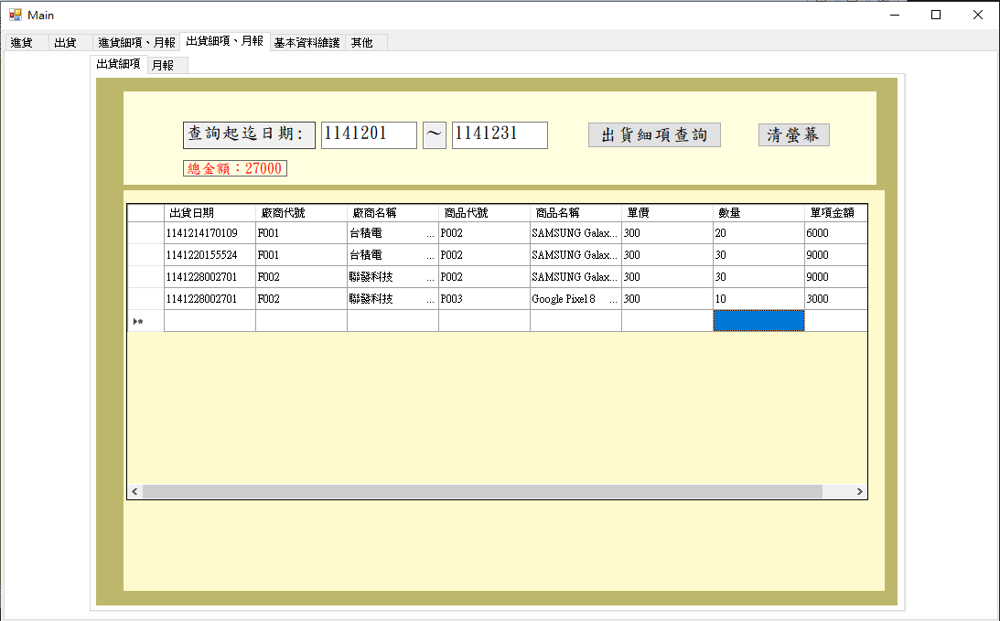

#### 2.3 出貨月報查詢（btnOutMonthQuery_Click）

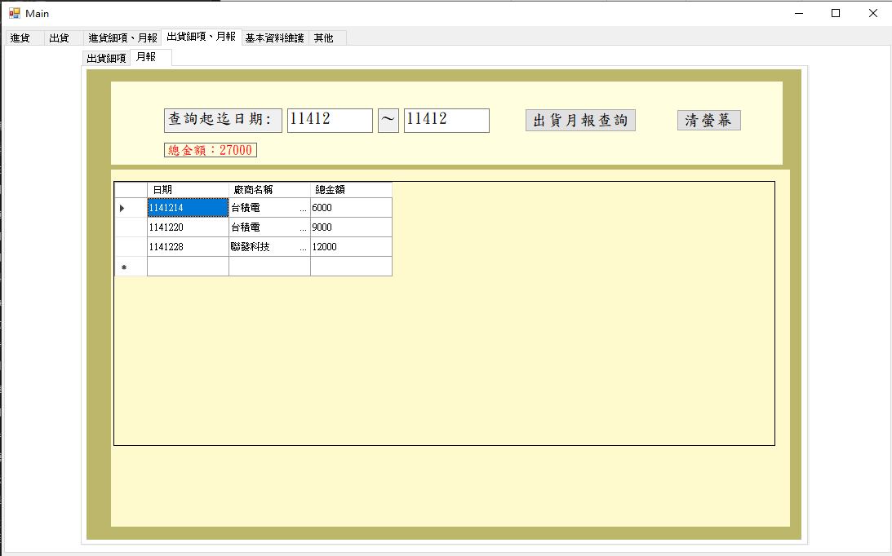

---

將第 7 堂課（`Session_7_AddressBook_Complete`）的通訊錄維護系統整合到庫存管理系統的「基本資料維護」分頁（`tabPage5`）中，完成本課程的最終成果。

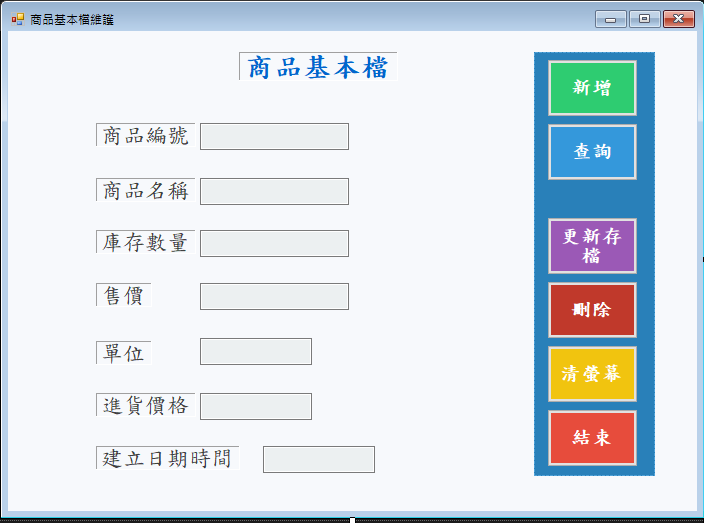

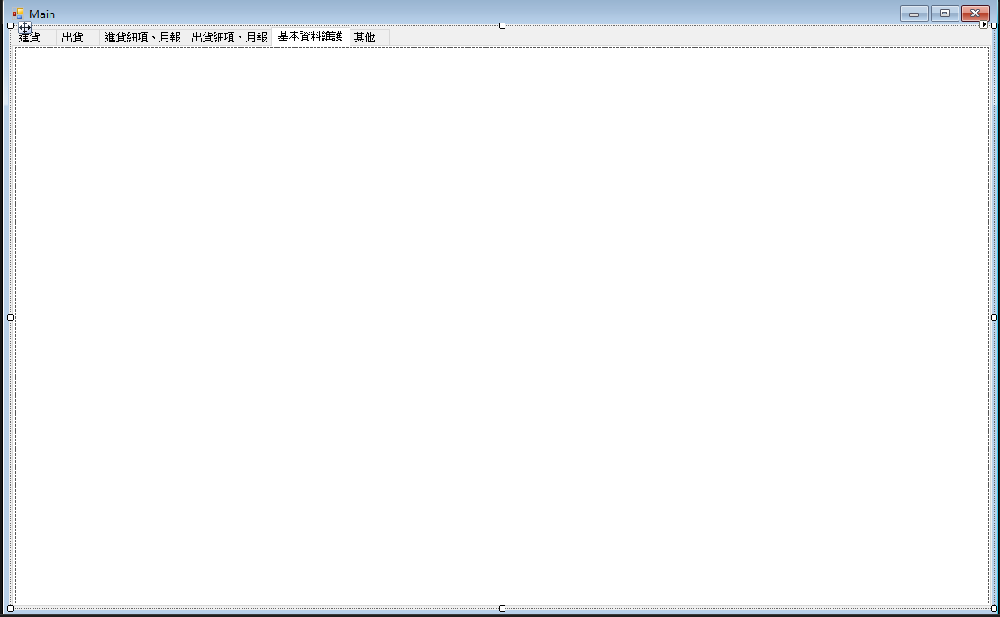

---

### 🎓 課程總結

恭喜您完成本單元的學習！透過本單元的實作，您已經：

- ✅ 學會使用 SQL JOIN 查詢多個資料表
- ✅ 學會使用 GROUP BY 和 SUM 進行聚合查詢
- ✅ 學會將 SQL 查詢結果綁定到 DataGridView
- ✅ 完成庫存管理系統的進貨和出貨報表功能
- ✅ 整合通訊錄維護系統，完成本課程的最終成果

這些技能將幫助您在未來的系統開發中，能夠靈活運用 SQL 查詢和資料綁定技術，開發出功能完整的資料庫應用系統。

---
