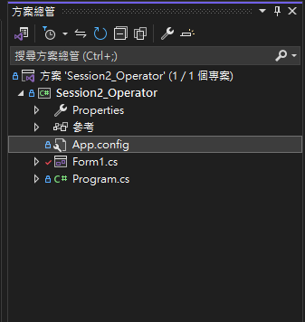
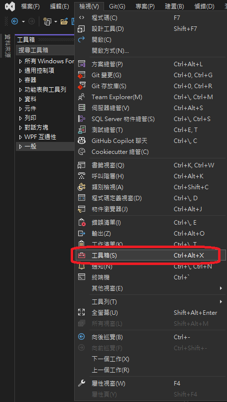
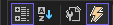
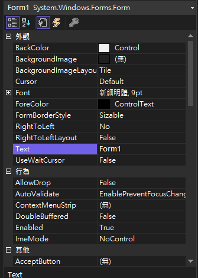
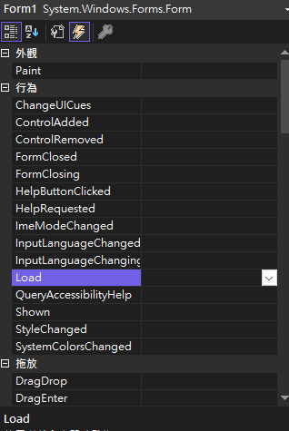
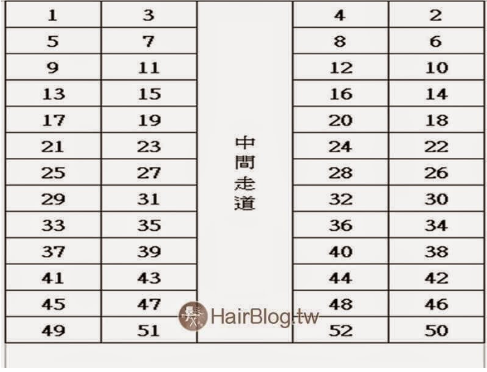

# 🚂 C#單元三：Modulo

---

## 🎯 單元目標

-✅ 熟悉 Visual Studio 的開發流程

- 延續上周課程再次熟悉Visual Studio 上環境操作
- 了解 控制項(屬性、方法、事件)
- 認識函式(Founction)
- 認識系統保留字 以及自訂變數

-✅ 理解 Modulo（模運算）的概念和應用場景
-✅ 掌握 % 運算子的使用方法
-✅ 能夠使用條件判斷（if-else）搭配 Modulo 解決實際問題

---

## 🧩 熟悉Visual Studio 上環境操作

📁方案總管 (Solution Explorer)

檢視 → 方案總管




方案-專案-表單-類別-程式碼

🧱工具箱 / 控制項 (Control)

檢視 → 工具箱



⚙️ 屬性 (Property)

檢視 → 屬性視窗

屬性視窗下 有 控制屬性及 事件



第一個選項為 分類排序
第二個選項為 字母排序

第三個選項為⚙️ 屬性（Property）



常見屬性類別

| 類別              | 常見屬性                                                | 用途                     |
| ----------------- | ------------------------------------------------------- | ------------------------ |
| 外觀 (Appearance) | `BackColor`,`ForeColor`,`Font`,`Text`,`Image` | 控制項顯示效果           |
| 佈局 (Layout)     | `Size`,`Location`,`Dock`,`Anchor`               | 控制控制項位置與大小     |
| 行為 (Behavior)   | `Enabled`,`Visible`,`TabIndex`,`TabStop`        | 控制互動性               |
| 資料 (Data)       | `DataBindings`                                        | 綁定資料來源             |
| 通用 (Misc)       | `Name`,`Tag`                                        | 控制項識別或存放自訂資料 |

第四個選項為⚡ 事件（Event）



常見事件類別

| 類別            | 常見事件                                                | 用途                       |
| --------------- | ------------------------------------------------------- | -------------------------- |
| 滑鼠 (Mouse)    | `Click`,`DoubleClick`,`MouseEnter`,`MouseLeave` | 使用者滑鼠操作時觸發       |
| 鍵盤 (Keyboard) | `KeyDown`,`KeyPress`,`KeyUp`                      | 鍵盤操作觸發               |
| 焦點 (Focus)    | `Enter`,`Leave`                                     | 控制項獲得或失去焦點時觸發 |
| 文字變更        | `TextChanged`                                         | TextBox 內容變動時觸發     |
| 表單事件        | `Load`,`Shown`,`Closing`                          | 控制表單生命週期觸發       |

屬性 vs 事件  差異

| 項目       | 屬性 (Property)              | 事件 (Event)                          |
| ---------- | ---------------------------- | ------------------------------------- |
| 功能       | 設定控制項的外觀與狀態       | 指定互動時要執行的程式                |
| 修改方式   | 直接在屬性視窗設定           | 在事件視窗指定事件處理函式            |
| 範例       | `Name`, `Text`, `Font` | `Click`, `Leave`, `TextChanged` |
| 對應程式碼 | Designer.cs                  | 事件處理函式（C# 程式碼）             |

---

## ƒ函式 (Function)

```csharp
[存取修飾詞] [回傳型別] 函式名稱([參數列表])
{
    // 函式內的程式碼
    return 結果; // 若回傳型別不是 void
}
```

🔹 範例 1：無回傳函式

```csharp
// 顯示問候訊息
public void SayHello()
{
    MessageBox.Show("Hello World!");
}
```

🔹 範例 2：有回傳值函式

```csharp
// 計算兩數加總
private int Add(int a, int b)
{
    return a + b;
}
```

🔹 範例 3：使用函式

```csharp
SayHello();         // 呼叫無回傳函式
int result = Add(3,5); // 呼叫有回傳值函式
MessageBox.Show(result.ToString()); // 8
```

C# 常用的存取修飾詞(還有其他的 建議可以網路上查詢暫時用不到不說明)

| 修飾詞            | 可被誰存取                   | 說明                           |
| :---------------- | :--------------------------- | :----------------------------- |
| **public**  | 所有程式碼（任何地方都能用） | 對外完全開放的成員。           |
| **private** | 只能在同一個類別內使用       | 最嚴格的封裝限制，外部看不到。 |

---

## 📝 課堂小測驗一：判斷火車票座位（靠窗/靠走道）

**規則：**

- 車型：EMU 3000型自強號，最大座位數為 52
- 輸入之座位號碼不可大於 52(只可輸入數字)
- 火車座位 1~4 排列
- 號碼除以 4 餘數為 1 或 2，位置靠窗戶
- 餘數為 3 或 0，位置靠走道

  

> [圖片資料來源請](https://hairstyle.life/taiwanrailways-seat/)

---

## 🏠 回家作業：判斷教室座位位置（靠窗/靠走道）

規則：

教室座位總數為 40
-輸入之座位號碼不可大於 40(只可輸入數字)
-座位每排 5 個
-號碼除以 5 餘數為 1 或 0，位置靠窗戶
-餘數為 2、3、4，位置靠走道
請設計一個程式，讓使用者輸入座位號碼，判斷該座位是「靠窗」還是「靠走道」，並顯示結果。

| 窗戶 | 1 | 2 |  | 3 |  | 4 | 5 | 窗戶 |
| :--: | :-: | :-: | :-: | :-: | :-: | :-: | :-: | :--: |
| 窗戶 | 6 | 7 |  | 8 |  | 9 | 10 | 窗戶 |
| 窗戶 | 11 | 12 |  | 13 |  | 14 | 15 | 窗戶 |
| 窗戶 | 16 | 17 |  | 18 |  | 19 | 20 | 窗戶 |
| 窗戶 | 21 | 22 |  | 23 |  | 24 | 25 | 窗戶 |
| 窗戶 | 26 | 27 |  | 28 |  | 29 | 30 | 窗戶 |
| 窗戶 | 31 | 32 |  | 33 |  | 34 | 35 | 窗戶 |
| 窗戶 | 36 | 37 |  | 38 |  | 39 | 40 | 窗戶 |
