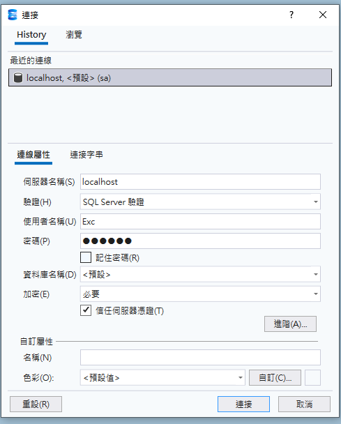
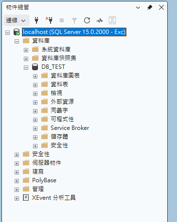
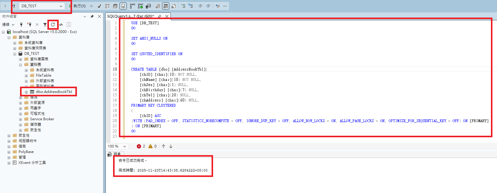
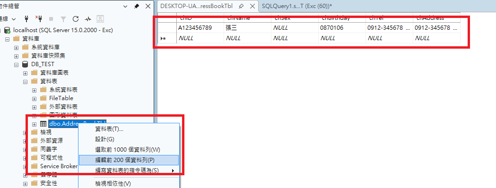
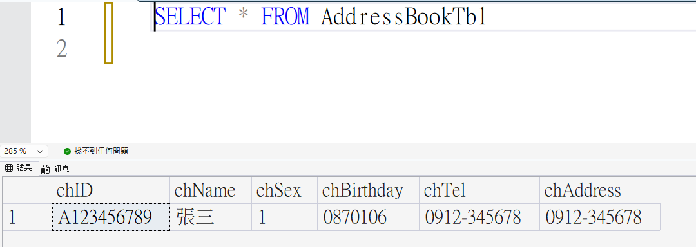
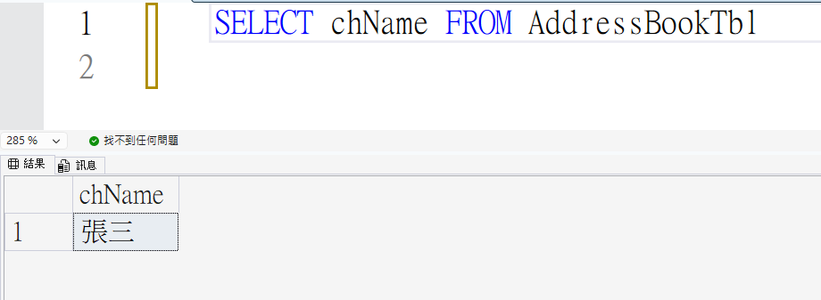
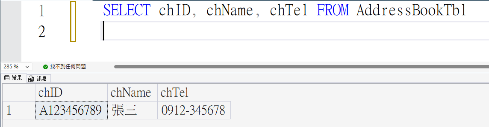
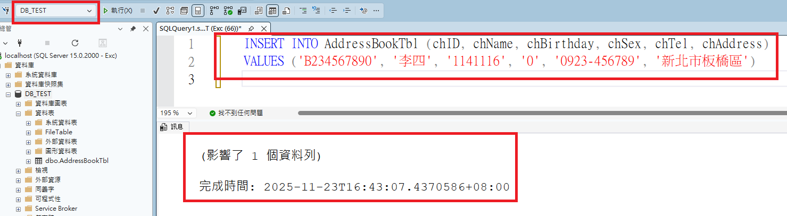

# 📖 C#單元六：通訊錄維護系統

---

## 🎯 單元目標

- ✅ 學會使用 SSMS 連線本機資料庫
- ✅ 使用 CREATE TABLE 指令建立資料表
- ✅ 了解 SQL SELECT 查詢語法的基本用法
- ✅ 學會使用 INSERT 指令新增資料
- ✅ 了解 C# 如何連接資料庫並執行查詢
- ✅ 完成通訊錄維護系統的查詢與新增功能

---

## 🔌 使用 SSMS 連線本機資料庫

### 📝 單元一：開啟 SSMS 並連線

1. 從「開始」選單開啟 **SQL Server Management Studio (SSMS)**
2. 在「連接到伺服器」視窗中，輸入以下資訊：

   - **伺服器類型**：資料庫引擎
   - **伺服器名稱**：`localhost`
   - **驗證**：SQL Server 驗證
   - **登入**：`sa` 或 `Exc`
   - **密碼**：`my@PWD` 或 `Excpwd`（依您的設定）
3. 點擊「連接」按鈕

   

### ✅ 驗證連線成功

連線成功後，您應該會在「物件總管」中看到 SQL Server 實例，可以展開查看資料庫節點。



---

## 📋 單元一：建立 AddressBookTbl 資料表

本單元將在 `DB_TEST` 資料庫中建立 `AddressBookTbl` 資料表。

### 🎯 資料表設計

我們要建立一個「通訊錄」資料表，用來儲存聯絡人資訊。

#### 欄位規劃

| 欄位名稱       | 資料型別     | 說明                  | 是否允許 NULL |
| -------------- | ------------ | --------------------- | ------------- |
| `chID`       | `char(10)` | 身份證字號（主鍵）    | ❌ 否         |
| `chName`     | `char(10)` | 姓名                  | ❌ 否         |
| `chSex`      | `char(1)`  | 性別（1/0）           | ✅ 是         |
| `chBirthday` | `char(7)`  | 生日（民國年YYYMMDD） | ✅ 是         |
| `chTel`      | `char(20)` | 電話                  | ✅ 是         |
| `chAddress`  | `char(60)` | 地址                  | ✅ 是         |

### 📝 使用 CREATE TABLE 指令建立資料表

1. 在「物件總管」中，展開 `DB_TEST` 資料庫
2. 點擊工具列上的「新增查詢」按鈕
3. 在查詢視窗中，輸入以下 SQL 指令：

```sql
USE [DB_TEST]
GO

SET ANSI_NULLS ON
GO

SET QUOTED_IDENTIFIER ON
GO

CREATE TABLE [dbo].[AddressBookTbl](
	[chID] [char](10) NOT NULL,
	[chName] [char](10) NOT NULL,
	[chSex] [char](1) NULL,
	[chBirthday] [char](7) NULL,
	[chTel] [char](20) NULL,
	[chAddress] [char](60) NULL,
PRIMARY KEY CLUSTERED 
(
	[chID] ASC
)WITH (PAD_INDEX = OFF, STATISTICS_NORECOMPUTE = OFF, IGNORE_DUP_KEY = OFF, ALLOW_ROW_LOCKS = ON, ALLOW_PAGE_LOCKS = ON, OPTIMIZE_FOR_SEQUENTIAL_KEY = OFF) ON [PRIMARY]
) ON [PRIMARY]
GO
```

4. 點擊工具列上的「執行」按鈕（或按 `F5`）
5. 在「訊息」視窗中，應該會顯示「命令已成功完成」

### ✅ 驗證資料表建立成功

1. 在「物件總管」中，展開 `DB_TEST` 資料庫
2. 展開「資料表」節點
3. 您應該會看到 `dbo.AddressBookTbl` 資料表
4. 如果沒有看到，請在「資料表」節點上按右鍵，選擇「重新整理」

   

---

## 📝 單元二：使用編輯模式新增測試資料

### 📋 新增測試資料

1. 在「物件總管」中，展開 `DB_TEST` 資料庫
2. 展開「資料表」節點
3. 右鍵點擊 `dbo.AddressBookTbl` 資料表
4. 選擇「編輯前 200 個資料列」
5. 在資料編輯視窗中，新增以下測試資料：

| chID       | chName | chSex | chBirthday | chTel       | chAddress    |
| ---------- | ------ | ----- | ---------- | ----------- | ------------ |
| A123456789 | 張三   | 1     | 0870106    | 0912-345678 | 台北市信義區 |

6. 輸入完成後，按 `Enter` 或點擊其他列，資料會自動儲存

   

---

## 📖 單元三：練習 SELECT * 查詢

### 🔹 SELECT * 語法

使用 `SELECT * FROM 資料表名稱` 可以查詢資料表中的所有欄位。

#### 範例：查詢 AddressBookTbl 的所有資料

```sql
SELECT * FROM AddressBookTbl
```

### 📝 執行步驟

1. 在 SSMS 中，點擊「新增查詢」按鈕
2. 確認查詢視窗上方顯示的資料庫為 `DB_TEST`
3. 輸入以下 SQL 指令：

```sql
SELECT * FROM AddressBookTbl
```

4. 點擊「執行」按鈕（或按 `F5`）
5. 在「結果」視窗中，您應該會看到資料表的所有欄位和資料

   

#### 結果說明

執行 `SELECT * FROM AddressBookTbl` 後，會顯示以下欄位：

- `chID`（身份證字號）
- `chName`（姓名）
- `chSex`（性別）
- `chBirthday`（生日）
- `chTel`（電話）
- `chAddress`（地址）

> 💡 Tip：`*` 代表「所有欄位」，這是最簡單的查詢方式。

---

## 📖 單元四：練習 SELECT 特定欄位

### 🔹 SELECT 特定欄位語法

使用 `SELECT 欄位名稱1, 欄位名稱2, ...` 可以只查詢指定的欄位。

#### 語法

```sql
SELECT 欄位名稱1, 欄位名稱2, 欄位名稱3
FROM 資料表名稱
```

### 📝 練習範例

#### 範例一：查詢單一欄位（姓名）

```sql
SELECT chName
FROM AddressBookTbl
```



#### 範例二：查詢三個欄位（身份證字號、姓名、電話）

```sql
SELECT chID, chName, chTel
FROM AddressBookTbl
```



#### 範例三：使用 WHERE 條件查詢特定身份證字號

```sql
SELECT * FROM AddressBookTbl WHERE chID = 'A123456789'
```

### 📝 執行步驟

1. 在查詢視窗中，輸入以下 SQL 指令（以範例一為例）：

```sql
SELECT chName
FROM AddressBookTbl
```

2. 點擊「執行」按鈕（或按 `F5`）
3. 在「結果」視窗中，您應該只會看到 `chName` 一個欄位

#### 結果說明

執行 `SELECT chName FROM AddressBookTbl` 後，只會顯示：

- `chName`（姓名）

其他欄位（如 `chID`、`chSex`、`chBirthday`、`chTel`、`chAddress`）不會顯示。

> 💡 **Tip**：查詢特定欄位可以減少資料傳輸量，提高查詢效能，這是實際開發中的最佳實踐。

---

## 💻 單元五：程式講解 - 查詢按鈕功能與 ComboBox 使用

### 🎯 通訊錄維護系統介面說明

本單元將建立一個通訊錄維護系統，包含以下功能：

- **查詢**：根據身份證字號查詢通訊錄資料
- **新增**：新增一筆通訊錄資料
- **清螢幕**：清除所有輸入欄位
- **結束**：關閉程式

### 🔹 ComboBox 控制項說明

ComboBox（下拉式選單）是一個常用的控制項，可以讓使用者從預設的選項中選擇。

#### ComboBox 常用屬性

| 屬性              | 說明                            | 範例                         |
| ----------------- | ------------------------------- | ---------------------------- |
| `Items`         | 選項集合                        | `cboSex.Items.Add("0.女")` |
| `SelectedIndex` | 目前選取的項目索引（從 0 開始） | `cboSex.SelectedIndex = 0` |
| `Text`          | 目前顯示的文字                  | `cboSex.Text`              |

#### ComboBox 常用方法

| 方法              | 說明         | 範例                         |
| ----------------- | ------------ | ---------------------------- |
| `Items.Add()`   | 新增選項     | `cboSex.Items.Add("0.女")` |
| `Items.Clear()` | 清除所有選項 | `cboSex.Items.Clear()`     |

### 📝 初始化 ComboBox（Main_Load 事件）

在表單載入時，我們需要初始化 ComboBox 的選項：

```csharp
private void Main_Load(object sender, EventArgs e)
{
    cboSex.Items.Clear();
    cboSex.Items.Add("0.女");
    cboSex.Items.Add("1.男");
}
```

**程式碼說明**：

- `cboSex.Items.Clear()`：清除 ComboBox 中所有現有的選項
- `cboSex.Items.Add("0.女")`：新增「0.女」選項（索引為 0）
- `cboSex.Items.Add("1.男")`：新增「1.男」選項（索引為 1）

### 🔹 查詢按鈕功能講解（btnQuery_Click）

查詢按鈕的功能是根據身份證字號查詢資料，並將結果顯示在表單上。

#### 程式碼流程說明

1. 使用者輸入身分證字號
2. 使用者按下查詢按鈕
3. 程式連線到資料庫
4. 執行 SQL 查詢指令
5. 將結果顯示在表單上

請參考 Main.cs 檔案中的 `btnQuery_Click` 事件。

#### 重點說明

1. **連線字串格式**：

   ```
   data source=資料庫伺服器位址;initial catalog=資料庫名稱; user id=使用者名稱;password=密碼;MultipleActiveResultSets=true
   ```
2. **SQL 查詢指令**：

   ```sql
   select Top 1 * from AddressBookTbl where chID = '身份證字號'
   ```

   - `Top 1`：只取第一筆資料
   - `where chID = '身份證字號'`：條件查詢
3. **DataTable 使用**：

   - `dt.Rows[0]`：第一筆資料（索引從 0 開始）
   - `dt.Rows[0]["欄位名稱"]`：取得指定欄位的值

### 🎯 練習：修改查詢功能以支援「2.不明」

請修改查詢按鈕的程式碼，加入對「2.不明」的處理：

---

## 📖 單元六：練習 INSERT 指令

### 🔹 INSERT 語法

使用 `INSERT INTO` 可以新增資料到資料表中。

#### 語法

```sql
INSERT INTO 資料表名稱 (欄位1, 欄位2, 欄位3, ...)
VALUES ('值1', '值2', '值3', ...)
```

### 📝 範例：新增一筆通訊錄資料

### 📝 執行步驟

1. 在 SSMS 中，點擊「新增查詢」按鈕
2. 確認查詢視窗上方顯示的資料庫為 `DB_TEST`
3. 輸入以下 SQL 指令：

```sql
INSERT INTO AddressBookTbl (chID, chName, chBirthday, chSex, chTel, chAddress)
VALUES ('B234567890', '李四', '1141116', '0', '0923-456789', '新北市板橋區')
```

4. 點擊「執行」按鈕（或按 `F5`）
5. 在「訊息」視窗中，應該會顯示「(1 個資料列受到影響)」
   

### ✅ 驗證資料新增成功

執行以下查詢，確認資料已成功新增：

```sql
SELECT * FROM AddressBookTbl
```

### 🔹 INSERT 語法說明

| 語法元素        | 說明                     | 範例                           |
| --------------- | ------------------------ | ------------------------------ |
| `INSERT INTO` | 指定要新增資料的資料表   | `INSERT INTO AddressBookTbl` |
| `(欄位列表)`  | 指定要新增資料的欄位     | `(chID, chName, chSex, ...)` |
| `VALUES`      | 指定要新增的值           | `VALUES ('值1', '值2', ...)` |
| 字串值          | 字串值需要用單引號括起來 | `'張三'`                     |
| 數值            | 數值不需要引號           | `123`                        |

> ⚠️ **注意**：
>
> - 字串值必須用單引號（`'`）括起來
> - 欄位順序必須與值的順序對應
> - 如果欄位允許 NULL，可以省略該欄位或使用 `NULL`

---

## 💻 單元七：程式講解 - 新增按鈕功能

### 🔹 新增按鈕功能講解（btnAdd_Click）

新增按鈕的功能是將表單上的資料新增到資料庫中。

#### 程式碼流程說明

1. 使用者輸入資料
2. 使用者按下新增按鈕
3. 程式連線到資料庫
4. 檢查身份證字號是否已存在
5. 若已存在，顯示錯誤訊息並停止新增
6. 若不存在，則組裝 INSERT 指令 並執行
7. 成功後顯示訊息 並呼叫查詢按鈕功能

請參考 Main.cs 檔案中的 `btnAdd_Click` 事件。

#### 重點說明

1. **檢查重複資料**：

   - 在新增前先查詢身份證字號是否已存在
   - 如果已存在，顯示錯誤訊息並停止新增
2. **組裝 INSERT 指令**：

   ```csharp
   string insertSQL = "INSERT INTO AddressBookTbl (chID, chName, chBirthday, chSex, chTel, chAddress) VALUES ('" +
       txtID.Text.ToString().Trim() + "', '" +
       txtName.Text.ToString().Trim() + "', '" +
       txtBirthday.Text.ToString().Trim() + "', '" +
       cboSex.Text.ToString().Trim().Substring(0, 1) + "', '" +  // 只取第一個字元
       txtTel.Text.ToString().Trim() + "', '" +
       txtAddress.Text.ToString().Trim() + "')";
   ```
3. **ComboBox 值處理**：

   - `cboSex.Text.ToString().Trim().Substring(0, 1)`：只取第一個字元
   - 例如：「0.女」→ `0`、「1.男」→ `1`
4. **ExecuteNonQuery()**：

   - 用於執行 INSERT、UPDATE、DELETE 等指令
   - 不回傳資料，只回傳受影響的資料列數

### 🔹 其他功能說明

#### 清螢幕按鈕（btnClear_Click）

```csharp
private void btnClear_Click(object sender, EventArgs e)
{
    // 清除所有欄位
    txtID.Text = "";
    txtName.Text = "";
    txtBirthday.Text = "";
    cboSex.Text = "";
    txtTel.Text = "";
    txtAddress.Text = "";
  
    // 重置身份證字號欄位狀態
    txtID.Enabled = true;  // 恢復可編輯
}
```

#### 身份證字號自動轉大寫（txtID_Leave）

```csharp
private void txtID_Leave(object sender, EventArgs e)
{
    // 當離開身份證字號欄位時，自動轉換為大寫
    txtID.Text = txtID.Text.ToUpper();
}
```

---

## 🎯 單元八：測試新增一筆資料並查詢

請實作新增一筆資料並查詢

---

## 🏠 課後作業

### 📋 作業要求

請建立一個「商品基本檔」資料表，並撰寫維護程式，包含查詢與新增功能。

### 🎯 資料表設計需求

#### 資料表名稱

`ProductTbl`

#### 欄位定義

| 欄位名稱            | 資料型別      | 說明             | 是否允許 NULL |
| ------------------- | ------------- | ---------------- | ------------- |
| `chProdNo`        | `char(7)`   | 商品編號（主鍵） | ❌ 否         |
| `chProdName`      | `char(100)` | 商品名稱         | ❌ 否         |
| `chUnit`          | `char(4)`   | 單位             | ✅ 是         |
| `rlStockQty`      | `real`      | 庫存數量         | ✅ 是         |
| `rlInpPrice`      | `real`      | 進貨價格         | ✅ 是         |
| `rlSellPrice`     | `real`      | 售價             | ✅ 是         |
| `chCreatDateTime` | `char(11)`  | 建立日期時間     | ✅ 是         |

### 📝 作業步驟

1. **建立資料表**

   - 使用 SSMS 在 `DB_TEST` 資料庫中建立 `ProductTbl` 資料表
   - 確認主鍵設定為 `chProdNo`
2. **設計程式介面**

   - 參考通訊錄維護系統的介面設計
   - 建立對應的 Label、TextBox、Button 等控制項
   - 商品編號、商品名稱、單位、庫存數量、進貨價格、售價、建立日期時間
3. **實作查詢功能**

   - 根據商品編號查詢商品資料
   - 將查詢結果顯示在表單上
4. **實作新增功能**

   - 檢查商品編號是否已存在
   - 將表單資料新增到資料庫
   - 新增成功後鎖定商品編號欄位
5. **實作其他功能**

   - 清螢幕功能
   - 結束功能
   - 其他您認為需要的功能

### 💡 提示

- 商品編號（`chProdNo`）為主鍵，使用 `char(7)` 型別
- 商品名稱（`chProdName`）為必填欄位（NOT NULL）
- 庫存數量、進貨價格、售價使用 `real` 型別（浮點數）
- 建立日期時間（`chCreatDateTime`）使用 `char(11)` 型別
- 可以參考通訊錄維護系統的程式碼結構
- 注意資料型別的轉換（特別是 `real` 型別）

### ✅ 驗證清單

完成作業後，請確認：

- [ ] 資料表已成功建立
- [ ] 所有欄位都已正確設定
- [ ] 主鍵已設定為 `chProdNo`
- [ ] 程式介面設計完整
- [ ] 查詢功能可以正常運作
- [ ] 新增功能可以正常運作
- [ ] 可以成功新增至少 3 筆測試資料
- [ ] 可以成功查詢到新增的資料

---

## 🎓 本週重點回顧

### SQL 語法

- ✅ `CREATE TABLE` 可以建立資料表
- ✅ `SELECT *` 可以查詢資料表中的所有欄位
- ✅ `SELECT 欄位名稱1, 欄位名稱2, ...` 可以查詢指定的欄位
- ✅ `INSERT INTO` 可以新增資料到資料表中
- ✅ `WHERE` 子句可以設定查詢條件

### C# 資料庫操作

- ✅ `SqlConnection` 用於建立資料庫連線
- ✅ `SqlCommand` 用於執行 SQL 指令
- ✅ `DataTable` 用於儲存查詢結果
- ✅ `ExecuteReader()` 用於執行查詢指令
- ✅ `ExecuteNonQuery()` 用於執行新增、修改、刪除指令

### Windows Forms 控制項

- ✅ `ComboBox` 用於下拉式選單
- ✅ `ComboBox.Items.Add()` 可以新增選項
- ✅ `ComboBox.SelectedIndex` 可以設定選取的項目
- ✅ `TextBox.Enabled` 可以控制欄位是否可編輯
- ✅ `TextBox.ForeColor` 可以設定文字顏色

---

## 💡 進階提示

### 🔹 使用參數化查詢（避免 SQL Injection）

在實際開發中，建議使用參數化查詢來避免 SQL Injection 攻擊：

```csharp
string strSQL = "SELECT * FROM AddressBookTbl WHERE chID = @chID";
using (SqlCommand sqlcmd = new SqlCommand(strSQL, sql_Conn))
{
    sqlcmd.Parameters.AddWithValue("@chID", txtID.Text.Trim());
    // ... 執行查詢
}
```

### 🔹 錯誤處理

建議在程式中加入更詳細的錯誤處理，以便於除錯：

```csharp
catch (SqlException ex)
{
    MessageBox.Show("資料庫錯誤：" + ex.Message, "錯誤");
}
catch (Exception ex)
{
    MessageBox.Show("系統錯誤：" + ex.Message, "錯誤");
}
```
