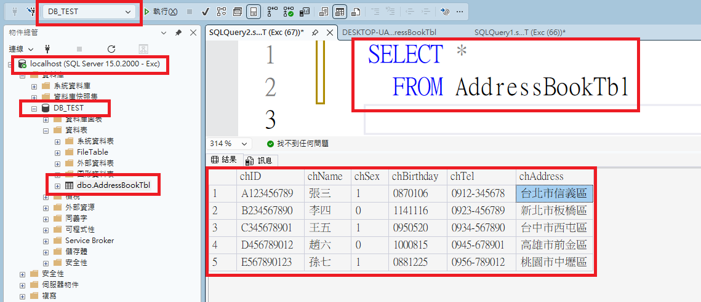
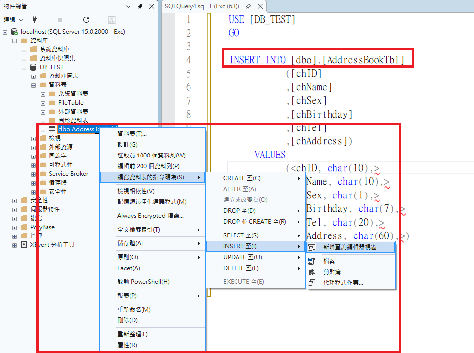
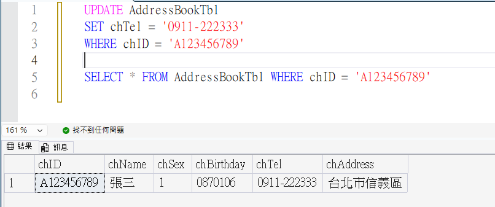
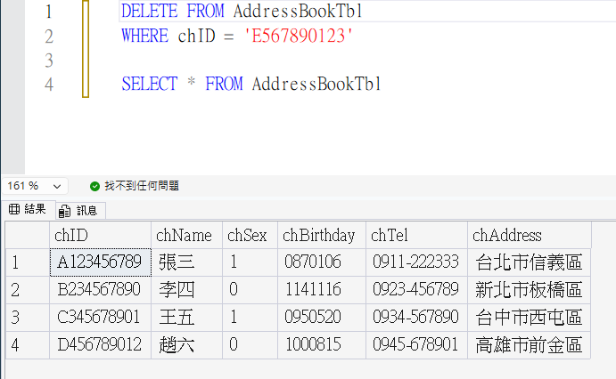
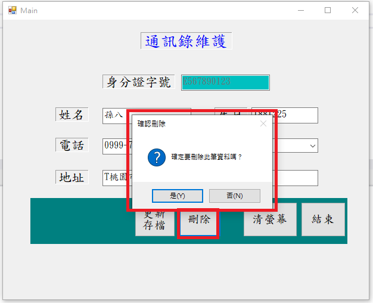
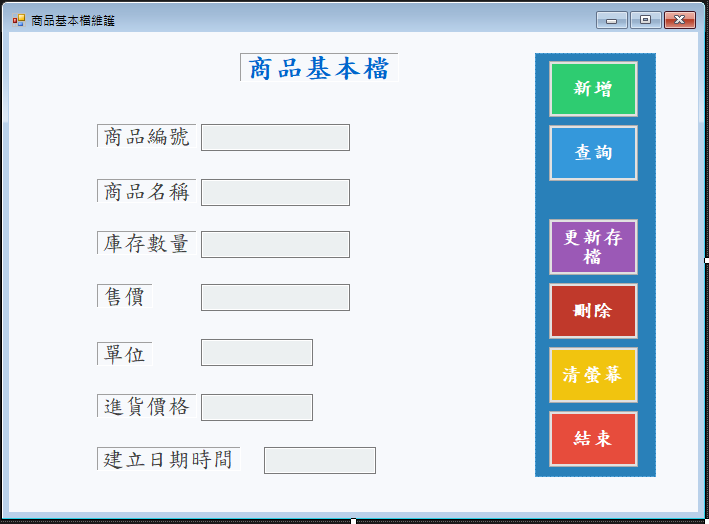

# 📖 C#單元七：通訊錄維護系統（完整功能）

---

## 🎯 單元目標

- ✅ 複習使用 SSMS 連線本機資料庫
- ✅ 複習 CREATE TABLE 指令建立資料表
- ✅ 複習 INSERT 指令新增資料
- ✅ 學會使用 UPDATE 指令更新資料
- ✅ 學會使用 DELETE 指令刪除資料
- ✅ 了解正規系統設計中刪除資料的正確做法
- ✅ 完成通訊錄維護系統的查詢、新增、更新與刪除功能

---

## 🔌 使用 SSMS 連線本機資料庫

### 📝 單元一：開啟 SSMS 並連線

1. 從「開始」選單開啟 **SQL Server Management Studio (SSMS)**
2. 在「連接到伺服器」視窗中，輸入以下資訊：

   - **伺服器類型**：資料庫引擎
   - **伺服器名稱**：`localhost`
   - **驗證**：SQL Server 驗證
   - **登入**：`sa` 或 `Exc`
   - **密碼**：`my@PWD` 或 `Excpwd`（依您的設定）
3. 點擊「連接」按鈕

### ✅ 驗證連線成功

連線成功後，您應該會在「物件總管」中看到 SQL Server 實例，可以展開查看資料庫節點。

---

## 📋 單元一：建立 AddressBookTbl 資料表

本單元將在 `DB_TEST` 資料庫中建立 `AddressBookTbl` 資料表。

### 🎯 資料表設計

我們要建立一個「通訊錄」資料表，用來儲存聯絡人資訊。

#### 欄位規劃

| 欄位名稱     | 資料型別   | 說明                  | 是否允許 NULL |
| ------------ | ---------- | --------------------- | ------------- |
| `chID`       | `char(10)` | 身份證字號（主鍵）    | ❌ 否          |
| `chName`     | `char(10)` | 姓名                  | ❌ 否          |
| `chSex`      | `char(1)`  | 性別（1/0）           | ✅ 是          |
| `chBirthday` | `char(7)`  | 生日（民國年YYYMMDD） | ✅ 是          |
| `chTel`      | `char(20)` | 電話                  | ✅ 是          |
| `chAddress`  | `char(60)` | 地址                  | ✅ 是          |

### 📝 使用 CREATE TABLE 指令建立資料表

1. 在「物件總管」中，展開 `DB_TEST` 資料庫
2. 點擊工具列上的「新增查詢」按鈕
3. 在查詢視窗中，輸入以下 SQL 指令：

```sql
USE [DB_TEST]
GO

SET ANSI_NULLS ON
GO

SET QUOTED_IDENTIFIER ON
GO

CREATE TABLE [dbo].[AddressBookTbl](
	[chID] [char](10) NOT NULL,
	[chName] [char](10) NOT NULL,
	[chSex] [char](1) NULL,
	[chBirthday] [char](7) NULL,
	[chTel] [char](20) NULL,
	[chAddress] [char](60) NULL,
PRIMARY KEY CLUSTERED 
(
	[chID] ASC
)WITH (PAD_INDEX = OFF, STATISTICS_NORECOMPUTE = OFF, IGNORE_DUP_KEY = OFF, ALLOW_ROW_LOCKS = ON, ALLOW_PAGE_LOCKS = ON, OPTIMIZE_FOR_SEQUENTIAL_KEY = OFF) ON [PRIMARY]
) ON [PRIMARY]
GO
```

4. 點擊工具列上的「執行」按鈕（或按 `F5`）
5. 在「訊息」視窗中，應該會顯示「命令已成功完成」

### ✅ 驗證資料表建立成功

1. 在「物件總管」中，展開 `DB_TEST` 資料庫
2. 展開「資料表」節點
3. 您應該會看到 `dbo.AddressBookTbl` 資料表
4. 如果沒有看到，請在「資料表」節點上按右鍵，選擇「重新整理」

---

## 📝 單元二：使用 INSERT 指令新增測試資料

### 🔹 INSERT 語法

使用 `INSERT INTO` 可以新增資料到資料表中。

#### 語法

```sql
INSERT INTO 資料表名稱 (欄位1, 欄位2, 欄位3, ...)
VALUES ('值1', '值2', '值3', ...)
```

### 📝 新增 5 筆測試資料

1. 在 SSMS 中，點擊「新增查詢」按鈕
2. 確認查詢視窗上方顯示的資料庫為 `DB_TEST`
3. 輸入以下 SQL 指令，一次新增 5 筆測試資料：

```sql
-- 第一筆資料
INSERT INTO AddressBookTbl (chID, chName, chBirthday, chSex, chTel, chAddress)
VALUES ('A123456789', '張三', '0870106', '1', '0912-345678', '台北市信義區')

-- 第二筆資料
INSERT INTO AddressBookTbl (chID, chName, chBirthday, chSex, chTel, chAddress)
VALUES ('B234567890', '李四', '1141116', '0', '0923-456789', '新北市板橋區')

-- 第三筆資料
INSERT INTO AddressBookTbl (chID, chName, chBirthday, chSex, chTel, chAddress)
VALUES ('C345678901', '王五', '0950520', '1', '0934-567890', '台中市西屯區')

-- 第四筆資料
INSERT INTO AddressBookTbl (chID, chName, chBirthday, chSex, chTel, chAddress)
VALUES ('D456789012', '趙六', '1000815', '0', '0945-678901', '高雄市前金區')

-- 第五筆資料
INSERT INTO AddressBookTbl (chID, chName, chBirthday, chSex, chTel, chAddress)
VALUES ('E567890123', '孫七', '0881225', '1', '0956-789012', '桃園市中壢區')
```

4. 點擊「執行」按鈕（或按 `F5`）
5. 在「訊息」視窗中，應該會顯示「(5 個資料列受到影響)」

### ✅ 驗證資料新增成功

執行以下查詢，確認資料已成功新增：

```sql
SELECT * FROM AddressBookTbl
```

您應該會看到 5 筆資料。



### 🔹 INSERT 指令複習

| 語法元素      | 說明                     | 範例                         |
| ------------- | ------------------------ | ---------------------------- |
| `INSERT INTO` | 指定要新增資料的資料表   | `INSERT INTO AddressBookTbl` |
| `(欄位列表)`  | 指定要新增資料的欄位     | `(chID, chName, chSex, ...)` |
| `VALUES`      | 指定要新增的值           | `VALUES ('值1', '值2', ...)` |
| 字串值        | 字串值需要用單引號括起來 | `'張三'`                     |
| 數值          | 數值不需要引號           | `123`                        |

> ⚠️ **注意**：
>
> - 字串值必須用單引號（`'`）括起來
> - 欄位順序必須與值的順序對應
> - 如果欄位允許 NULL，可以省略該欄位或使用 `NULL`

    若忘記結構可使用選單產生指令 如下圖

## 📖 單元三：練習 UPDATE 指令

### 🔹 UPDATE 語法

使用 `UPDATE` 可以更新資料表中的資料。

#### 語法

```sql
UPDATE 資料表名稱
SET 欄位1 = '值1', 欄位2 = '值2', ...
WHERE 條件
```

> ⚠️ **重要**：`WHERE` 子句非常重要！如果沒有 `WHERE` 子句，會更新資料表中的**所有資料列**。

### 📝 範例：更新一筆通訊錄資料

#### 範例一：更新單一欄位（電話）

```sql
UPDATE AddressBookTbl
SET chTel = '0911-222333'
WHERE chID = 'A123456789'
```

#### 範例二：更新多個欄位

```sql
UPDATE AddressBookTbl
SET chName = '張三豐',
    chTel = '0911-222333',
    chAddress = '台北市大安區'
WHERE chID = 'A123456789'
```

### 📝 執行步驟

1. 在 SSMS 中，點擊「新增查詢」按鈕
2. 確認查詢視窗上方顯示的資料庫為 `DB_TEST`
3. 輸入以下 SQL 指令（以範例一為例）：

```sql
UPDATE AddressBookTbl
SET chTel = '0911-222333'
WHERE chID = 'A123456789'
```

4. 點擊「執行」按鈕（或按 `F5`）
5. 在「訊息」視窗中，應該會顯示「(1 個資料列受到影響)」

### ✅ 驗證資料更新成功

執行以下查詢，確認資料已成功更新：

```sql
SELECT * FROM AddressBookTbl WHERE chID = 'A123456789'
```



### 🔹 UPDATE 語法說明

| 語法元素 | 說明                     | 範例                        |
| -------- | ------------------------ | --------------------------- |
| `UPDATE` | 指定要更新資料的資料表   | `UPDATE AddressBookTbl`     |
| `SET`    | 指定要更新的欄位和值     | `SET chTel = '0911-222333'` |
| `WHERE`  | 指定更新的條件（必填！） | `WHERE chID = 'A123456789'` |

> ⚠️ **警告**：
>
> - **永遠要使用 `WHERE` 子句**，否則會更新所有資料列
> - 更新前建議先執行 `SELECT` 查詢確認要更新的資料
> - 可以一次更新多個欄位，用逗號分隔

---

## 💻 單元四：程式講解 - 更新存檔按鈕功能

### 🔹 更新存檔按鈕功能講解（btnUpdate_Click）

更新存檔按鈕的功能是將表單上修改後的資料更新到資料庫中。

#### 程式碼流程說明

1. 使用者先輸入ID查詢一筆資料
2. 使用者修改表單上的資料
3. 使用者按下更新存檔按鈕
4. 程式連線到資料庫
5. 檢查身份證字號是否存在（必須先查詢過才能更新）
6. 若不存在，顯示錯誤訊息並停止更新
7. 若存在，則組裝 UPDATE 指令並執行
8. 成功後顯示訊息並重新查詢資料

請參考 Main.cs 檔案中的 `btnUpdate_Click` 事件。

#### 重點說明

1. **檢查資料是否存在**：

   - 在更新前先查詢身份證字號是否已存在
   - 如果不存在，顯示錯誤訊息並停止更新
2. **組裝 UPDATE 指令**：

   ```csharp
   string updateSQL = "UPDATE AddressBookTbl SET " +
       "chName = '" + txtName.Text.ToString().Trim() + "', " +
       "chBirthday = '" + txtBirthday.Text.ToString().Trim() + "', " +
       "chSex = '" + cboSex.Text.ToString().Trim().Substring(0, 1) + "', " +
       "chTel = '" + txtTel.Text.ToString().Trim() + "', " +
       "chAddress = '" + txtAddress.Text.ToString().Trim() + "' " +
       "WHERE chID = '" + txtID.Text.ToString().Trim() + "'";
   ```
3. **WHERE 子句的重要性**：

   - `WHERE chID = '身份證字號'` 確保只更新指定的那一筆資料
   - 如果沒有 WHERE 子句，會更新所有資料列！
4. **ExecuteNonQuery()**：

   - 用於執行 UPDATE、INSERT、DELETE 等指令
   - 不回傳資料，只回傳受影響的資料列數

---

## 📖 單元五：練習 DELETE 指令

### 🔹 DELETE 語法

使用 `DELETE` 可以刪除資料表中的資料。

#### 語法

```sql
DELETE FROM 資料表名稱
WHERE 條件
```

> ⚠️ **重要**：`WHERE` 子句非常重要！如果沒有 `WHERE` 子句，會刪除資料表中的**所有資料列**。

### 📝 範例：刪除一筆通訊錄資料

```sql
DELETE FROM AddressBookTbl
WHERE chID = 'E567890123'
```

### 📝 執行步驟

1. 在 SSMS 中，點擊「新增查詢」按鈕
2. 確認查詢視窗上方顯示的資料庫為 `DB_TEST`
3. 輸入以下 SQL 指令：

```sql
DELETE FROM AddressBookTbl
WHERE chID = 'E567890123'
```

4. 點擊「執行」按鈕（或按 `F5`）
5. 在「訊息」視窗中，應該會顯示「(1 個資料列受到影響)」

### ✅ 驗證資料刪除成功

執行以下查詢，確認資料已成功刪除：

```sql
SELECT * FROM AddressBookTbl
```

您應該會看到只剩下 4 筆資料。



### 🔹 DELETE 語法說明

| 語法元素      | 說明                     | 範例                         |
| ------------- | ------------------------ | ---------------------------- |
| `DELETE FROM` | 指定要刪除資料的資料表   | `DELETE FROM AddressBookTbl` |
| `WHERE`       | 指定刪除的條件（必填！） | `WHERE chID = 'E567890123'`  |

> ⚠️ **警告**：
>
> - **永遠要使用 `WHERE` 子句**，否則會刪除所有資料列
> - 刪除前建議先執行 `SELECT` 查詢確認要刪除的資料
> - 刪除操作**無法復原**，請謹慎操作

---

## 💡 重要觀念：正規系統設計中的刪除處理

### ⚠️ 為什麼不應該直接使用 DELETE？

在實際的系統開發中，**不建議直接使用 `DELETE` 指令刪除資料**，原因如下：

1. **資料無法復原**：一旦刪除，資料就永久消失了
2. **稽核追蹤困難**：無法追蹤誰在什麼時候刪除了什麼資料
3. **關聯資料問題**：如果其他資料表有外鍵關聯，刪除會造成資料不一致
4. **歷史記錄需求**：許多系統需要保留歷史記錄供查詢或報表使用

### ✅ 正規做法：使用狀態欄位註記刪除

正規的系統設計應該使用**狀態欄位**來註記刪除，而不是直接刪除資料。

#### 做法說明

1. **在資料表中新增狀態欄位**：

   - 例如：`chStatus`（`char(1)`）
   - `'1'` 表示正常（有效）
   - `'0'` 表示已刪除（無效）
2. **刪除時更新狀態欄位**：

   ```sql
   UPDATE AddressBookTbl
   SET chStatus = '0'
   WHERE chID = 'E567890123'
   ```
3. **查詢時過濾已刪除的資料**：

   ```sql
   SELECT * FROM AddressBookTbl
   WHERE chStatus = '1' OR chStatus IS NULL
   ```

#### 優點

- ✅ **資料可復原**：可以隨時將狀態改回 `'1'` 來復原資料
- ✅ **保留歷史記錄**：所有資料都保留在資料庫中
- ✅ **稽核追蹤**：可以記錄刪除時間、刪除人員等資訊
- ✅ **資料完整性**：不會影響外鍵關聯

#### 範例：完整的狀態欄位設計

```sql
-- 建立資料表時加入狀態欄位
CREATE TABLE [dbo].[AddressBookTbl](
	[chID] [char](10) NOT NULL,
	[chName] [char](10) NOT NULL,
	[chSex] [char](1) NULL,
	[chBirthday] [char](7) NULL,
	[chTel] [char](20) NULL,
	[chAddress] [char](60) NULL,
	[chStatus] [char](1) NULL DEFAULT '1',  -- 狀態欄位，預設為 '1'（正常）
	[chDeleteDate] [char(8)] NULL,          -- 刪除日期（選用）
	[chDeleteUser] [char(10)] NULL,          -- 刪除人員（選用）
	PRIMARY KEY CLUSTERED ([chID] ASC)
)
```

> 💡 **本課程說明**：
>
> 本課程為了簡化教學，使用 `DELETE` 指令來示範刪除功能。但在實際的系統開發中，請務必使用狀態欄位的方式來處理刪除，這是業界標準做法。

---

## 💻 單元六：程式講解 - 刪除按鈕功能

### 🔹 刪除按鈕功能講解（btnDelete_Click）

刪除按鈕的功能是將指定的資料從資料庫中刪除。

#### 程式碼流程說明

1. 使用者先輸入ID查詢一筆資料
2. 使用者按下刪除按鈕
3. 程式顯示確認對話框
4. 使用者確認刪除
5. 程式連線到資料庫
6. 檢查身份證字號是否存在
7. 若不存在，顯示錯誤訊息並停止刪除
8. 若存在，則組裝 DELETE 指令並執行
9. 成功後顯示訊息並清除表單

請參考 Main.cs 檔案中的 `btnDelete_Click` 事件。



#### 重點說明

1. **確認對話框**：

   ```csharp
   DialogResult result = MessageBox.Show(
       "確定要刪除此筆資料嗎？", 
       "確認刪除", 
       MessageBoxButtons.YesNo, 
       MessageBoxIcon.Question
   );
   ```

   - 使用 `MessageBoxButtons.YesNo` 顯示「是」和「否」按鈕
   - 如果使用者選擇「否」，則不執行刪除
2. **組裝 DELETE 指令**：

   ```csharp
   string deleteSQL = "DELETE FROM AddressBookTbl WHERE chID = '" + 
       txtID.Text.ToString().Trim() + "'";
   ```
3. **WHERE 子句的重要性**：

   - `WHERE chID = '身份證字號'` 確保只刪除指定的那一筆資料
   - 如果沒有 WHERE 子句，會刪除所有資料列！
4. **刪除後處理**：

   - 刪除成功後，清除表單上的所有欄位
   - 恢復身份證字號欄位的可編輯狀態

> ⚠️ **重要提醒**：
>
> 本課程使用 `DELETE` 指令來示範刪除功能。在實際的系統開發中，請使用狀態欄位的方式來處理刪除（如前面單元所說明），這是業界標準做法。

---

## 🎯 單元七：測試完整功能

請依序測試以下功能：

1. **查詢功能**

   - 輸入身份證字號，按下「查詢」按鈕
   - 確認資料正確顯示在表單上
2. **新增功能**

   - 輸入新資料，按下「新增」按鈕
   - 確認資料成功新增
3. **更新存檔功能**

   - 先查詢一筆資料
   - 修改表單上的資料
   - 按下「更新存檔」按鈕
   - 確認資料成功更新
4. **刪除功能**

   - 先查詢一筆資料
   - 按下「刪除」按鈕
   - 確認刪除對話框出現
   - 選擇「是」確認刪除
   - 確認資料成功刪除
5. **清螢幕功能**

   - 按下「清螢幕」按鈕
   - 確認所有欄位都已清除

---

## 🏠 課後作業

### 📋 作業要求

請在通訊錄維護系統中加入「更新存檔」和「刪除」功能，並測試所有功能。



### 🎯 作業步驟

1. **實作更新存檔功能**

   - 在表單上新增「更新存檔」按鈕
   - 實作 `btnUpdate_Click` 事件
   - 測試更新功能是否正常運作
2. **實作刪除功能**

   - 在表單上新增「刪除」按鈕
   - 實作 `btnDelete_Click` 事件
   - 加入確認對話框
   - 測試刪除功能是否正常運作
3. **測試完整流程**

   - 新增一筆資料
   - 查詢該筆資料
   - 修改資料並更新存檔
   - 再次查詢確認資料已更新
   - 刪除該筆資料
   - 查詢確認資料已刪除

### 💡 提示

- 更新和刪除功能都需要先查詢資料才能執行
- 記得在更新和刪除前檢查資料是否存在
- 刪除功能建議加入確認對話框
- 更新和刪除成功後，記得給使用者適當的提示訊息

### ✅ 驗證清單

完成作業後，請確認：

- [ ] 更新存檔按鈕已新增到表單上
- [ ] 更新存檔功能可以正常運作
- [ ] 刪除按鈕已新增到表單上
- [ ] 刪除功能有確認對話框
- [ ] 刪除功能可以正常運作
- [ ] 可以成功更新至少 2 筆資料
- [ ] 可以成功刪除至少 1 筆資料
- [ ] 所有功能都能正常運作

---

## 🎓 本週重點回顧

### SQL 語法

- ✅ `UPDATE` 可以更新資料表中的資料
- ✅ `DELETE` 可以刪除資料表中的資料
- ✅ `WHERE` 子句在 UPDATE 和 DELETE 中非常重要，避免更新或刪除所有資料
- ✅ 正規系統設計應使用狀態欄位註記刪除，而非直接使用 DELETE

### C# 資料庫操作

- ✅ `ExecuteNonQuery()` 用於執行 UPDATE、DELETE 等指令
- ✅ `MessageBox.Show()` 可以顯示確認對話框
- ✅ `DialogResult` 用於判斷使用者選擇的按鈕

### Windows Forms 控制項

- ✅ `Button` 用於觸發更新和刪除操作
- ✅ `MessageBoxButtons.YesNo` 用於顯示確認對話框
- ✅ `MessageBoxIcon.Question` 用於顯示問號圖示

---

## 💡 進階提示

### 🔹 使用參數化查詢（避免 SQL Injection）

在實際開發中，建議使用參數化查詢來避免 SQL Injection 攻擊：

```csharp
// UPDATE 範例
string strSQL = "UPDATE AddressBookTbl SET chName = @chName WHERE chID = @chID";
using (SqlCommand sqlcmd = new SqlCommand(strSQL, sql_Conn))
{
    sqlcmd.Parameters.AddWithValue("@chName", txtName.Text.Trim());
    sqlcmd.Parameters.AddWithValue("@chID", txtID.Text.Trim());
    sqlcmd.ExecuteNonQuery();
}

// DELETE 範例
string strSQL = "DELETE FROM AddressBookTbl WHERE chID = @chID";
using (SqlCommand sqlcmd = new SqlCommand(strSQL, sql_Conn))
{
    sqlcmd.Parameters.AddWithValue("@chID", txtID.Text.Trim());
    sqlcmd.ExecuteNonQuery();
}
```

### 🔹 錯誤處理

建議在程式中加入更詳細的錯誤處理，以便於除錯：

```csharp
catch (SqlException ex)
{
    MessageBox.Show("資料庫錯誤：" + ex.Message, "錯誤");
}
catch (Exception ex)
{
    MessageBox.Show("系統錯誤：" + ex.Message, "錯誤");
}
```

### 🔹 正規系統設計建議

在實際的系統開發中，建議：

1. **使用狀態欄位註記刪除**：

   - 新增 `chStatus` 欄位（`char(1)`）
   - `'1'` 表示正常，`'0'` 表示已刪除
   - 刪除時更新狀態欄位，而非直接 DELETE
2. **加入稽核欄位**：

   - `chCreateDate`：建立日期
   - `chCreateUser`：建立人員
   - `chUpdateDate`：更新日期
   - `chUpdateUser`：更新人員
   - `chDeleteDate`：刪除日期
   - `chDeleteUser`：刪除人員
3. **查詢時過濾已刪除資料**：

   ```sql
   SELECT * FROM AddressBookTbl 
   WHERE (chStatus = '1' OR chStatus IS NULL)
   ```

---
