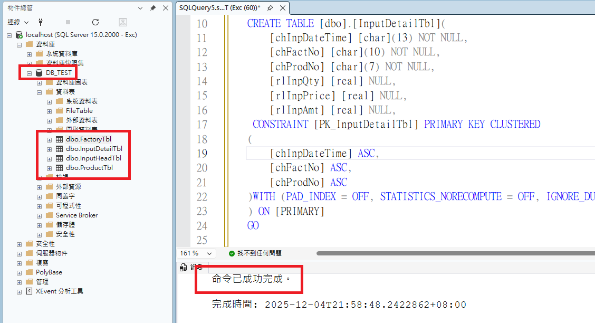
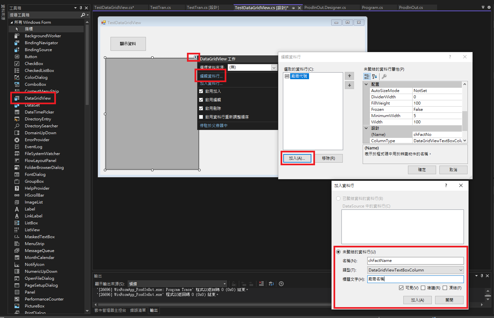
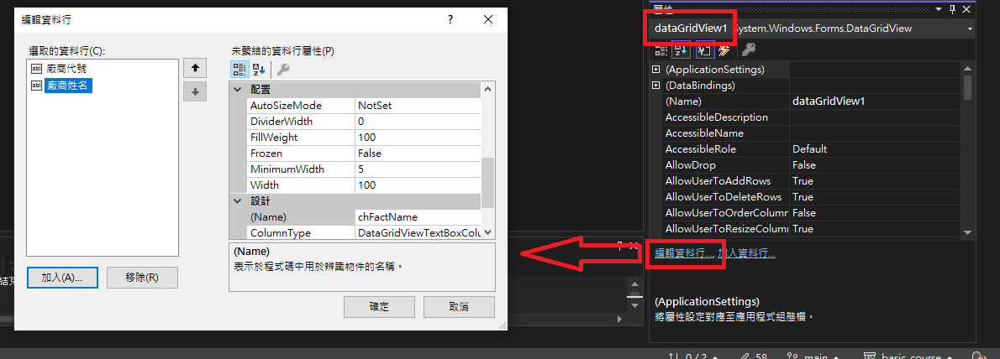
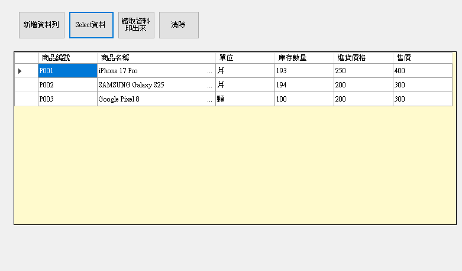
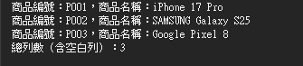

# 📖 C#單元八：進貨系統（DataGridView 與 SqlTransaction）

---

## 🎯 單元目標

- ✅ 學會使用 DataGridView 顯示與操作資料
- ✅ 了解多表資料庫設計概念（單頭單身結構）
- ✅ 學會使用 SqlTransaction 處理交易（確保資料一致性）
- ✅ 實作進貨系統的完整功能

---

## 📋 單元一：建立進貨系統所需的資料表

本單元將在 `DB_TEST` 資料庫中建立進貨系統所需的四個資料表。

### 🎯 資料表設計說明

進貨系統採用「單頭單身」的資料庫設計架構：

- **單頭（Head）**：一張進貨單的基本資訊（進貨日期時間、廠商代號、總金額）
- **單身（Detail）**：一張進貨單的明細資料（商品代號、進貨數量、單價、金額）

**關係說明**：

- 一筆進貨單（單頭）對應多筆進貨明細（單身）
- 一筆進貨單只對應一個廠商
- 一筆進貨明細只對應一個商品

### 📝 資料表一：FactoryTbl（廠商主檔）

#### 欄位規劃

| 欄位名稱       | 資料型別      | 說明             | 是否允許 NULL |
| -------------- | ------------- | ---------------- | ------------- |
| `chFactNo`   | `char(10)`  | 廠商代號（主鍵） | ❌ 否         |
| `chFactName` | `char(100)` | 廠商名稱         | ✅ 是         |

#### 建立資料表

1. 在 SSMS 中，點擊「新增查詢」按鈕
2. 確認查詢視窗上方顯示的資料庫為 `DB_TEST`
3. 輸入以下 SQL 指令：

```sql
USE [DB_TEST]
GO

SET ANSI_NULLS ON
GO

SET QUOTED_IDENTIFIER ON
GO

CREATE TABLE [dbo].[FactoryTbl](
	[chFactNo] [char](10) NOT NULL,
	[chFactName] [char](100) NULL,
 CONSTRAINT [PK_FactoryTbl] PRIMARY KEY CLUSTERED 
(
	[chFactNo] ASC
)WITH (PAD_INDEX = OFF, STATISTICS_NORECOMPUTE = OFF, IGNORE_DUP_KEY = OFF, ALLOW_ROW_LOCKS = ON, ALLOW_PAGE_LOCKS = ON, OPTIMIZE_FOR_SEQUENTIAL_KEY = OFF) ON [PRIMARY]
) ON [PRIMARY]
GO
```

4. 點擊「執行」按鈕（或按 `F5`）
5. 在「訊息」視窗中，應該會顯示「命令已成功完成」

#### 新增測試資料

```sql
INSERT INTO FactoryTbl (chFactNo, chFactName) VALUES ('F001', '台積電');
INSERT INTO FactoryTbl (chFactNo, chFactName) VALUES ('F002', '聯發科技');
INSERT INTO FactoryTbl (chFactNo, chFactName) VALUES ('F003', '台達電');
INSERT INTO FactoryTbl (chFactNo, chFactName) VALUES ('F004', '鴻海');
INSERT INTO FactoryTbl (chFactNo, chFactName) VALUES ('F005', '仁寶');
```

### 📝 資料表二：ProductTbl（商品主檔）

#### 欄位規劃

| 欄位名稱            | 資料型別      | 說明             | 是否允許 NULL |
| ------------------- | ------------- | ---------------- | ------------- |
| `chProdNo`        | `char(7)`   | 商品編號（主鍵） | ❌ 否         |
| `chProdName`      | `char(100)` | 商品名稱         | ❌ 否         |
| `chUnit`          | `char(4)`   | 單位             | ✅ 是         |
| `rlStockQty`      | `real`      | 庫存數量         | ✅ 是         |
| `rlInpPrice`      | `real`      | 進貨價格         | ✅ 是         |
| `rlSellPrice`     | `real`      | 售價             | ✅ 是         |
| `chCreatDateTime` | `char(11)`  | 建立日期時間     | ✅ 是         |

#### 建立資料表

```sql
USE [DB_TEST]
GO

SET ANSI_NULLS ON
GO

SET QUOTED_IDENTIFIER ON
GO

CREATE TABLE [dbo].[ProductTbl](
	[chProdNo] [char](7) NOT NULL,
	[chProdName] [char](100) NOT NULL,
	[chUnit] [char](4) NULL,
	[rlStockQty] [real] NULL,
	[rlInpPrice] [real] NULL,
	[rlSellPrice] [real] NULL,
	[chCreatDateTime] [char](11) NULL,
 CONSTRAINT [PK_ProductTbl] PRIMARY KEY CLUSTERED 
(
	[chProdNo] ASC
)WITH (PAD_INDEX = OFF, STATISTICS_NORECOMPUTE = OFF, IGNORE_DUP_KEY = OFF, ALLOW_ROW_LOCKS = ON, ALLOW_PAGE_LOCKS = ON, OPTIMIZE_FOR_SEQUENTIAL_KEY = OFF) ON [PRIMARY]
) ON [PRIMARY]
GO
```

#### 新增測試資料

```sql
INSERT INTO ProductTbl (chProdNo, chProdName, chUnit, rlStockQty, rlInpPrice, rlSellPrice, chCreatDateTime) VALUES ('P001', 'iPhone 17 Pro', '支', 100, 250, 400, '11412021530');
INSERT INTO ProductTbl (chProdNo, chProdName, chUnit, rlStockQty, rlInpPrice, rlSellPrice, chCreatDateTime) VALUES ('P002', 'SAMSUNG Galaxy S25', '支', 100, 200, 300, '11412021440');
INSERT INTO ProductTbl (chProdNo, chProdName, chUnit, rlStockQty, rlInpPrice, rlSellPrice, chCreatDateTime) VALUES ('P003', 'Google Pixel 8', '支', 100, 200, 300, '11412022130');
```

### 📝 資料表三：InputHeadTbl（進貨單頭）

#### 欄位規劃

| 欄位名稱          | 資料型別     | 說明                  | 是否允許 NULL |
| ----------------- | ------------ | --------------------- | ------------- |
| `chInpDateTime` | `char(13)` | 進貨日期時間（主鍵1） | ❌ 否         |
| `chFactNo`      | `char(10)` | 廠商代號（主鍵2）     | ❌ 否         |
| `rlInpTotAmt`   | `real`     | 進貨總金額            | ✅ 是         |

> 💡 **說明**：主鍵由 `chInpDateTime` 和 `chFactNo` 組成，表示同一時間同一廠商只能有一張進貨單。

#### 建立資料表

```sql
USE [DB_TEST]
GO

SET ANSI_NULLS ON
GO

SET QUOTED_IDENTIFIER ON
GO

CREATE TABLE [dbo].[InputHeadTbl](
	[chInpDateTime] [char](13) NOT NULL,
	[chFactNo] [char](10) NOT NULL,
	[rlInpTotAmt] [real] NULL,
 CONSTRAINT [PK_InputHeadTbl] PRIMARY KEY CLUSTERED 
(
	[chInpDateTime] ASC,
	[chFactNo] ASC
)WITH (PAD_INDEX = OFF, STATISTICS_NORECOMPUTE = OFF, IGNORE_DUP_KEY = OFF, ALLOW_ROW_LOCKS = ON, ALLOW_PAGE_LOCKS = ON, OPTIMIZE_FOR_SEQUENTIAL_KEY = OFF) ON [PRIMARY]
) ON [PRIMARY]
GO
```

### 📝 資料表四：InputDetailTbl（進貨單身）

#### 欄位規劃

| 欄位名稱          | 資料型別     | 說明                  | 是否允許 NULL |
| ----------------- | ------------ | --------------------- | ------------- |
| `chInpDateTime` | `char(13)` | 進貨日期時間（主鍵1） | ❌ 否         |
| `chFactNo`      | `char(10)` | 廠商代號（主鍵2）     | ❌ 否         |
| `chProdNo`      | `char(7)`  | 商品編號（主鍵3）     | ❌ 否         |
| `rlInpQty`      | `real`     | 進貨數量              | ✅ 是         |
| `rlInpPrice`    | `real`     | 進貨單價              | ✅ 是         |
| `rlInpAmt`      | `real`     | 進貨金額              | ✅ 是         |

> 💡 **說明**：主鍵由 `chInpDateTime`、`chFactNo` 和 `chProdNo` 組成，表示同一張進貨單中，同一商品只能出現一次。

#### 建立資料表

```sql
USE [DB_TEST]
GO

SET ANSI_NULLS ON
GO

SET QUOTED_IDENTIFIER ON
GO

CREATE TABLE [dbo].[InputDetailTbl](
	[chInpDateTime] [char](13) NOT NULL,
	[chFactNo] [char](10) NOT NULL,
	[chProdNo] [char](7) NOT NULL,
	[rlInpQty] [real] NULL,
	[rlInpPrice] [real] NULL,
	[rlInpAmt] [real] NULL,
 CONSTRAINT [PK_InputDetailTbl] PRIMARY KEY CLUSTERED 
(
	[chInpDateTime] ASC,
	[chFactNo] ASC,
	[chProdNo] ASC
)WITH (PAD_INDEX = OFF, STATISTICS_NORECOMPUTE = OFF, IGNORE_DUP_KEY = OFF, ALLOW_ROW_LOCKS = ON, ALLOW_PAGE_LOCKS = ON, OPTIMIZE_FOR_SEQUENTIAL_KEY = OFF) ON [PRIMARY]
) ON [PRIMARY]
GO
```

### ✅ 驗證資料表建立成功

1. 在「物件總管」中，展開 `DB_TEST` 資料庫
2. 展開「資料表」節點
3. 您應該會看到以下四個資料表：

   - `dbo.FactoryTbl`
   - `dbo.ProductTbl`
   - `dbo.InputHeadTbl`
   - `dbo.InputDetailTbl`
4. 如果沒有看到，請在「資料表」節點上按右鍵，選擇「重新整理」

   

---

## 📊 單元二：DataGridView 控制項教學

### 🎯 DataGridView 簡介

DataGridView 是 Windows Forms 中用來顯示和編輯表格資料的控制項，類似 Excel 的表格。





### 📝 步驟一：從工具箱拉出 DataGridView 控制項

1. 在「工具箱」中找到「DataGridView」控制項
2. 將 DataGridView 拖曳到表單上
3. 調整 DataGridView 的大小和位置

### 📝 步驟二：使用設計功能設定 DataGridView 欄位

#### 2.1 開啟 Columns 編輯器

1. 選取 DataGridView 控制項
2. 在「屬性」視窗中，找到「編輯資料行」

#### 2.2 新增欄位

在「編輯資料行」視窗中，點擊「新增」按鈕，依序新增以下欄位：

**欄位 1：商品編號（chProdNo）**

- 名稱：`chProdNo`
- 標題文字：`商品編號`
- 資料型別：`TextBoxColumn`

**欄位 2：商品名稱（chProdName）**

- 名稱：`chProdName`
- 標題文字：`商品名稱`
- 資料型別：`TextBoxColumn`
- 寬度：`300`（可調整）

**欄位 3：單位（chUnit）**

- 名稱：`chUnit`
- 標題文字：`單位`
- 資料型別：`TextBoxColumn`

**欄位 4：庫存數量（rlStockQty）**

- 名稱：`rlStockQty`
- 標題文字：`庫存數量`
- 資料型別：`TextBoxColumn`

**欄位 5：進貨價格（rlInpPrice）**

- 名稱：`rlInpPrice`
- 標題文字：`進貨價格`
- 資料型別：`TextBoxColumn`

**欄位 6：售價（rlSellPrice）**

- 名稱：`rlSellPrice`
- 標題文字：`售價`
- 資料型別：`TextBoxColumn`

### 📝 步驟三：設定 DataGridView 屬性

在「屬性」視窗中，設定以下重要屬性：

| 屬性名稱               | 設定值           | 說明                       |
| ---------------------- | ---------------- | -------------------------- |
| `AllowUserToAddRows` | `False`        | 不允許使用者新增資料列     |
| `ReadOnly`           | `True`         | 設定為唯讀（可依需求調整） |
| `BackgroundColor`    | `LemonChiffon` | 設定背景顏色（可選）       |

### 💻 程式碼範例：新增資料到 DataGridView

```csharp
// 新增一筆 Product 資料到 DataGridView
dgvProduct.Rows.Add(
    "P001",           // chProdNo（商品編號）
    "iPhone 17 Pro",  // chProdName（商品名稱）
    "片",             // chUnit（單位）
    "100",            // rlStockQty（庫存數量）
    "250",            // rlInpPrice（進貨價格）
    "400"             // rlSellPrice（售價）
);
```

### 💻 程式碼範例：讀取 DataGridView 中的資料

```csharp
// 使用迴圈讀取 DataGridView 中的所有資料列
for (int i = 0; i < dgvProduct.Rows.Count; i++)
{
    // 若是最後一行的空白列，則跳過不處理
    if (dgvProduct.Rows[i].IsNewRow) continue;
  
    // 取得第 i 列的商品編號
    string prodNo = dgvProduct.Rows[i].Cells["chProdNo"].Value.ToString().Trim();
  
    // 取得第 i 列的商品名稱
    string prodName = dgvProduct.Rows[i].Cells["chProdName"].Value.ToString().Trim();
  
  
    // 在Console印出來
    Console.WriteLine("商品編號：" + prodNo + "，商品名稱：" + prodName);
}
```

### 💻 程式碼範例：清除 DataGridView 中的資料

```csharp
// 清除 DataGridView 中的所有資料列
dgvProduct.Rows.Clear();
```

### 💻 程式碼範例：從資料庫查詢 Product 資料並新增到 DataGridView

```csharp
private void btnSelectProductFor_Click(object sender, EventArgs e)
{
    string strConnString = @"data source=localhost;initial catalog=DB_TEST;user id=Exc;password=Excpwd;MultipleActiveResultSets=true";
    using (SqlConnection sqlConn = new SqlConnection(strConnString))
    {
        sqlConn.Open();
        string strSQL = "SELECT chProdNo, chProdName, chUnit, rlStockQty, rlInpPrice, rlSellPrice FROM ProductTbl";
        using (SqlCommand sqlCmd = new SqlCommand(strSQL, sqlConn))
        {
            DataTable dt = new DataTable();
            dt.Load(sqlCmd.ExecuteReader());
  
            // 使用迴圈將資料庫查詢結果新增到 DataGridView
            for (int i = 0; i < dt.Rows.Count; i++)
            {
                dgvProduct.Rows.Add(
                    dt.Rows[i]["chProdNo"].ToString(),      // 商品編號
                    dt.Rows[i]["chProdName"].ToString(),    // 商品名稱
                    dt.Rows[i]["chUnit"].ToString(),        // 單位
                    dt.Rows[i]["rlStockQty"].ToString(),    // 庫存數量
                    dt.Rows[i]["rlInpPrice"].ToString(),    // 進貨價格
                    dt.Rows[i]["rlSellPrice"].ToString()    // 售價
                );
            }
        }
    }
}
```





### 📝 步驟四：練習實作 Product 的 DataGridView 功能

現在請參考上面 Factory 的範例，自己實作 Product 的 DataGridView 功能：

#### 4.1 建立 Product 的 DataGridView

1. 在表單上新增一個 DataGridView 控制項，命名為 `dgvProduct`
2. 使用「編輯資料行」功能，新增以下欄位：

   - `chProdNo`（商品編號）
   - `chProdName`（商品名稱）
   - `chUnit`（單位）
   - `rlStockQty`（庫存數量）
   - `rlInpPrice`（進貨價格）
   - `rlSellPrice`（售價）

#### 4.2 實作新增資料列按鈕

建立一個按鈕 `btnProductAddRow`，點擊後新增一筆測試資料到 DataGridView：

```csharp
private void btnProductAddRow_Click(object sender, EventArgs e)
{
    dgvProduct.Rows.Add("P001", "iPhone 17 Pro", "片", "100", "250", "400");
}
```

#### 4.3 實作清除按鈕

建立一個按鈕 `btnProductClear`，點擊後清除 DataGridView 中的所有資料：

```csharp
private void btnProductClear_Click(object sender, EventArgs e)
{
    dgvProduct.Rows.Clear();
}
```

#### 4.4 實作讀取資料並列印按鈕

建立一個按鈕 `btnProductPrint`，點擊後讀取 DataGridView 中的所有資料並列印到 Console：

```csharp
private void btnProductPrint_Click(object sender, EventArgs e)
{
    for (int i = 0; i < dgvProduct.Rows.Count; i++)
    {
        // 若是最後一行的空白列，則跳過不列印
        if (dgvProduct.Rows[i].IsNewRow) continue;
  
        Console.WriteLine("商品編號：" + dgvProduct.Rows[i].Cells["chProdNo"].Value.ToString() +
                         "，商品名稱：" + dgvProduct.Rows[i].Cells["chProdName"].Value.ToString() +
                         "，庫存數量：" + dgvProduct.Rows[i].Cells["rlStockQty"].Value.ToString());
    }
    Console.WriteLine("總列數（含空白列）：" + dgvProduct.Rows.Count);
}
```

#### 4.5 實作從資料庫查詢 Product 資料按鈕

建立一個按鈕 `btnSelectProductFor`，點擊後從資料庫查詢 ProductTbl 的資料，並新增到 DataGridView：

```csharp
private void btnSelectProductFor_Click(object sender, EventArgs e)
{
    string strConnString = @"data source=localhost;initial catalog=DB_TEST;user id=Exc;password=Excpwd;MultipleActiveResultSets=true";
    using (SqlConnection sqlConn = new SqlConnection(strConnString))
    {
        sqlConn.Open();
        string strSQL = "SELECT chProdNo, chProdName, chUnit, rlStockQty, rlInpPrice, rlSellPrice FROM ProductTbl";
        using (SqlCommand sqlCmd = new SqlCommand(strSQL, sqlConn))
        {
            DataTable dt = new DataTable();
            dt.Load(sqlCmd.ExecuteReader());
  
            // 使用迴圈將資料庫查詢結果新增到 DataGridView
            for (int i = 0; i < dt.Rows.Count; i++)
            {
                dgvProduct.Rows.Add(
                    dt.Rows[i]["chProdNo"].ToString(),      // 商品編號
                    dt.Rows[i]["chProdName"].ToString(),    // 商品名稱
                    dt.Rows[i]["chUnit"].ToString(),        // 單位
                    dt.Rows[i]["rlStockQty"].ToString(),    // 庫存數量
                    dt.Rows[i]["rlInpPrice"].ToString(),    // 進貨價格
                    dt.Rows[i]["rlSellPrice"].ToString()    // 售價
                );
            }
        }
    }
}
```

> 💡 **提示**：請參考 Factory 的範例程式碼，將欄位名稱和資料表名稱改成 Product 相關的即可。

---

## 🔄 單元三：SqlTransaction 交易處理教學

### 🎯 Transaction 的用意與重要性

在進貨系統中，儲存一張進貨單需要同時處理多個資料表：

1. **新增進貨單頭**（InputHeadTbl）
2. **新增進貨單身**（InputDetailTbl）- 可能有多筆
3. **更新商品庫存**（ProductTbl）- 增加庫存數量

**問題情境**：如果執行到一半發生錯誤（例如：新增單頭成功，但新增單身失敗），會造成資料不一致。

**解決方案**：使用 Transaction（交易）確保所有操作「全部成功」或「全部失敗」，不會有中間狀態。

### 📝 Transaction 使用步驟

#### 步驟 1：BeginTransaction() 開始交易

```csharp
using (SqlConnection sqlConn = new SqlConnection(strConnString))
{
    sqlConn.Open();
  
    // 開始交易
    SqlTransaction myTransaction = sqlConn.BeginTransaction();
  
    try
    {
        // 執行多個 SQL 指令...
  
        // 確認交易
        myTransaction.Commit();
    }
    catch (Exception ex)
    {
        // 回滾交易
        myTransaction.Rollback();
        MessageBox.Show(ex.Message);
    }
}
```

#### 步驟 2：設定 SqlCommand.Transaction 屬性

所有在交易中執行的 SqlCommand 都必須設定 Transaction 屬性：

```csharp
// 建立 SqlCommand
SqlCommand sqlCmd = new SqlCommand(strSQL, sqlConn);

// 設定 Transaction 屬性（重要！）
sqlCmd.Transaction = myTransaction;

// 執行指令
sqlCmd.ExecuteNonQuery();
```

#### 步驟 3：執行多個 SQL 指令

在交易中執行多個 SQL 指令：

```csharp
// 在迴圈外建立共用的 SqlCommand 物件
SqlCommand sqlCmd = new SqlCommand();
sqlCmd.Connection = sqlConn;
sqlCmd.Transaction = myTransaction;  // 設定 Transaction

// 使用 FOR 迴圈處理 DataGridView 中的每一筆資料
for (int i = 0; i < DgvInp.Rows.Count; i++)
{
    // 1. 新增進貨單身（InputDetailTbl）
    string strSQL = "INSERT INTO InputDetailTbl (chInpDateTime, chFactNo, chProdNo, rlInpPrice, rlInpQty, rlInpAmt) " +
                   "VALUES ('" + inpDateTime + "', '" + factNo + "', '" + prodNo + "', " + 
                   inpPrice + ", " + inpQty + ", " + inpAmt + ")";
    sqlCmd.CommandText = strSQL;
    sqlCmd.ExecuteNonQuery();
  
    // 2. 更新商品庫存
    strSQL = "UPDATE ProductTbl SET rlStockQty = rlStockQty + " + inpQty + 
            " WHERE chProdNo = '" + prodNo + "'";
    sqlCmd.CommandText = strSQL;
    sqlCmd.ExecuteNonQuery();
}

// 3. 新增進貨單頭（InputHeadTbl）
string insertHeadSQL = "INSERT INTO InputHeadTbl (chInpDateTime, chFactNo, rlInpTotAmt) " +
                       "VALUES ('" + inpDateTime + "', '" + factNo + "', " + totAmt + ")";
sqlCmd.CommandText = insertHeadSQL;
sqlCmd.ExecuteNonQuery();
```

#### 步驟 4：Commit() 確認交易 或 Rollback() 回滾交易

```csharp
try
{
    // 執行所有 SQL 指令...
  
    // 如果所有指令都成功，確認交易
    myTransaction.Commit();
    MessageBox.Show("儲存成功！");
}
catch (Exception ex)
{
    // 如果任何指令失敗，回滾交易（取消所有變更）
    myTransaction.Rollback();
    MessageBox.Show("儲存失敗：" + ex.Message);
}
```

### 🔍 使用斷點功能配合 SSMS 講解 Transaction

#### 示範步驟

1. **成功 Commit 示範**：示範當所有 SQL 指令執行成功後，呼叫 `Commit()` 確認交易，此時資料才會真正寫入資料庫
2. **Insert 資料變化時機**：說明在 Transaction 進行中，資料尚未 Commit 前，其他連線無法看到未確認的資料變化
3. **Update 鎖定機制**：示範 Transaction 執行 Update 時，資料列會被鎖定（Lock），其他連線需等待交易完成才能存取
4. **錯誤處理與 Rollback**：示範當 Insert 資料違反 SQL 約束條件（如主鍵重複、外鍵違反等）導致錯誤時，自動觸發 `Rollback()` 取消所有變更

### 💻 完整程式碼範例：進貨單儲存功能（含 Transaction）

```csharp
private void btnSaveInpDgv_Click(object sender, EventArgs e)
{
    if (DgvInp.Rows.Count == 0) return;
  
    using (SqlConnection sqlConn = new SqlConnection(strConnString))
    {
        try
        {
            sqlConn.Open();
  
            // *1. 開始交易
            SqlTransaction myTransaction = sqlConn.BeginTransaction();
  
            try
            {
                // 準備進貨日期時間字串（13碼：yyyMMddhhmmss）
                string inpDateTime = txtInpDateTime.Text.Substring(0, 7) + txtInpDateTime.Text.Substring(8, 6);
                string factNo = txtFactNo.Text.Trim();
                decimal mInpTotAmt = 0;
  
                // 在迴圈外建立共用的 SqlCommand 物件
                SqlCommand sqlCmd = new SqlCommand();
                sqlCmd.Connection = sqlConn;
                // *2. 設定 SqlCommand 的 Transaction
                sqlCmd.Transaction = myTransaction;
  
                // 迴圈處理 DataGridView 中的每一筆資料
                for (int i = 0; i < DgvInp.Rows.Count; i++)
                {
                    // 取得 DataGridView 中的資料
                    string prodNo = DgvInp.Rows[i].Cells["ProdNo"].Value.ToString().Trim();
                    string inpPrice = DgvInp.Rows[i].Cells["InpPrice"].Value.ToString().Trim();
                    string inpQty = DgvInp.Rows[i].Cells["InpQty"].Value.ToString().Trim();
                    string inpAmt = DgvInp.Rows[i].Cells["InpAmt"].Value.ToString().Trim();
    
                    // 累加總金額
                    mInpTotAmt = mInpTotAmt + decimal.Parse(inpAmt);
    
                    // 1. 新增進貨單身（InputDetailTbl）
                    string strSQL = "INSERT INTO InputDetailTbl (chInpDateTime, chFactNo, chProdNo, rlInpPrice, rlInpQty, rlInpAmt) " +
                                   "VALUES ('" + inpDateTime + "', '" + factNo + "', '" + prodNo + "', " + 
                                   inpPrice + ", " + inpQty + ", " + inpAmt + ")";
    
                    sqlCmd.CommandText = strSQL;
                    sqlCmd.ExecuteNonQuery();
    
                    // 2. 更新商品庫存主檔的庫存數量
                    strSQL = "UPDATE ProductTbl SET rlStockQty = rlStockQty + " + inpQty +
                             " WHERE chProdNo = '" + prodNo + "'";
    
                    sqlCmd.CommandText = strSQL;
                    sqlCmd.ExecuteNonQuery();
                }
  
                // 3. 新增進貨單頭（InputHeadTbl）
                string insertHeadSQL = "INSERT INTO InputHeadTbl (chInpDateTime, chFactNo, rlInpTotAmt) " +
                                      "VALUES ('" + inpDateTime + "', '" + factNo + "', " + Convert.ToString(mInpTotAmt) + ")";
  
                sqlCmd.CommandText = insertHeadSQL;
                sqlCmd.ExecuteNonQuery();
  
                // *5. 確認交易（所有操作都成功）
                myTransaction.Commit();
                MessageBox.Show("儲存成功！");
  
                // 清除表單
                btnClear_Click(null, null);
                DgvInp.Rows.Clear();
                txtInpDateTime.Text = "";
            }
            catch (Exception ex)
            {
                // *6. 回滾交易（取消所有變更）
                myTransaction.Rollback();
                MessageBox.Show("儲存失敗：" + ex.Message);
            }
        }
        catch (Exception ex)
        {
            // 外層的 Exception 只為抓取 connection Error
            MessageBox.Show("連線錯誤：" + ex.Message);
        }
    }
}
```

### 🔑 Transaction 重點整理

| 步驟                | 說明                        | 程式碼範例                                                     |
| ------------------- | --------------------------- | -------------------------------------------------------------- |
| 1. 開始交易         | 呼叫 `BeginTransaction()` | `SqlTransaction myTransaction = sqlConn.BeginTransaction();` |
| 2. 設定 Transaction | 所有 SqlCommand 都要設定    | `sqlCmd.Transaction = myTransaction;`                        |
| 3. 執行 SQL 指令    | 執行多個 SQL 指令           | `sqlCmd.ExecuteNonQuery();`                                  |
| 4-1. 確認交易       | 所有操作成功後確認          | `myTransaction.Commit();`                                    |
| 4-2. 回滾交易       | 發生錯誤時取消所有變更      | `myTransaction.Rollback();`                                  |

> ⚠️ **重要提醒**：
>
> - 所有在交易中執行的 SqlCommand 都必須設定 `Transaction` 屬性
> - 如果沒有設定 `Transaction` 屬性，該指令不會參與交易
> - 交易失敗時，所有變更都會被取消，資料庫狀態回到交易開始前

---

## 💻 單元四：進貨單儲存功能完整實作

### 🎯 功能流程說明

1. **使用者輸入廠商代號** → 系統查詢並顯示廠商名稱
2. **使用者輸入商品代號** → 系統查詢並顯示商品資訊（名稱、單位、參考單價）
3. **使用者輸入進貨單價和數量** → 系統自動計算金額
4. **使用者按下「確定」按鈕** → 將資料新增到 DataGridView
5. **使用者按下「單張儲存」按鈕** → 將 DataGridView 中的資料儲存到資料庫

### 📝 步驟一：實作將 TextBox 資料新增至 DataGridView 的功能

#### 1.1 檢查廠商代號（txtFactNo_Leave）

```csharp
private void txtFactNo_Leave(object sender, EventArgs e)
{
    if (txtFactNo.Text.Trim() == "") return;
  
    try
    {
        using (SqlConnection sqlConn = new SqlConnection(strConnString))
        {
            sqlConn.Open();
  
            string strSQL = "SELECT * FROM FactoryTbl WHERE chFactNo = '" + 
                           txtFactNo.Text.Trim() + "'";
            using (SqlCommand sqlCmd = new SqlCommand(strSQL, sqlConn))
            {
                DataTable dtTbl = new DataTable();
                dtTbl.Load(sqlCmd.ExecuteReader());
  
                if (dtTbl.Rows.Count == 0)
                {
                    MessageBox.Show("查無此廠商代號資料", "敬請確認");
                    txtFactNo.Focus();
                    return;
                }
  
                // 顯示廠商名稱
                txtFactName.Text = dtTbl.Rows[0]["chFactName"].ToString().Trim();
  
                // 鎖定廠商代號欄位（不可再更改）
                txtFactNo.ForeColor = Color.Red;
                txtFactNo.ReadOnly = true;
                txtFactName.ForeColor = Color.Red;
            }
        }
    }
    catch (Exception ex)
    {
        MessageBox.Show(ex.Message);
    }
}
```

#### 1.2 檢查商品代號並顯示商品資訊（txtProdNo_Leave）

```csharp
private void txtProdNo_Leave(object sender, EventArgs e)
{
    if (txtProdNo.Text.Trim() == "") return;
  
    try
    {
        using (SqlConnection sqlConn = new SqlConnection(strConnString))
        {
            sqlConn.Open();
  
            string strSQL = "SELECT * FROM ProductTbl WHERE chProdNo = '" + 
                           txtProdNo.Text.Trim() + "'";
            using (SqlCommand sqlCmd = new SqlCommand(strSQL, sqlConn))
            {
                DataTable dt = new DataTable();
                dt.Load(sqlCmd.ExecuteReader());
  
                if (dt.Rows.Count == 0)
                {
                    MessageBox.Show("查無此產品代號資料", "敬請確認");
                    txtProdNo.Focus();
                    return;
                }
  
                // 顯示商品資訊
                txtProdName.Text = dt.Rows[0]["chProdName"].ToString().Trim();
                if (txtInpPrice.Text.Trim() == "") 
                    txtInpPrice.Text = dt.Rows[0]["rlInpPrice"].ToString().Trim();
                if (txtInpQty.Text.Trim() == "") 
                    txtInpQty.Text = "0";
                if (txtUnit.Text.Trim() == "") 
                    txtUnit.Text = dt.Rows[0]["chUnit"].ToString().Trim();
            }
        }
    }
    catch (Exception ex)
    {
        MessageBox.Show(ex.Message);
    }
}
```

#### 1.3 計算金額（txtInpPrice_Leave 和 txtInpQty_Leave）

```csharp
// 當單價改變時，重新計算金額
private void txtInpPrice_Leave(object sender, EventArgs e)
{
    if (txtInpPrice.Text.Trim() == "" || txtInpPrice.Text.Trim() == "0")
    {
        lblAmt.Text = "";
        return;
    }
  
    decimal mDeciNumber = 0;
    bool mDeciFlag = decimal.TryParse(txtInpPrice.Text.Trim(), out mDeciNumber);
    if (mDeciFlag == false)
    {
        MessageBox.Show("單價只可為數字", "敬請確認");
        lblAmt.Text = "";
        txtInpPrice.Focus();
        return;
    }
  
    if (txtInpQty.Text.Trim() != "" && txtInpQty.Text.Trim() != "0")
    {
        lblAmt.Text = Convert.ToString(mDeciNumber * decimal.Parse(txtInpQty.Text.Trim()));
    }
}

// 當數量改變時，重新計算金額
private void txtInpQty_Leave(object sender, EventArgs e)
{
    if (txtInpQty.Text.Trim() == "" || txtInpQty.Text.Trim() == "0")
    {
        lblAmt.Text = "";
        return;
    }
  
    decimal mDeciNumber = 0;
    bool mDeciFlag = decimal.TryParse(txtInpQty.Text.Trim(), out mDeciNumber);
    if (mDeciFlag == false)
    {
        MessageBox.Show("進貨數量只可為數字", "敬請確認");
        lblAmt.Text = "";
        txtInpQty.Focus();
        return;
    }
  
    if (txtInpPrice.Text.Trim() != "" && txtInpPrice.Text.Trim() != "0")
    {
        lblAmt.Text = Convert.ToString(mDeciNumber * decimal.Parse(txtInpPrice.Text.Trim()));
    }
}
```

#### 1.4 新增資料到 DataGridView（btnOK_Click）

```csharp
private void btnOK_Click(object sender, EventArgs e)
{
    if (txtProdNo.Text.Trim() == "") return;
  
    try
    {
        using (SqlConnection sqlConn = new SqlConnection(strConnString))
        {
            sqlConn.Open();
  
            // 1. 檢查廠商代號
            string strSQL = "SELECT * FROM FactoryTbl WHERE chFactNo = '" + 
                           txtFactNo.Text.Trim() + "'";
            using (SqlCommand sqlCmd = new SqlCommand(strSQL, sqlConn))
            {
                DataTable dtTbl = new DataTable();
                dtTbl.Load(sqlCmd.ExecuteReader());
                if (dtTbl.Rows.Count == 0)
                {
                    MessageBox.Show("查無此廠商代號", "敬請確認");
                    return;
                }
            }
  
            // 2. 檢查產品代號
            strSQL = "SELECT * FROM ProductTbl WHERE chProdNo = '" + 
                    txtProdNo.Text.Trim() + "'";
            using (SqlCommand sqlCmd = new SqlCommand(strSQL, sqlConn))
            {
                DataTable dtTbl = new DataTable();
                dtTbl.Load(sqlCmd.ExecuteReader());
                if (dtTbl.Rows.Count == 0)
                {
                    MessageBox.Show("查無此產品代號", "敬請確認");
                    txtProdNo.Focus();
                    return;
                }
            }
  
            // 3. 檢查單價不可為 0 及空白
            if (txtInpPrice.Text.Trim() == "" || txtInpPrice.Text.Trim() == "0")
            {
                MessageBox.Show("單價不可為【 0 及空白 】", "敬請確認");
                txtInpPrice.Focus();
                return;
            }
  
            // 4. 檢查進貨數量不可為 0 及空白
            if (txtInpQty.Text.Trim() == "" || txtInpQty.Text.Trim() == "0")
            {
                MessageBox.Show("進貨數量不可為【 0 及空白 】", "敬請確認");
                txtInpQty.Focus();
                return;
            }
  
            // 5. 新增至 DataGridView
            DgvInp.Rows.Add(
                txtProdNo.Text.Trim(),      // 產品代號
                txtProdName.Text.Trim(),    // 產品名稱
                txtInpPrice.Text.Trim(),    // 進貨單價
                txtInpQty.Text.Trim(),      // 進貨數量
                lblAmt.Text.Trim(),         // 金額
                txtUnit.Text.Trim()          // 產品單位
            );
  
            // 6. 產生進貨日期時間（如果尚未產生）
            if (txtInpDateTime.Text.Trim() == "")
            {
                string tmpDate = GetDateToDate13();
                txtInpDateTime.Text = tmpDate.Substring(0, 7) + "-" + tmpDate.Substring(7, 6);
            }
  
            // 7. 清除輸入欄位
            txtProdNo.Text = "";
            txtProdName.Text = "";
            txtInpPrice.Text = "";
            txtInpQty.Text = "";
            lblAmt.Text = "";
            txtUnit.Text = "";
  
            txtProdNo.Focus();
        }
    }
    catch (Exception ex)
    {
        MessageBox.Show(ex.Message);
    }
}

// 取得現在時間的13碼（民國年月日時分秒：yyyMMddhhmmss）
private string GetDateToDate13()
{
    DateTime now = DateTime.Now;
    int rocYear = now.Year - 1911; // 民國年
    return $"{rocYear:000}{now.Month:00}{now.Day:00}{now.Hour:00}{now.Minute:00}{now.Second:00}";
}
```

### 📝 步驟二：實作進貨單儲存功能（使用 Transaction）

請參考「單元三：SqlTransaction 交易處理教學」中的完整程式碼範例。

### 📝 步驟三：實作清螢幕功能

```csharp
private void btnClear_Click(object sender, EventArgs e)
{
    // 清除廠商相關欄位
    txtFactNo.Text = "";
    txtFactNo.ReadOnly = false;
    txtFactNo.ForeColor = System.Drawing.Color.Black;
    txtFactName.Text = "";
    txtFactName.ForeColor = System.Drawing.Color.Black;
  
    // 清除商品相關欄位
    txtProdNo.Text = "";
    txtProdName.Text = "";
    txtInpPrice.Text = "";
    txtInpQty.Text = "";
    lblAmt.Text = "";
    txtUnit.Text = "";
  
    // 清除進貨日期時間
    txtInpDateTime.Text = "";
  
    // 清除 DataGridView
    DgvInp.Rows.Clear();
}
```

### 📝 步驟四：實作單張清除功能

```csharp
private void btnClearInpDgv_Click(object sender, EventArgs e)
{
    if (DgvInp.RowCount == 0) return;
  
    DialogResult myResult = MessageBox.Show(
        "確定要將底下單張資料都清除?", 
        "敬請再次確認", 
        MessageBoxButtons.YesNo, 
        MessageBoxIcon.Question
    );
  
    if (myResult == DialogResult.Yes)
    {
        DgvInp.Rows.Clear();
        txtInpDateTime.Text = "";
        MessageBox.Show("清除成功");
    }
}
```

---


## 🏠 課後作業

### 📋 作業要求

建置出貨表單（參考進貨系統的架構）。

### 🎯 作業步驟

1. **建立出貨相關資料表**

   **OutHeadTbl（出貨單-頭）**

   | 欄位名稱          | 資料型別     | 說明                  | 是否允許 NULL |
   | ----------------- | ------------ | --------------------- | ------------- |
   | `chOutDateTime` | `char(13)` | 出貨日期時間（主鍵1） | ❌ 否         |
   | `chFactNo`      | `char(10)` | 廠商代號（主鍵2）     | ❌ 否         |
   | `rlOutTotAmt`   | `real`     | 出貨總金額            | ✅ 是         |

   **OutDetailTbl（出貨單-身）**

   | 欄位名稱          | 資料型別     | 說明                  | 是否允許 NULL |
   | ----------------- | ------------ | --------------------- | ------------- |
   | `chOutDateTime` | `char(13)` | 出貨日期時間（主鍵1） | ❌ 否         |
   | `chFactNo`      | `char(10)` | 廠商代號（主鍵2）     | ❌ 否         |
   | `chProdNo`      | `char(7)`  | 商品編號（主鍵3）     | ❌ 否         |
   | `rlOutQty`      | `real`     | 出貨數量              | ✅ 是         |
   | `rlOutPrice`    | `real`     | 出貨單價              | ✅ 是         |
   | `rlOutAmt`      | `real`     | 出貨金額              | ✅ 是         |
2. **設計出貨系統介面**

   - 參考進貨系統的介面設計
   - 建立出貨系統表單
   - 加入 DataGridView 控制項
   - 設定 DataGridView 欄位（產品代號、產品名稱、出貨單價、出貨數量、金額、產品單位）
3. **實作出貨單的 DataGridView 操作**

   - 廠商代號查詢功能
   - 商品代號查詢功能
   - 金額自動計算功能
   - 新增資料到 DataGridView 功能
   - 清螢幕功能
   - 單張清除功能
4. **實作出貨單儲存功能（含 SqlTransaction）**

   - 使用 Transaction 確保資料一致性
   - 新增出貨單頭（OutHeadTbl）
   - 新增出貨單身（OutDetailTbl）
   - 更新商品庫存（ProductTbl）- 減少庫存數量
   - 處理錯誤情況（Rollback）

### 💡 提示

- 出貨系統的架構與進貨系統類似，可以參考進貨系統的程式碼
- 出貨時，庫存數量應該**減少**（進貨時是增加）
- 出貨單價通常使用商品的售價（`rlSellPrice`）
- 記得檢查庫存數量是否足夠（出貨數量不能超過庫存數量）

### ✅ 驗證清單

完成作業後，請確認：

- [ ] 出貨相關資料表已建立（OutHeadTbl、OutDetailTbl）
- [ ] 出貨系統介面設計完整
- [ ] 出貨單的 DataGridView 操作功能正常
- [ ] 出貨單儲存功能使用 SqlTransaction
- [ ] 出貨時庫存數量正確減少
- [ ] 可以成功新增至少 2 張出貨單
- [ ] 所有功能都能正常運作

---

## 🎓 本週重點回顧

### 資料庫設計

- ✅ 了解「單頭單身」的資料庫設計架構
- ✅ 一筆進貨單（單頭）對應多筆進貨明細（單身）
- ✅ 主鍵可以由多個欄位組成（複合主鍵）

### DataGridView 控制項

- ✅ DataGridView 用於顯示和編輯表格資料
- ✅ 使用 Columns 編輯器設定欄位名稱、標題、資料型別
- ✅ `Rows.Add()` 可以新增資料列
- ✅ `Rows[i].Cells["欄位名"].Value` 可以存取資料
- ✅ `Rows.Clear()` 可以清除所有資料列

### SqlTransaction 交易處理

- ✅ Transaction 確保多表資料的一致性
- ✅ `BeginTransaction()` 開始交易
- ✅ 所有 SqlCommand 都要設定 `Transaction` 屬性
- ✅ `Commit()` 確認交易（所有操作成功）
- ✅ `Rollback()` 回滾交易（取消所有變更）
- ✅ 交易失敗時，所有變更都會被取消

### C# 資料庫操作

- ✅ `SqlCommand` 搭配 `ExecuteReader()` 和 `DataTable.Load()` 用於查詢資料並填充 DataTable
- ✅ `SqlCommandBuilder` 用於自動產生更新指令
- ✅ `ExecuteNonQuery()` 用於執行 INSERT、UPDATE 等指令
- ✅ 使用迴圈處理 DataGridView 中的多筆資料

---
