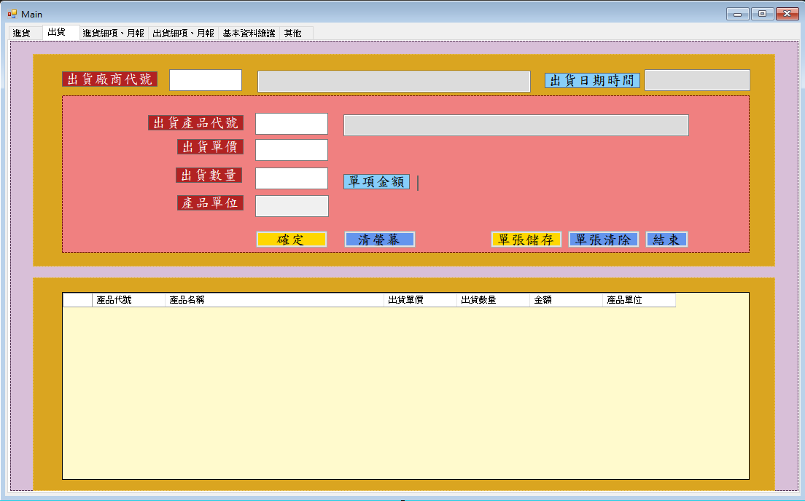
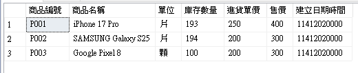
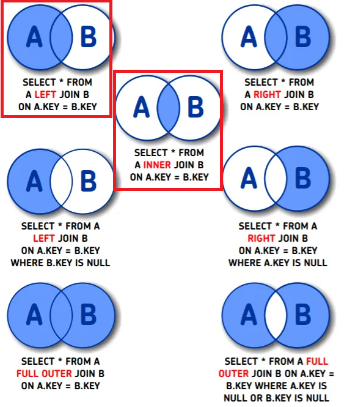
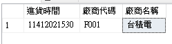

# 📖 C#單元九：出貨系統與報表（SQL JOIN 與 DataGridView 資料綁定）

---

## 🎯 單元目標

- ✅ 建立出貨系統所需的資料表
- ✅ 實作出貨表單功能（參考進貨系統架構）
- ✅ 了解 SQL JOIN 的種類與用法
- ✅ 深入理解 LEFT JOIN 的撰寫方式與結果
- ✅ 學會使用欄位別名（Alias）
- ✅ 學會使用 DataGridView 的 DataSource 屬性綁定 DataTable
- ✅ 完成進貨明細報表功能
- ✅ 完成出貨明細報表作業

---

## 📋 單元一：建立出貨系統所需的資料表

本單元將在 `DB_TEST` 資料庫中建立出貨系統所需的六個資料表。

### 🎯 資料表設計說明

出貨系統採用「單頭單身」的資料庫設計架構，與進貨系統類似：

- **單頭（Head）**：一張出貨單的基本資訊（出貨日期時間、廠商代號、總金額）
- **單身（Detail）**：一張出貨單的明細資料（商品代號、出貨數量、單價、金額）

**關係說明**：

- 一筆出貨單（單頭）對應多筆出貨明細（單身）
- 一筆出貨單只對應一個廠商
- 一筆出貨明細只對應一個商品

### 📝 資料表一：FactoryTbl（廠商主檔）

```sql
USE [DB_TEST]
GO

SET ANSI_NULLS ON
GO

SET QUOTED_IDENTIFIER ON
GO

CREATE TABLE [dbo].[FactoryTbl](
	[chFactNo] [char](10) NOT NULL,
	[chFactName] [char](100) NULL,
 CONSTRAINT [PK_FactoryTbl] PRIMARY KEY CLUSTERED 
(
	[chFactNo] ASC
)WITH (PAD_INDEX = OFF, STATISTICS_NORECOMPUTE = OFF, IGNORE_DUP_KEY = OFF, ALLOW_ROW_LOCKS = ON, ALLOW_PAGE_LOCKS = ON, OPTIMIZE_FOR_SEQUENTIAL_KEY = OFF) ON [PRIMARY]
) ON [PRIMARY]
GO
```

#### 新增測試資料

```sql
INSERT INTO FactoryTbl (chFactNo, chFactName) VALUES ('F001', '台積電');
INSERT INTO FactoryTbl (chFactNo, chFactName) VALUES ('F002', '聯發科技');
INSERT INTO FactoryTbl (chFactNo, chFactName) VALUES ('F003', '台達電');
INSERT INTO FactoryTbl (chFactNo, chFactName) VALUES ('F004', '鴻海');
INSERT INTO FactoryTbl (chFactNo, chFactName) VALUES ('F005', '仁寶');
```

### 📝 資料表二：ProductTbl（商品主檔）

```sql
USE [DB_TEST]
GO

SET ANSI_NULLS ON
GO

SET QUOTED_IDENTIFIER ON
GO

CREATE TABLE [dbo].[ProductTbl](
	[chProdNo] [char](7) NOT NULL,
	[chProdName] [char](100) NOT NULL,
	[chUnit] [char](4) NULL,
	[rlStockQty] [real] NULL,
	[rlInpPrice] [real] NULL,
	[rlSellPrice] [real] NULL,
	[chCreatDateTime] [char](11) NULL,
 CONSTRAINT [PK_ProductTbl] PRIMARY KEY CLUSTERED 
(
	[chProdNo] ASC
)WITH (PAD_INDEX = OFF, STATISTICS_NORECOMPUTE = OFF, IGNORE_DUP_KEY = OFF, ALLOW_ROW_LOCKS = ON, ALLOW_PAGE_LOCKS = ON, OPTIMIZE_FOR_SEQUENTIAL_KEY = OFF) ON [PRIMARY]
) ON [PRIMARY]
GO
```

#### 新增測試資料

```sql
INSERT INTO ProductTbl (chProdNo, chProdName, chUnit, rlStockQty, rlInpPrice, rlSellPrice, chCreatDateTime) VALUES ('P001', 'iPhone 17 Pro', '支', 100, 250, 400, '11412021530');
INSERT INTO ProductTbl (chProdNo, chProdName, chUnit, rlStockQty, rlInpPrice, rlSellPrice, chCreatDateTime) VALUES ('P002', 'SAMSUNG Galaxy S25', '支', 100, 200, 300, '11412021440');
INSERT INTO ProductTbl (chProdNo, chProdName, chUnit, rlStockQty, rlInpPrice, rlSellPrice, chCreatDateTime) VALUES ('P003', 'Google Pixel 8', '支', 100, 200, 300, '11412022130');

```

### 📝 資料表三：InputHeadTbl（進貨單頭）

```sql
USE [DB_TEST]
GO

SET ANSI_NULLS ON
GO

SET QUOTED_IDENTIFIER ON
GO

CREATE TABLE [dbo].[InputHeadTbl](
	[chInpDateTime] [char](13) NOT NULL,
	[chFactNo] [char](10) NOT NULL,
	[rlInpTotAmt] [real] NULL,
 CONSTRAINT [PK_InputHeadTbl] PRIMARY KEY CLUSTERED 
(
	[chInpDateTime] ASC,
	[chFactNo] ASC
)WITH (PAD_INDEX = OFF, STATISTICS_NORECOMPUTE = OFF, IGNORE_DUP_KEY = OFF, ALLOW_ROW_LOCKS = ON, ALLOW_PAGE_LOCKS = ON, OPTIMIZE_FOR_SEQUENTIAL_KEY = OFF) ON [PRIMARY]
) ON [PRIMARY]
GO
```

### 📝 資料表四：InputDetailTbl（進貨單身）

```sql
USE [DB_TEST]
GO

SET ANSI_NULLS ON
GO

SET QUOTED_IDENTIFIER ON
GO

CREATE TABLE [dbo].[InputDetailTbl](
	[chInpDateTime] [char](13) NOT NULL,
	[chFactNo] [char](10) NOT NULL,
	[chProdNo] [char](7) NOT NULL,
	[rlInpQty] [real] NULL,
	[rlInpPrice] [real] NULL,
	[rlInpAmt] [real] NULL,
 CONSTRAINT [PK_InputDetailTbl] PRIMARY KEY CLUSTERED 
(
	[chInpDateTime] ASC,
	[chFactNo] ASC,
	[chProdNo] ASC
)WITH (PAD_INDEX = OFF, STATISTICS_NORECOMPUTE = OFF, IGNORE_DUP_KEY = OFF, ALLOW_ROW_LOCKS = ON, ALLOW_PAGE_LOCKS = ON, OPTIMIZE_FOR_SEQUENTIAL_KEY = OFF) ON [PRIMARY]
) ON [PRIMARY]
GO
```

### 📝 資料表五：OutputHeadTbl（出貨單頭）

```sql
USE [DB_TEST]
GO

SET ANSI_NULLS ON
GO

SET QUOTED_IDENTIFIER ON
GO

CREATE TABLE [dbo].[OutputHeadTbl](
	[chOutpDateTime] [char](13) NOT NULL,
	[chFactNo] [char](10) NOT NULL,
	[rlOutpTotAmt] [real] NULL,
 CONSTRAINT [PK_OutputHeadTbl] PRIMARY KEY CLUSTERED 
(
	[chOutpDateTime] ASC,
	[chFactNo] ASC
)WITH (PAD_INDEX = OFF, STATISTICS_NORECOMPUTE = OFF, IGNORE_DUP_KEY = OFF, ALLOW_ROW_LOCKS = ON, ALLOW_PAGE_LOCKS = ON, OPTIMIZE_FOR_SEQUENTIAL_KEY = OFF) ON [PRIMARY]
) ON [PRIMARY]
GO
```

### 📝 資料表六：OutputDetailTbl（出貨單身）

```sql
USE [DB_TEST]
GO

SET ANSI_NULLS ON
GO

SET QUOTED_IDENTIFIER ON
GO

CREATE TABLE [dbo].[OutputDetailTbl](
	[chOutpDateTime] [char](13) NOT NULL,
	[chFactNo] [char](10) NOT NULL,
	[chProdNo] [char](7) NOT NULL,
	[rlQty] [real] NULL,
	[rlOutpPrice] [real] NULL,
	[rlOutpAmt] [real] NULL,
 CONSTRAINT [PK_OutputDetailTbl] PRIMARY KEY CLUSTERED 
(
	[chOutpDateTime] ASC,
	[chFactNo] ASC,
	[chProdNo] ASC
)WITH (PAD_INDEX = OFF, STATISTICS_NORECOMPUTE = OFF, IGNORE_DUP_KEY = OFF, ALLOW_ROW_LOCKS = ON, ALLOW_PAGE_LOCKS = ON, OPTIMIZE_FOR_SEQUENTIAL_KEY = OFF) ON [PRIMARY]
) ON [PRIMARY]
GO
```

### ✅ 驗證資料表建立成功

1. 在「物件總管」中，展開 `DB_TEST` 資料庫
2. 展開「資料表」節點
3. 您應該會看到以下六個資料表：

   - `dbo.FactoryTbl`
   - `dbo.ProductTbl`
   - `dbo.InputHeadTbl`
   - `dbo.InputDetailTbl`
   - `dbo.OutputHeadTbl`
   - `dbo.OutputDetailTbl`
4. 如果沒有看到，請在「資料表」節點上按右鍵，選擇「重新整理」

   

---

## 💻 單元二：實作出貨表單

本單元將參考進貨系統的架構，實作出貨表單功能。

### 🎯 功能流程說明

1. **使用者輸入廠商代號** → 系統查詢並顯示廠商名稱
2. **使用者輸入商品代號** → 系統查詢並顯示商品資訊（名稱、單位、參考單價）
3. **使用者輸入出貨單價和數量** → 系統自動計算金額
4. **使用者按下「確定」按鈕** → 將資料新增到 DataGridView
5. **使用者按下「單張儲存」按鈕** → 將 DataGridView 中的資料儲存到資料庫

### 📝 步驟一：設計出貨系統介面(已完成)

1. 參考進貨系統的介面設計
2. 建立出貨系統表單
3. 加入 DataGridView 控制項
4. 設定 DataGridView 欄位（產品代號、產品名稱、出貨單價、出貨數量、金額、產品單位）

   

### 📝 步驟二：實作出貨單的操作

#### 2.1 廠商代號查詢功能

參考進貨系統的 `txtInpFactNo_Leave` 事件處理，實作出貨系統的 `txtOutFactNo_Leave` 事件處理。

```csharp
        private void txtOutFactNo_Leave(object sender, EventArgs e)
        {
            if (txtOutFactNo.Text.Trim() == "") return;
            txtOutFactNo.Text = txtOutFactNo.Text.Trim().ToUpper();
            try
            {
                // 建立資料庫連線
                using (SqlConnection mySqlConn = new SqlConnection(strConnString))
                {
                    mySqlConn.Open();
                    string strSQL = "select * from FactoryTbl where chFactNo = '" + txtOutFactNo.Text.Trim() + "' ";
                    using (SqlCommand sqlCmd = new SqlCommand(strSQL, mySqlConn))
                    {
                        DataTable dtTbl = new DataTable();
                        dtTbl.Load(sqlCmd.ExecuteReader());
                        if (dtTbl.Rows.Count == 0)
                        {
                            MessageBox.Show("查無此廠商代號資料" + "\r\n\r\n" + "按任一鍵離開!", "敬請確認");
                            txtOutFactNo.Focus();
                            return;
                        }
                        txtOutFactName.Text = dtTbl.Rows[0]["chFactName"].ToString().Trim();
                        txtOutFactNo.ForeColor = Color.Red;
                        txtOutFactNo.ReadOnly = true;
                        txtOutFactName.ForeColor = Color.Red;
                    }
                }
            }
            catch (Exception ex)
            {
                MessageBox.Show(ex.Message);
            }
        }
```

#### 2.2 商品代號查詢功能

參考進貨系統的 `txtInpProdNo_Leave` 事件處理，實作出貨系統的 `txtOutProdNo_Leave` 事件處理。
出貨單價通常使用商品的售價（`rlSellPrice`）。

```csharp
請同學練習實作  txtOutProdNo_Leave
```

#### 2.3 金額自動計算功能

參考進貨系統的 `txtInpPrice_Leave` 和 `txtInpQty_Leave` 事件處理，實作出貨系統的 `txtOutPrice_Leave` 和 `txtOutQty_Leave` 事件處理。

**出貨系統程式碼範例：**

```csharp
// 檢查單價是否為數字並即時計算單項金額
private void txtOutPrice_Leave(object sender, EventArgs e)
{
    if (txtOutPrice.Text.Trim() == "" || txtOutPrice.Text.Trim() == "0")
    {
        lblOutAmt.Text = "";
        return;
    }
    decimal mDeciNumber = 0;
    bool mDeciFlag = decimal.TryParse(txtOutPrice.Text.Trim(), out mDeciNumber);
    if (mDeciFlag == false)
    {
        MessageBox.Show("單價只可為數字【 0-9 . - 】等" + "\r\n\r\n" + "按任一鍵離開!", "敬請確認");
        lblOutAmt.Text = "";
        txtOutPrice.Focus();
        return;
    }
    if (txtOutQty.Text.Trim() != "" && txtOutQty.Text.Trim() != "0")
    {
        lblOutAmt.Text = Convert.ToString(mDeciNumber * decimal.Parse(txtOutQty.Text.Trim()));
    }
}

```

```csharp
txtOutQty_Leave 請同學練習實作
```

#### 2.4 新增資料到 DataGridView 功能

參考進貨系統的 `btnInpOK_Click` 事件處理，實作出貨系統的 `btnOutOK_Click` 事件處理。

記得檢查庫存數量是否足夠（出貨數量不能超過庫存數量）。

```csharp
        private void btnOutOK_Click(object sender, EventArgs e)
        {
            if (txtOutProdNo.Text.Trim() == "") return;
            txtOutProdNo.Text = txtOutProdNo.Text.Trim().ToUpper();
            try
            {
                using (SqlConnection mySqlConn = new SqlConnection(strConnString))
                {
                    mySqlConn.Open();
                    string strSQL = "select * from FactoryTbl where chFactNo = '" + txtOutFactNo.Text.Trim() + "' ";
                    using (SqlCommand sqlCmd = new SqlCommand(strSQL, mySqlConn))
                    {
                        DataTable dtTbl = new DataTable();
                        dtTbl.Load(sqlCmd.ExecuteReader());
                        if (dtTbl.Rows.Count == 0)
                        {
                            MessageBox.Show("查無此廠商代號" + "\r\n\r\n" + "按任一鍵離開!", "敬請確認");
                            return;
                        }
                    }
                    strSQL = "select * from ProductTbl where chProdNo = '" + txtOutProdNo.Text.Trim() + "' ";
                    using (SqlCommand sqlCmd = new SqlCommand(strSQL, mySqlConn))
                    {
                        DataTable dtTbl = new DataTable();
                        dtTbl.Load(sqlCmd.ExecuteReader());
                        if (dtTbl.Rows.Count == 0)
                        {
                            MessageBox.Show("查無此產品代號" + "\r\n\r\n" + "按任一鍵離開!", "敬請確認");
                            txtOutProdNo.Focus();
                            return;
                        }
                    }
                    if (txtOutPrice.Text.Trim() == "" || txtOutPrice.Text.Trim() == "0")
                    {
                        MessageBox.Show("單價不可為【 0 及空白 】" + "\r\n\r\n" + "按任一鍵離開!", "敬請確認");
                        txtOutPrice.Focus();
                        return;
                    }
                    decimal mDeciNumber = 0;
                    bool mDeciFlag = decimal.TryParse(txtOutPrice.Text.Trim(), out mDeciNumber);
                    if (mDeciFlag == false)
                    {
                        MessageBox.Show("單價只可為數字【 0-9 . - 】等" + "\r\n\r\n" + "按任一鍵離開!", "敬請確認");
                        txtOutPrice.Focus();
                        return;
                    }
                    if (txtOutQty.Text.Trim() == "" || txtOutQty.Text.Trim() == "0")
                    {
                        MessageBox.Show("出貨數量不可為【 0 及空白 】" + "\r\n\r\n" + "按任一鍵離開!", "敬請確認");
                        txtOutQty.Focus();
                        return;
                    }
                    mDeciNumber = 0;
                    mDeciFlag = decimal.TryParse(txtOutQty.Text.Trim(), out mDeciNumber);
                    if (mDeciFlag == false)
                    {
                        MessageBox.Show("出貨數量只可為數字【 0-9 . - 】等" + "\r\n\r\n" + "按任一鍵離開!", "敬請確認");
                        txtOutQty.Focus();
                        return;
                    }
                    strSQL = "select rlStockQty from ProductTbl where chProdNo = '" + txtOutProdNo.Text.Trim() + "' ";
                    using (SqlCommand sqlCmd = new SqlCommand(strSQL, mySqlConn))
                    {
                        // ExecuteScalar() 是把第一列第一欄的資料抓出來
                        decimal currentStock = Convert.ToDecimal(sqlCmd.ExecuteScalar());
                        decimal outQty = decimal.Parse(txtOutQty.Text.Trim());

                        // 檢查本次出貨數量是否超過庫存（假設一張單同一個產品只會有一筆）
                        if (currentStock < outQty)
                        {
                            MessageBox.Show("商品 " + txtOutProdNo.Text.Trim() + " 庫存不足！" + "\r\n" +
                                          "目前庫存：" + currentStock + "\r\n" +
                                          "本次出貨數量：" + outQty + "\r\n\r\n" +
                                          "按任一鍵離開!", "敬請確認");
                            txtOutQty.Focus();
                            return;
                        }
                    }

                    //此處請同學實作新增資料至DataGridView
                    if (txtOutDateTime.Text.Trim() == "")
                    {
                        string tmpDate = GetDateToDate13();
                        txtOutDateTime.Text = tmpDate.Substring(0, 7) + "-" + tmpDate.Substring(7, 6);
                    }
                    txtOutProdNo.Text = "";
                    txtOutProdName.Text = "";

                    txtOutPrice.Text = "";
                    txtOutQty.Text = "";
                    lblOutAmt.Text = "";
                    txtOutUnit.Text = "";

                    txtOutProdNo.Focus();

                }
            }
            catch (Exception ex)
            {
                MessageBox.Show(ex.Message);
            }
        }
```

#### 2.5 清螢幕功能

參考進貨系統的 `btnInpClear_Click` 事件處理，實作出貨系統的 `btnOutClear_Click` 事件處理。

```csharp
        private void btnOutClear_Click(object sender, EventArgs e)
        {

            txtOutFactNo.Text = "";
            txtOutFactNo.ReadOnly = false;
            txtOutFactNo.ForeColor = System.Drawing.Color.Black;
            txtOutFactName.Text = "";
            txtOutFactName.ForeColor = System.Drawing.Color.Black;

            txtOutProdNo.Text = "";
            txtOutProdName.Text = "";

            txtOutPrice.Text = "";
            txtOutQty.Text = "";
            lblOutAmt.Text = "";
            txtOutUnit.Text = "";
        }
```

#### 2.6 單張清除功能

參考進貨系統的 `btnClearInpDgv_Click` 事件處理，實作出貨系統的 `btnClearOutDgv_Click` 事件處理。

```csharp
btnClearOutDgv_Click  請同學練習實作

```

### 📝 步驟三：實作出貨單儲存功能（含 SqlTransaction）

#### 3.1 使用 Transaction 確保資料一致性

參考進貨系統的 `btnSaveInpDgv_Click` 事件處理，實作出貨系統的 `btnSaveOutDgv_Click` 事件處理。
出貨單儲存需要同時處理多個資料表：

1. **新增出貨單頭**（OutputHeadTbl）
2. **新增出貨單身**（OutputDetailTbl）- 可能有多筆
3. **更新商品庫存**（ProductTbl）- **減少**庫存數量

但實際操作順序是

1. 新增出貨單身（OutputDetailTbl）
2. 更新商品庫存（ProductTbl）
3. 新增出貨單頭（OutputHeadTbl）

#### 3.2 完整程式碼範例

```csharp
private void btnSaveOutDgv_Click(object sender, EventArgs e)
        {
            // 如果DataGridView中沒有資料，則不執行
            if (DgvOut.Rows.Count == 0) return;

            // 如果產品代號、單價、出貨數量為空，則顯示錯誤訊息
            if (txtOutProdNo.Text.Trim() != "" || txtOutPrice.Text.Trim() != "" || txtOutQty.Text.Trim() != "")
            {
                MessageBox.Show("螢幕上尚未未完成的輸入資料" + "\r\n\r\n" + "按任一鍵離開!", "敬請確認");
                return;
            }
			// 此處請同學實作資料存取  參考進貨並按照上述流程
        }
```

### 💡 重點提示

- 出貨系統的架構與進貨系統類似，可以參考進貨系統的程式碼
- 出貨時，庫存數量應該**減少**（進貨時是增加）
- 出貨單價通常使用商品的售價（`rlSellPrice`）
- 記得檢查庫存數量是否足夠（出貨數量不能超過庫存數量）

---

## 📊 單元三：SQL 語法教學

### 📝 欄位別名（Alias）

使用 `AS` 關鍵字可以為欄位設定別名，讓查詢結果更容易閱讀：

```sql
SELECT 
    chInpDateTime AS '進貨日期時間',
    chFactNo AS '廠商代號',
    chProdNo AS '商品編號',
    rlInpQty AS '進貨數量',
    rlInpPrice AS '進貨單價',
    rlInpAmt AS '進貨金額'
FROM InputDetailTbl
```

> 💡 **提示**：別名可以使用單引號或雙引號包起來，也可以不使用引號（如果別名不包含空格）。

#### 練習題：ProductTbl 資料表的欄位別名

請同學練習為 `ProductTbl` 資料表的所有欄位設定中文別名：


### 🎯 JOIN 的種類

SQL JOIN 用於結合兩個或多個資料表的資料。常見的 JOIN 種類包括：



JOIN  分為連結後的欄位呈現  (擴充欄位)、資料關係比對

### 📝 LEFT JOIN 深入講解

#### 3.1 LEFT JOIN 的撰寫方式

```sql
SELECT 
    左表.欄位1,
    左表.欄位2,
    右表.欄位1,
    右表.欄位2
FROM 左表
LEFT JOIN 右表 ON 左表.關聯欄位 = 右表.關聯欄位
```

#### 3.2 LEFT JOIN 的預期結果

- **左表的所有記錄都會被返回**
- 如果右表有匹配的記錄，則顯示右表的資料
- 如果右表沒有匹配的記錄，則右表的欄位顯示為 `NULL`

#### 3.2.1 範例：資料不全的情況

假設我們有以下情況：

- **交易明細表（InputDetailTbl）** 有 P001、P002、P003、P004 的商品記錄

```sql
INSERT INTO InputDetailTbl (chInpDateTime, chFactNo, chProdNo, rlInpQty, rlInpPrice, rlInpAmt) VALUES
('1141202153000', 'F001', 'P001', 10, 250, 2500),
('1141202153000', 'F001', 'P002', 20, 200, 4000),
('1141202153000', 'F001', 'P003', 15, 300, 4500),
('1141202153000', 'F001', 'P004', 5, 150, 750);
INSERT INTO InputHeadTbl (chInpDateTime, chFactNo, rlInpTotAmt) VALUES ('1141202153000', 'F001', 11750);
```

- **商品基本檔（ProductTbl）** 只有 P001、P002、P003 的商品資料（缺少 P004）

**交易明細表（InputDetailTbl）的資料：**

| chInpDateTime | chFactNo | chProdNo | rlInpQty | rlInpPrice | rlInpAmt |
| ------------- | -------- | -------- | -------- | ---------- | -------- |
| 11412021530   | F001     | P001     | 10       | 250        | 2500     |
| 11412021530   | F001     | P002     | 20       | 200        | 4000     |
| 11412021530   | F001     | P003     | 15       | 300        | 4500     |
| 11412021530   | F001     | P004     | 5        | 150        | 750      |

**商品基本檔（ProductTbl）的資料：**

| chProdNo | chProdName         | chUnit | rlStockQty | rlInpPrice | rlSellPrice |
| -------- | ------------------ | ------ | ---------- | ---------- | ----------- |
| P001     | iPhone 17 Pro      | 支     | 100        | 250        | 400         |
| P002     | SAMSUNG Galaxy S25 | 支     | 100        | 200        | 300         |
| P003     | iPad Pro           | 台     | 50         | 300        | 450         |

**使用 LEFT JOIN 查詢：**

```sql
SELECT 
    d.chProdNo AS '商品編號',
    p.chProdName AS '商品名稱',
    d.rlInpQty AS '進貨數量',
    d.rlInpPrice AS '進貨單價',
    d.rlInpAmt AS '進貨金額'
FROM InputDetailTbl d
LEFT JOIN ProductTbl p ON d.chProdNo = p.chProdNo
```

**LEFT JOIN 查詢結果：**

| 商品編號 | 商品名稱           | 進貨數量 | 進貨單價 | 進貨金額 |
| -------- | ------------------ | -------- | -------- | -------- |
| P001     | iPhone 17 Pro      | 10       | 250      | 2500     |
| P002     | SAMSUNG Galaxy S25 | 20       | 200      | 4000     |
| P003     | iPad Pro           | 15       | 300      | 4500     |
| *P004*   | *NULL*             | *5*      | *150*    | *750*    |

**重點說明：**

- ✅ **P001、P002、P003**：在商品基本檔中有對應資料，所以顯示商品名稱
- ⚠️ **P004**：在商品基本檔中**沒有**對應資料，所以商品名稱欄位顯示為 `NULL`
- ✅ **所有交易明細記錄都被保留**：即使 P004 在商品基本檔中不存在，交易明細的記錄仍然會被返回

這個範例清楚地展示了 LEFT JOIN 的特性：**即使右表（ProductTbl）沒有匹配的記錄，左表（InputDetailTbl）的所有記錄都會被返回**，這正是 LEFT JOIN 與 INNER JOIN 的最大差異。

#### 3.3 使用 INNER JOIN 的差異

如果我們使用 INNER JOIN，同樣以缺少 P004 為例：

**使用相同的資料表：**

- **交易明細表（InputDetailTbl）** 有 P001、P002、P003、P004 的商品記錄
- **商品基本檔（ProductTbl）** 只有 P001、P002、P003 的商品資料（缺少 P004）

**使用 INNER JOIN 查詢：**

```sql
SELECT 
    d.chProdNo AS '商品編號',
    p.chProdName AS '商品名稱',
    d.rlInpQty AS '進貨數量',
    d.rlInpPrice AS '進貨單價',
    d.rlInpAmt AS '進貨金額'
FROM InputDetailTbl d
INNER JOIN ProductTbl p ON d.chProdNo = p.chProdNo
```

**INNER JOIN 查詢結果：**

| 商品編號 | 商品名稱           | 進貨數量 | 進貨單價 | 進貨金額 |
| -------- | ------------------ | -------- | -------- | -------- |
| P001     | iPhone 17 Pro      | 10       | 250      | 2500     |
| P002     | SAMSUNG Galaxy S25 | 20       | 200      | 4000     |
| P003     | iPad Pro           | 15       | 300      | 4500     |

**重點說明：**

- ✅ **P001、P002、P003**：在商品基本檔中有對應資料，所以顯示商品名稱
- ❌ **P004**：在商品基本檔中**沒有**對應資料，**整筆記錄被過濾掉**，不會出現在查詢結果中
- ⚠️ **只返回有匹配的記錄**：INNER JOIN 只會返回兩個表中都有對應資料的記錄

**LEFT JOIN vs INNER JOIN 的差異比較：**

| 比較項目 | LEFT JOIN                 | INNER JOIN  |
| -------- | ------------------------- | ----------- |
| P001     | ✅ 顯示                    | ✅ 顯示      |
| P002     | ✅ 顯示                    | ✅ 顯示      |
| P003     | ✅ 顯示                    | ✅ 顯示      |
| P004     | ✅ 顯示（商品名稱為 NULL） | ❌**不顯示** |

這個範例清楚地展示了 INNER JOIN 的特性：**只返回兩個表中都有匹配的記錄，如果右表（ProductTbl）沒有匹配的記錄，左表（InputDetailTbl）的該筆記錄會被完全過濾掉**，這就是 INNER JOIN 與 LEFT JOIN 的最大差異。

#### 3.5 結果驗證

1. 在 SSMS 中執行 LEFT JOIN 的查詢
2. 觀察結果：所有進貨明細都會顯示
3. 在 SSMS 中執行 INNER JOIN 的查詢
4. 觀察結果：只顯示有對應商品的進貨明細
5. 比較兩者的差異

#### 📝 練習題：出貨單頭的 LEFT JOIN 查詢

請同學完成以下練習：
請分析每個欄位需要從哪個資料表取得資料，並寫出 SQL 查詢  以得到此圖內容的資料



### 📝 實戰範例：多表 JOIN 查詢進貨明細報表

#### 資料表關聯關係圖

```
InputHeadTbl (InpH) ──LEFT JOIN──> InputDetailTbl (InpD)
     │                                    │
     │                                    │
     └──LEFT JOIN──> FactoryTbl (F)       └──LEFT JOIN──> ProductTbl (P)
```

以下是一個完整的實戰範例，展示如何使用多個 LEFT JOIN 來查詢進貨明細報表：

```sql
SELECT InpH.chInpDateTime AS '進貨日期', InpH.chFactNo AS '廠商代號',
		F.chFactName AS '廠商名稱',InpD.chProdNo AS '商品代號', P.chProdName AS '商品名稱',
		InpD.rlInpPrice AS '單價', InpD.rlInpQty AS '數量', InpD.rlInpAmt AS '單項金額'
from InputHeadTbl InpH (nolock) 
left join InputDetailTbl InpD (nolock) on InpH.chInpDateTime = InpD.chInpDateTime AND InpH.chFactNo = InpD.chFactNo
left join FactoryTbl F (nolock) on InpH.chFactNo = F.chFactNo
left join ProductTbl P (nolock) ON InpD.chProdNo = P.chProdNo 
Where InpH.chInpDateTime >= '1141202000000' AND InpH.chInpDateTime <= '1141202153000'

```

#### SQL 結構講解

**1. SELECT （欄位）**

- `InpH.chInpDateTime AS '進貨日期'`：從進貨單頭表（InputHeadTbl，別名 `InpH`）取得進貨日期時間
- `InpH.chFactNo AS '廠商代號'`：從進貨單頭表取得廠商代號
- `F.chFactName AS '廠商名稱'`：從廠商主檔（FactoryTbl，別名 `F`）取得廠商名稱
- `InpD.chProdNo AS '商品代號'`：從進貨單身表（InputDetailTbl，別名 `InpD`）取得商品代號
- `P.chProdName AS '商品名稱'`：從商品主檔（ProductTbl，別名 `P`）取得商品名稱
- `InpD.rlInpPrice AS '單價'`、`InpD.rlInpQty AS '數量'`、`InpD.rlInpAmt AS '單項金額'`：從進貨單身表取得價格、數量和金額資訊

**2. FROM （主表）**

- `from InputHeadTbl InpH (nolock)`：以進貨單頭表作為主表（左表），別名為 `InpH`
- `(nolock)`：SQL Server 的提示，表示讀取時不鎖定資料表，適合報表查詢使用

**3. LEFT JOIN （關聯其他資料表）**

- **第一個 LEFT JOIN**：`left join InputDetailTbl InpD (nolock) on InpH.chInpDateTime = InpD.chInpDateTime AND InpH.chFactNo = InpD.chFactNo`

  - 關聯進貨單身表（別名 `InpD`）
  - 關聯條件：進貨日期時間和廠商代號都相同（因為主鍵是複合鍵）
  - 目的：取得每張進貨單的明細資料
- **第二個 LEFT JOIN**：`left join FactoryTbl F (nolock) on InpH.chFactNo = F.chFactNo`

  - 關聯廠商主檔（別名 `F`）
  - 關聯條件：廠商代號相同
  - 目的：取得廠商名稱（擴充欄位）
- **第三個 LEFT JOIN**：`left join ProductTbl P (nolock) ON InpD.chProdNo = P.chProdNo`

  - 關聯商品主檔（別名 `P`）
  - 關聯條件：商品代號相同
  - 目的：取得商品名稱（擴充欄位）

**4. WHERE 子句（篩選條件）**

- `Where InpH.chInpDateTime >= '1141202000000' AND InpH.chInpDateTime <= '1141202153000'`
- 篩選進貨日期時間在指定範圍內的記錄
- `'1141202000000'` 表示民國 114 年 12 月 02 日 00:00:00（格式：yyyMMddhhmmss，13碼）
- `'1141202153000'` 表示民國 114 年 12 月 02 日 15:30:00（格式：yyyMMddhhmmss，13碼）

#### 查詢邏輯說明

1. **以進貨單頭表為主**：查詢從 `InputHeadTbl` 開始，確保所有進貨單都會被查詢到
2. **關聯進貨單身表**：透過進貨日期時間關聯，取得每張進貨單的明細資料
3. **擴充廠商資訊**：透過廠商代號關聯廠商主檔，取得廠商名稱
4. **擴充商品資訊**：透過商品代號關聯商品主檔，取得商品名稱
5. **使用 LEFT JOIN 的原因**：確保即使某些資料表缺少對應資料（例如商品主檔中沒有該商品），進貨明細記錄仍然會被顯示

#### 使用 LEFT JOIN 的優點

- ✅ **資料完整性**：即使商品主檔或廠商主檔缺少資料，進貨明細仍會顯示
- ✅ **報表需求**：報表通常需要顯示所有交易記錄，即使主檔資料不完整
- ✅ **除錯方便**：可以發現主檔資料不完整的問題（顯示 NULL 值）

---

## 📊 單元四：進貨明細表操作（進貨明細）

### 🎯 功能說明

本單元將實作進貨明細表功能，使用 SQL JOIN 查詢進貨明細，並使用 DataGridView 的 DataSource 屬性綁定 DataTable 來呈現資料。

### 📝 步驟一：設計進貨明細表介面

1. 建立新的表單或使用現有表單
2. 加入 DataGridView 控制項（命名為 `dgvInputReport`）
3. 加入「查詢」按鈕

### 📝 步驟二：使用 DataSource 綁定 DataTable

#### 2.1 使用 SqlCommand 填充 DataTable

```csharp
private void btnInpDetailQuery_Click(object sender, EventArgs e)
        {
            if (txtInpDetailSDate.Text.Length != 7 || txtInpDetailEDate.Text.Length != 7)
            {
                MessageBox.Show("起迄日期需為7碼日期, eg.1141201" + "\r\n\r\n" + "按任一鍵離開!", "日期錯誤!!!");
                txtInpDetailSDate.Focus();
                return;
            }

            this.Cursor = Cursors.WaitCursor;
            lblInpDetailTotAmt.Text = "";
            lblInpDetailTotAmt.Visible = false;
            try
            {
                using (SqlConnection mySqlConn = new SqlConnection(strConnString))
                {
                    mySqlConn.Open();

                    string strSQL = @"SELECT InpH.chInpDateTime AS '進貨日期', InpH.chFactNo AS '廠商代號',
	                        F.chFactName AS '廠商名稱',InpD.chProdNo AS '商品代號', P.chProdName AS '商品名稱',
                            InpD.rlInpPrice AS '單價', InpD.rlInpQty AS '數量', InpD.rlInpAmt AS '單項金額'
                            from InputHeadTbl InpH (nolock) 
                            left join InputDetailTbl InpD (nolock) on InpH.chInpDateTime = InpD.chInpDateTime AND InpH.chFactNo = InpD.chFactNo
                            left join FactoryTbl F (nolock) on InpH.chFactNo = F.chFactNo
                            left join ProductTbl P (nolock) ON InpD.chProdNo = P.chProdNo
                            Where InpH.chInpDateTime >= '" + txtInpDetailSDate.Text.Trim() + "' AND InpH.chInpDateTime <= '" + txtInpDetailEDate.Text.Trim() + "999999'";
                    using (SqlCommand sqlCmd = new SqlCommand(strSQL, mySqlConn))
                    {
                        DataTable dt = new DataTable();
                        dt.Load(sqlCmd.ExecuteReader());
                        if (dt.Rows.Count == 0)
                        {
                            MessageBox.Show("查詢區間內無進貨資料。" + "\r\n\r\n" + "按任一鍵離開!", "查無資料，敬請確認！！！");
                            return;
                        }
                        dgvInpDetailReport.DataSource = dt;
                    }
                }
            }
            catch (Exception ex)
            {
                MessageBox.Show(ex.Message);
                this.Cursor = Cursors.Default;
            }
            this.Cursor = Cursors.Default;
        }

```

#### 2.2 DataSource 綁定的優點

- **自動產生欄位**：DataGridView 會根據 DataTable 的欄位自動產生對應的欄位
- **自動顯示別名**：SQL 查詢中的欄位別名會自動成為 DataGridView 的欄位標題
- **程式碼簡潔**：不需要手動使用迴圈新增資料列

#### 2.3 清除 DataGridView 資料

```csharp
    dgvInputReport.DataSource = null;
```

### 💡 重點整理

- **LEFT JOIN** 可以確保所有進貨明細都會被顯示，即使商品或廠商資料不存在
- **欄位別名（Alias）** 可以讓查詢結果更容易閱讀，並自動成為 DataGridView 的欄位標題
- **DataSource 綁定** 比使用迴圈新增資料列更簡潔、更有效率

---

## 🏠 課後作業

### 📋 作業要求

完成出貨明細報表功能。

### 🎯 作業步驟

1. **設計出貨明細表介面**

   - 建立新的表單或使用現有表單
   - 加入 DataGridView 控制項
   - 加入日期選擇控制項
   - 加入「查詢」按鈕
2. **撰寫 SQL 查詢語句**

   - 使用 LEFT JOIN 查詢出貨明細
   - 關聯 OutputHeadTbl、OutputDetailTbl、FactoryTbl 和 ProductTbl
   - 加上適當的欄位別名
   - 加入日期篩選條件
3. **實作查詢功能**

   - 使用 SqlCommand 填充 DataTable
   - 使用 DataGridView 的 DataSource 屬性綁定 DataTable
   - 處理錯誤情況

### 💡 提示

- 參考進貨明細表的實作方式
- 使用 LEFT JOIN 確保所有出貨明細都會被顯示
- 欄位別名使用中文，讓報表更容易閱讀

### ✅ 驗證清單

完成作業後，請確認：

- [ ] 出貨明細表介面設計完整
- [ ] SQL 查詢使用 LEFT JOIN
- [ ] 欄位有適當的別名（中文）
- [ ] 使用 DataSource 屬性綁定 DataTable
- [ ] 日期篩選功能正常運作
- [ ] 可以正確顯示出貨明細資料（含廠商名稱、商品名稱）
- [ ] 所有功能都能正常運作

---

## 🎓 本週重點回顧

### 資料表建立

- ✅ 建立出貨系統所需的六個資料表
- ✅ 熟悉「單頭單身」的資料庫設計架構

### 出貨系統實作

- ✅ 實作出貨表單功能（參考進貨系統架構）
- ✅ 出貨時庫存數量正確減少
- ✅ 使用 SqlTransaction 確保資料一致性

### SQL JOIN

- ✅ 了解 SQL JOIN 的種類（INNER JOIN、LEFT JOIN 等）
- ✅ 深入理解 LEFT JOIN 的撰寫方式與結果
- ✅ 了解 INNER JOIN 與 LEFT JOIN 的差異

### 欄位別名（Alias）

- ✅ 學會使用 `AS` 關鍵字設定欄位別名
- ✅ 別名可以讓查詢結果更容易閱讀

### DataGridView 資料綁定

- ✅ 學會使用 DataGridView 的 DataSource 屬性綁定 DataTable
- ✅ 使用 SqlCommand 填充 DataTable
- ✅ DataSource 綁定比使用迴圈新增資料列更簡潔、更有效率

---
